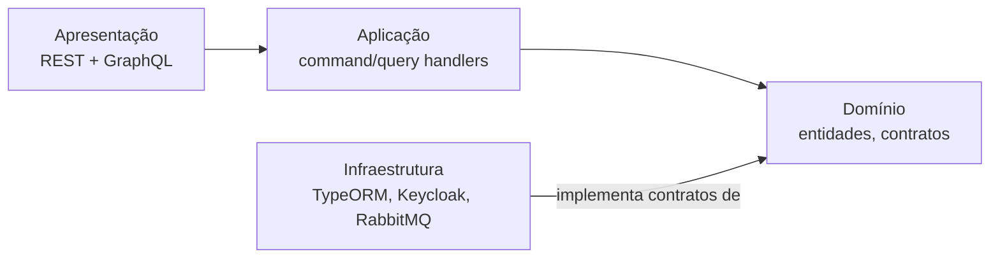
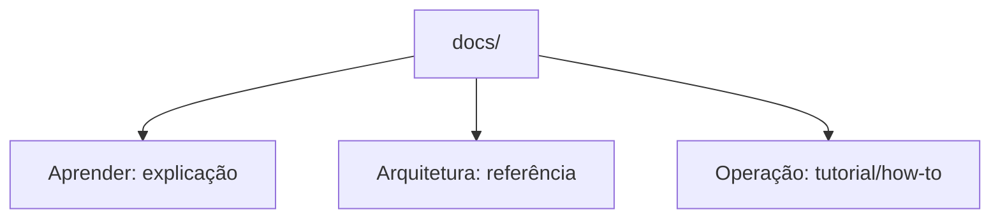

# management-service

[![Build & Push][action-build-deploy-dev-src]][action-build-deploy-dev-href]

API REST/GraphQL de gerenciamento acadêmico do Ladesa, construída com NestJS, TypeORM e PostgreSQL, seguindo arquitetura hexagonal com DDD e CQRS.

**Ambiente de desenvolvimento público**: <https://dev.ladesa.com.br/api/v1/docs/>


```mermaid
flowchart LR
    Apresentacao["Apresentação\nREST + GraphQL"] --> Aplicacao["Aplicação\ncommand/query handlers"]
    Aplicacao --> Dominio["Domínio\nentidades, contratos"]
    Infraestrutura["Infraestrutura\nTypeORM, Keycloak, RabbitMQ"] -- "implementa contratos de" --> Dominio
```

A documentação completa (setup, arquitetura, contribuição, deploy) está em **[docs/](docs/index.md)**, gerada a partir de `docs/` com MkDocs + Material.


```mermaid
flowchart TB
    Docs[docs/] --> Aprender[Aprender: explicação]
    Docs --> Arquitetura[Arquitetura: referência]
    Docs --> Operacao[Operação: tutorial/how-to]
```

## Começando rápido

```bash
git clone https://github.com/ladesa-ro/management-service.git
cd management-service
just up            # sobe os containers e abre um shell dentro do container
bun run dev         # dentro do container: servidor com hot reload
```

Todo o ambiente é containerizado, não é necessário instalar Bun, Node.js ou PostgreSQL na máquina. Passo a passo completo, variáveis de ambiente e troubleshooting em [Comece por aqui](docs/operacao/comecando.md).

Pra editar a documentação localmente:

```bash
docker run --rm -it -p 8000:8000 -v "$PWD":/docs squidfunk/mkdocs-material:9.7.7
```

## Licença

[MIT](./LICENSE) &copy; desde 2024, Ladesa.

<!-- Links dos Badges -->

[action-build-deploy-dev-src]: https://img.shields.io/github/actions/workflow/status/ladesa-ro/management-service/build-push.dev.yml?style=flat&logo=github&logoColor=white&label=Build+%26+Push&branch=main&labelColor=18181B
[action-build-deploy-dev-href]: https://github.com/ladesa-ro/management-service/actions/workflows/build-push.dev.yml?query=branch%3Amain
