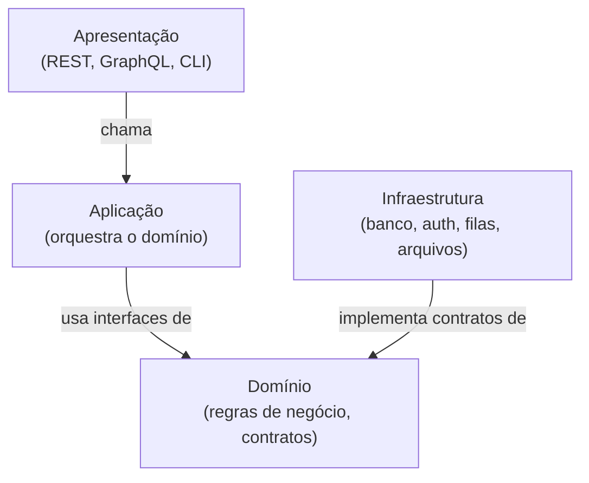
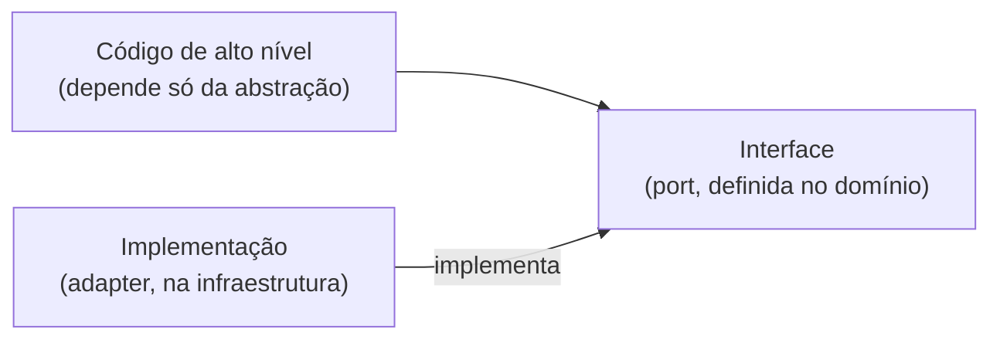
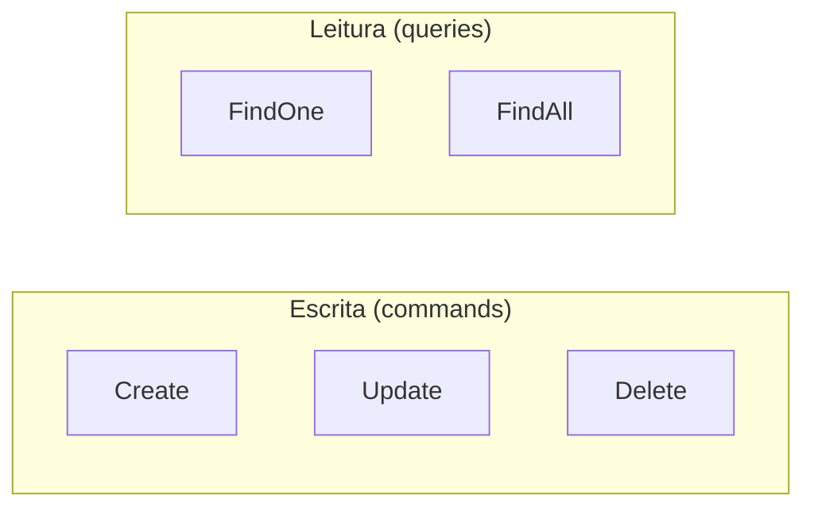

# Arquitetura hexagonal, DDD e CQRS

**TLDR**: arquitetura hexagonal (ports & adapters) isola a lógica de negócio no centro, sem depender de framework ou banco. DDD nomeia os conceitos desse centro (entidade, agregado, linguagem ubíqua). CQRS separa leitura de escrita em handlers distintos. Os três resolvem o mesmo problema geral, cada um por um ângulo diferente.

| Termo | Vá pra |
|---|---|
| Por que separar em camadas | [Arquitetura hexagonal](#arquitetura-hexagonal) |
| Ports, adapters, inversão de dependência | [Ports & adapters](#ports-adapters-e-inversao-de-dependencia) |
| Entidade, agregado, linguagem ubíqua | [Domain-Driven Design](#domain-driven-design) |
| Separar leitura de escrita | [CQRS](#cqrs) |

## Arquitetura hexagonal

**Arquitetura hexagonal** (também chamada *ports & adapters*, termo de Alistair Cockburn) organiza um sistema em camadas concêntricas: a lógica de negócio (domínio) fica no centro e não sabe nada sobre o mundo exterior. Ela define **contratos**, o que precisa existir, sem dizer como. As camadas externas fornecem as **implementações concretas** desses contratos.

O fluxo de dependência aponta sempre para dentro: apresentação depende de aplicação, que depende de domínio. Infraestrutura implementa contratos do domínio, mas o domínio nunca referencia infraestrutura. Se o banco de dados mudar, ou o provedor de autenticação mudar, só a camada de infraestrutura muda. A lógica de negócio permanece intacta.

## Ports, adapters e inversão de dependência

A arquitetura hexagonal se apoia no princípio de **inversão de dependência**: código de alto nível (lógica de negócio) não deve depender de código de baixo nível (banco de dados, frameworks). Ambos dependem de abstrações.

**Port** é o contrato, a interface que o domínio define ("preciso de algo que salve esta entidade"). **Adapter** é a implementação concreta desse contrato ("aqui está um repositório que usa PostgreSQL"). A mesma porta pode ter adapters diferentes conforme o contexto, um de produção, um de teste, sem que o código que consome a porta precise saber qual está em uso.

A diferença entre **inversão de dependência** e **injeção de dependência** é sutil. Inversão de dependência é um princípio de design, quem define a interface e quem implementa. Injeção de dependência é um mecanismo técnico, o container de DI resolve e injeta a implementação certa em tempo de execução. O primeiro é a decisão arquitetural, o segundo é como o framework concretiza essa decisão.

## Domain-Driven Design

**Domain-Driven Design** (DDD) nomeia os conceitos que vivem dentro do domínio de uma arquitetura hexagonal:

- **Entity** (entidade) é um objeto definido por identidade, não por valor. Duas entidades com os mesmos dados ainda são diferentes se têm IDs diferentes. Tem ciclo de vida, criação, carregamento, atualização.
- **Aggregate** (agregado) é um conjunto de entidades tratado como uma unidade de consistência. Toda operação passa pela raiz do agregado, nunca por uma entidade interna isolada.
- **Ubiquitous language** (linguagem ubíqua) é o vocabulário compartilhado entre quem entende o negócio e quem escreve o código. Os nomes de classes e campos refletem os termos que o próprio domínio usa, não uma tradução técnica genérica.
- **Bounded context** (contexto delimitado) é a fronteira onde um modelo de domínio é consistente e tem significado próprio. O mesmo termo pode significar coisas diferentes em contextos diferentes, e isso é esperado, não um erro de modelagem.
- **Anti-Corruption Layer** (ACL) é a camada que traduz entre o modelo de domínio interno e modelos externos (uma resposta de API de terceiro, o formato de uma mensagem de fila), pra que o vocabulário externo não vaze pra dentro do domínio.

## CQRS

**CQRS** (Command Query Responsibility Segregation) é a prática de separar operações de **leitura** (queries) de operações de **escrita** (commands) em handlers distintos, em vez de um único objeto fazer as duas coisas. A separação existe porque leitura e escrita têm necessidades diferentes: escrita precisa validar regra de negócio e manter consistência, leitura só precisa devolver dado, muitas vezes otimizado (cache, projeção, índice específico).

CQRS não exige Event Sourcing nem bancos separados para leitura e escrita, essa é uma evolução possível, não um requisito. A forma mais simples de CQRS, a separação lógica em handlers distintos sobre o mesmo banco, já entrega o benefício principal: cada handler tem uma responsabilidade clara e pode evoluir sem afetar o outro lado.

## Pra ir além

Os três conceitos vêm de fontes diferentes: arquitetura hexagonal foi proposta por Alistair Cockburn em 2005. DDD é o livro homônimo de Eric Evans (2003), que também cunhou os termos entity, aggregate e bounded context. CQRS foi popularizado por Greg Young a partir do trabalho de Bertrand Meyer sobre Command-Query Separation. Nenhum dos três depende dos outros dois, mas combinam bem porque resolvem problemas adjacentes do mesmo domínio, como organizar um sistema pra que a complexidade de negócio não se espalhe pela infraestrutura.
