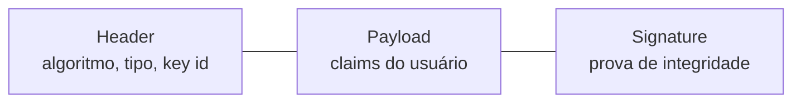
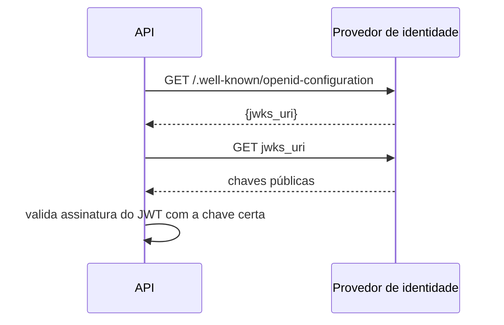
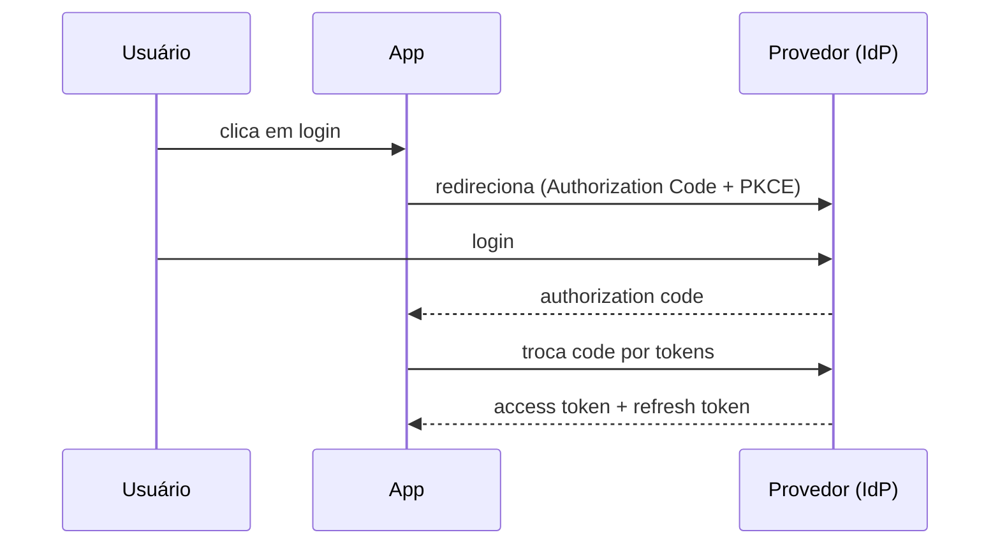

# JWT, JWKS, OAuth2 e OIDC

**TLDR**: JWT é um token auto-contido que carrega quem é o usuário e uma assinatura. JWKS é o endpoint que expõe a chave pública pra verificar essa assinatura. OAuth2 delega autenticação a um provedor externo. OIDC adiciona informação padronizada de usuário sobre o OAuth2.

| Termo | Vá pra |
|---|---|
| O token que carrega identidade | [JWT](#jwt-json-web-token) |
| Como verificar a assinatura do token | [JWKS](#jwks-json-web-key-set) |
| Autenticação delegada a um terceiro | [OAuth2 e OIDC](#oauth2-e-oidc) |

## JWT (JSON Web Token)

Um **JWT** é um token que carrega informação sobre um usuário: quem ele é (claims), quem emitiu (issuer), e uma assinatura que prova que o conteúdo não foi adulterado. É composto de três partes separadas por ponto, `header.payload.signature`.

A vantagem central do JWT é que quem valida não precisa consultar um banco de dados, basta verificar a assinatura com a chave pública do emissor. Isso o diferencia de um **token opaco** (como um session ID), que é só uma referência e exige consulta ao servidor emissor pra validar. O trade-off: um JWT não pode ser revogado instantaneamente, uma vez emitido é válido até expirar. Por isso costuma ter validade curta, e um **refresh token** existe pra obter um novo access token sem exigir novo login.

## JWKS (JSON Web Key Set)

**JWKS** é um endpoint HTTP que expõe as chaves públicas usadas pra verificar assinatura de JWTs emitidos por um provedor. Em vez de configurar a chave manualmente em cada serviço que valida token, cada serviço consulta o JWKS e obtém as chaves atuais automaticamente.

O JWKS permite **rotação de chave** sem downtime: o provedor gera um par novo e passa a assinar com ele, enquanto a chave antiga continua no JWKS pra validar tokens já emitidos. O campo `kid` (key id) no header do JWT indica qual chave foi usada.

## OAuth2 e OIDC

**OAuth2** é um protocolo de autenticação delegada: em vez do usuário informar senha diretamente ao serviço que precisa dela, ele se autentica num provedor confiável, que emite um token de acesso. **OIDC** (OpenID Connect) é uma camada sobre o OAuth2 que padroniza informação de usuário (nome, e-mail) via um **ID Token**.

O OAuth2 define vários **fluxos** (grant types). Pra aplicações web e SPAs, **Authorization Code** com PKCE é o mais seguro, o cliente troca um código temporário por tokens, evitando que o token apareça na URL. **Client Credentials** serve pra comunicação entre serviços (machine-to-machine), sem usuário envolvido. Um serviço que só valida token, sem emiti-lo, é chamado de **Resource Server**.

## Pra ir além

O [RFC 6749](https://www.rfc-editor.org/rfc/rfc6749) define o OAuth2 formalmente. A [especificação OIDC](https://openid.net/specs/openid-connect-core-1_0.html) cobre a camada de identidade sobre ele. Ambos são densos, mas a introdução de cada spec já cobre o vocabulário essencial sem exigir ler o documento inteiro.
