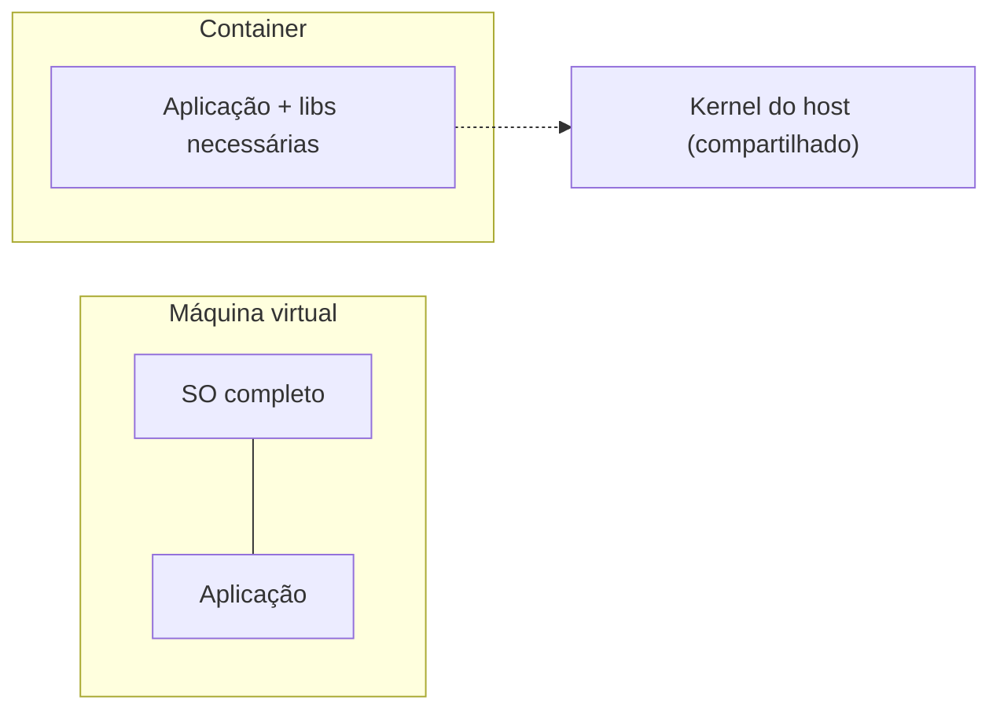

# Containers e Docker

**TLDR**: um container empacota uma aplicação com só as dependências que ela precisa, compartilhando o kernel do sistema host, o que o torna muito mais leve que uma máquina virtual. Docker Compose orquestra vários containers a partir de um arquivo de configuração.

## Container vs. máquina virtual

Um **container** inclui um sistema mínimo junto com as ferramentas e bibliotecas que uma aplicação precisa pra rodar, mas compartilha o kernel do sistema operacional host. Uma **máquina virtual** (VM) carrega um sistema operacional completo próprio, incluindo o kernel, o que a torna mais pesada e mais lenta pra iniciar.

## Docker Compose

**Docker Compose** orquestra múltiplos containers a partir de um único arquivo de configuração, útil quando uma aplicação precisa de vários serviços coordenados (a própria aplicação, um banco de dados, uma fila).

Dois mecanismos que aparecem em qualquer configuração de Compose:

- **Bind mount**: mapeia um diretório do host diretamente pra dentro do container. Qualquer alteração de um lado aparece do outro lado, imediatamente, sem reconstruir o container. É o que permite editar código no host e ver o efeito rodando dentro do container.
- **Port forwarding**: redireciona tráfego de rede de uma porta do host pra uma porta do container, permitindo acessar um serviço rodando dentro do container por uma porta local da máquina.
- **Named volume**: persiste dado entre reinicializações do container. Sem ele, um banco de dados rodando em container seria zerado toda vez que o container reiniciasse.

## Pra ir além

A [documentação oficial do Docker](https://docs.docker.com/get-started/) cobre os conceitos de imagem, container e Compose com exemplo prático. Pra entender exatamente por que containers são mais leves, o artigo [Namespaces e cgroups do kernel Linux](https://www.redhat.com/en/topics/containers/whats-a-linux-container) explica o mecanismo por trás do isolamento sem precisar de um kernel próprio por container.
