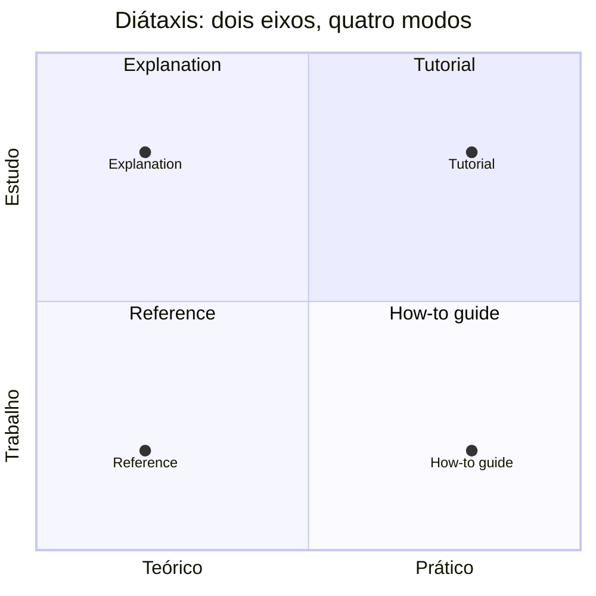
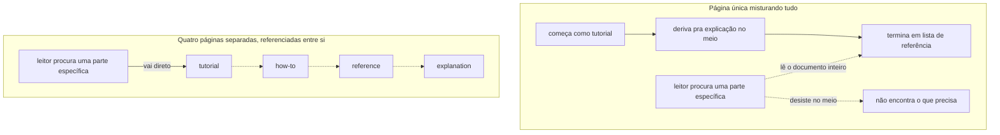

# Diátaxis

**TLDR**: quatro tipos de documentação técnica, um por combinação de estudo/trabalho e prático/teórico (tutorial, how-to, reference, explanation), cada um num lugar próprio em vez de tudo misturado na mesma página.

| Termo | Vá pra |
|---|---|
| Os quatro modos | [Duas perguntas, quatro modos](#duas-perguntas-quatro-modos) |
| Página que tenta ser tudo | [O erro mais comum](#o-erro-mais-comum-que-o-framework-nomeia) |
| Quem já adota | [Quem adota](#quem-adota) |

Diátaxis é um framework pra organizar documentação técnica em quatro tipos distintos, criado por Daniele Procida a partir de anos observando o mesmo padrão de confusão se repetir: uma página tenta ensinar um conceito, mostrar uma tarefa e servir de referência de fato ao mesmo tempo, e acaba fazendo as três coisas mal, porque quem lê um tutorial pela primeira vez precisa de algo bem diferente de quem já sabe o básico e só quer confirmar um parâmetro.

## Duas perguntas, quatro modos

O framework nasce de cruzar dois eixos independentes. O primeiro é sobre o momento do leitor: está **estudando** (adquirindo conhecimento novo) ou está **trabalhando** (aplicando conhecimento que já tem, pra resolver algo agora)? O segundo é sobre o tipo de conteúdo: é **prático** (ação, passo, comando) ou **teórico** (conceito, contexto, porquê)?

Cruzando os dois: **tutorial** é estudo mais prático, uma lição guiada, passo a passo, pra quem nunca fez aquilo antes e precisa de uma vitória concreta no fim. **How-to guide** é trabalho mais prático, uma receita pra uma tarefa específica, escrita assumindo que quem lê já sabe o básico e só quer o caminho mais direto. **Reference** é trabalho mais teórico, fato puro, sem opinião nem narrativa, organizado pra busca rápida, não pra leitura do início ao fim. **Explanation** é estudo mais teórico, contexto e raciocínio, o porquê por trás de uma decisão ou de como algo funciona, sem instrução nenhuma misturada.

Os dois eixos são contínuos e independentes, não uma árvore de decisão, o motivo pelo qual um `quadrantChart` (mermaid) representa a ideia com mais fidelidade que um `flowchart` com `subgraph` (a aproximação mais comum em diagrama de processo, usada no resto deste site, ver [Diagramas](../operacao/desenvolvimento.md#diagramas-qual-tipo-mermaid-pra-qual-proposito)):

## O erro mais comum que o framework nomeia

O sintoma que motivou o framework, segundo o próprio Procida, é a página que tenta ser tudo ao mesmo tempo: começa como tutorial, deriva pra explicação de conceito no meio, termina com uma lista de parâmetros de referência. Cada leitor lê o documento inteiro procurando a parte que serve pra ele, e a maioria desiste no meio. Separar os quatro modos em lugares diferentes do site, mesmo que se referenciando entre si, resolve isso sem exigir escrever mais conteúdo, só reorganizar o que já existe pelo tipo de necessidade que atende.

## Quem adota

Canonical (a empresa por trás do Ubuntu) reestruturou toda a documentação técnica ao redor dos quatro modos e documentou publicamente o processo. Django, Ansible e boa parte dos projetos que passam pela comunidade Write the Docs citam Diátaxis como referência direta de estrutura. Não é uma ferramenta nem um gerador de site, é só um jeito de pensar sobre organização de conteúdo, aplicável em cima de qualquer tooling de [documentação como código](documentacao-como-codigo.md).

## Pra ir além

A antítese de Diátaxis é a wiki de página única por tópico, onde tutorial, how-to, referência e explicação de um mesmo assunto vivem todos na mesma página, na ordem em que alguém foi lembrando de escrever. Funciona em documentação pequena o bastante pra uma pessoa manter tudo na cabeça, mas degrada rápido assim que o conteúdo cresce, porque não existe convenção nenhuma dizendo onde uma informação nova deveria entrar, cada contribuição nova só aumenta a mistura.

## Cheatsheet

| Modo | Eixo | Serve pra |
|---|---|---|
| Tutorial | Estudo + prático | Lição guiada, primeira vez |
| How-to guide | Trabalho + prático | Receita direta, quem já sabe o básico |
| Reference | Trabalho + teórico | Fato puro, busca rápida |
| Explanation | Estudo + teórico | Contexto e porquê |

Onde aprofundar: o site oficial, [diataxis.fr](https://diataxis.fr/), é curto, sem tooling nenhum embutido, e explica o framework inteiro em texto corrido. O [relato da Canonical sobre adotar Diátaxis](https://ubuntu.com/blog/diataxis-a-new-foundation-for-canonical-documentation) mostra o processo real de reorganizar uma base de documentação grande e já existente, não um projeto começado do zero já organizado assim.
