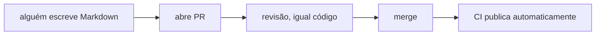
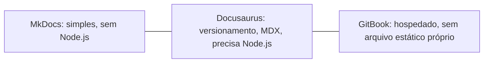

# Documentação como código

Docs-as-code é tratar documentação com o mesmo fluxo de trabalho de código: Markdown versionado em Git, revisado por PR, publicado automaticamente por CI, em vez de wiki editada direto no navegador, sem revisão nem histórico real.

## As três opções mais citadas

MkDocs é a opção mais simples das três: lê um `mkdocs.yml`, converte Markdown pra HTML, gera um site estático leve, sem framework JavaScript nem Node.js envolvido, instala com `pip` e roda localmente em menos de um minuto. Docusaurus é mais rico: suporta versionamento de documentação lado a lado (útil pra biblioteca com múltiplas versões suportadas ao mesmo tempo) e MDX (Markdown com componente React embutido), à custa de precisar de um pipeline de build em Node.js. GitBook é o oposto dos outros dois: uma plataforma hospedada, com editor colaborativo, sem gerar arquivo estático nenhum pra você hospedar sozinho, boa pra time com gente não-técnica editando, ruim pra quem quer os arquivos versionados no próprio Git como fonte única.

## Pra ir além

A antítese de docs-as-code é wiki tradicional (Confluence, um wiki interno), edição direta, sem revisão obrigatória nem histórico de verdade (a maioria tem "histórico de versão", mas não integrado ao mesmo fluxo de revisão do código). Funciona bem quando quem escreve documentação não é a mesma pessoa que escreve código e não quer lidar com Git, mas perde a garantia de que a documentação e o código evoluem juntos, revisados no mesmo PR.

Onde aprofundar: a comparação completa em [MkDocs vs Docusaurus vs GitBook](https://blog.markdowntools.com/posts/mkdocs-vs-docusaurus-vs-gitbook) cobre os três casos de uso onde cada ferramenta faz mais sentido, com mais detalhe do que cabe aqui.

Docs-as-code resolve só a camada de tooling e fluxo de revisão, como o conteúdo chega versionado e revisado. Não diz nada sobre como organizar o conteúdo em si, categoria diferente de problema coberta por [Diátaxis](diataxis.md).
