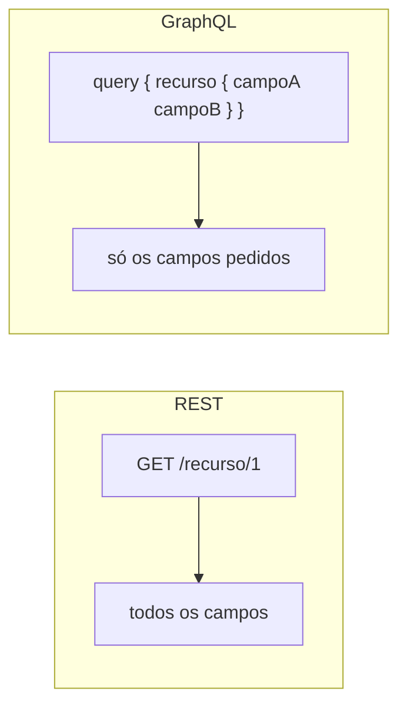
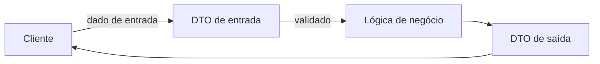

# REST, GraphQL e DTO

**TLDR**: REST expõe um endereço fixo por recurso, e o servidor decide o que vem na resposta. GraphQL deixa o cliente pedir exatamente os campos que quer, numa única requisição. DTO é o objeto que transporta dado entre camadas, sem lógica de negócio.

| Termo | Vá pra |
|---|---|
| Endereço fixo, verbo HTTP | [REST](#rest) |
| Cliente escolhe os campos | [GraphQL](#graphql) |
| O objeto que só transporta dado | [DTO](#dto-data-transfer-object) |

## REST

**REST** (Representational State Transfer) é um estilo de API onde cada recurso tem um endereço fixo (URL), e as operações são mapeadas para verbos HTTP: `GET` para ler, `POST` para criar, `PATCH`/`PUT` para atualizar, `DELETE` para excluir. A resposta traz todos os campos do recurso, mesmo os que o cliente não precisa naquele momento.

## GraphQL

**GraphQL** é uma linguagem de consulta onde o cliente especifica exatamente quais campos quer, e recebe só isso. Se um front-end precisa de dado de três recursos relacionados, uma API REST exige três requisições, uma API GraphQL responde tudo numa única requisição, com a forma exata que o cliente pediu.

Em GraphQL, **query** é leitura (equivalente a `GET`) e **mutation** é escrita (equivalente a `POST`/`PUT`/`DELETE`). Duas abordagens comuns de gerar o schema: **schema-first**, onde o schema é escrito à mão num arquivo `.graphql` e o código é gerado a partir dele, e **code-first**, onde o schema é gerado automaticamente a partir de classes decoradas na linguagem do próprio backend.

O trade-off entre manter as duas interfaces (REST e GraphQL) ao mesmo tempo é overhead de código (duas camadas de apresentação, dois conjuntos de DTOs) em troca de servir dois perfis de consumidor diferentes: integrações simples com documentação automática (REST) e front-ends com necessidade de consulta composta e flexível (GraphQL).

## DTO (Data Transfer Object)

Um **DTO** é um objeto que existe só pra transportar dados entre camadas, sem lógica de negócio embutida. Ele define quais campos existem e (geralmente) sua validação, mas não processa nada. A separação comum é entre DTO de **entrada** (o que o cliente envia) e DTO de **saída** (o que a API retorna), já que o formato enviado raramente é idêntico ao formato retornado, uma criação costuma receber poucos campos e devolver o recurso completo.

## Pra ir além

O [site oficial do GraphQL](https://graphql.org/learn/) cobre a linguagem de consulta em si, independente de qualquer framework de servidor. Pra REST, o artigo de referência é a própria tese de doutorado de Roy Fielding (2000), que cunhou o termo e formalizou as restrições que definem o estilo.
