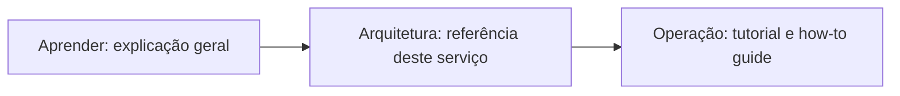

# Aprender

Esta seção é **explicação**, no sentido de [Diátaxis](diataxis.md): contexto e raciocínio, sem instrução nenhuma misturada, sem fato específico deste serviço. Se você já conhece os conceitos abaixo, pule direto pra [Arquitetura](../arquitetura/index.md), que mostra como este serviço real os usa, ou pra [Operação](../operacao/index.md), o roteiro executável.

| Se você precisa entender | Vá pra |
|---|---|
| Por que o código é organizado em camadas, e o vocabulário de DDD/CQRS | [Arquitetura hexagonal, DDD e CQRS](arquitetura-hexagonal.md) |
| Module, Controller, Provider, e a esteira que toda requisição atravessa | [NestJS](nestjs.md) |
| Como um objeto de código vira linha de tabela, migração, soft delete, transação | [ORM, migrações e transações](orm-e-banco-de-dados.md) |
| JWT, JWKS, OAuth2 e OIDC | [Autenticação](autenticacao.md) |
| REST, GraphQL e o objeto que só transporta dado | [REST, GraphQL e DTO](graphql-e-rest.md) |
| Fila de mensagens entre serviços, RPC vs. fire-and-forget | [Message broker](message-broker.md) |
| Container vs. máquina virtual, bind mount, Docker Compose | [Containers e Docker](containers.md) |
| Os quatro tipos de documentação técnica, e por que misturá-los confunde o leitor | [Diátaxis](diataxis.md) |
| Documentação versionada e revisada como código, em vez de wiki solto | [Documentação como código](documentacao-como-codigo.md) |
| Origem das regras de redação adotadas neste site (ISO, ABNT, Acordo Ortográfico) | [Normas de redação técnica](normas-de-redacao-tecnica.md) |

## Como esta seção foi montada

As sete primeiras páginas acima vieram da migração do `README.md` deste repositório (4298 linhas, antes desta iniciativa): cada trecho que explicava um conceito de forma genérica, sem depender de nenhuma decisão real deste serviço, foi reescrito em terceira pessoa impessoal e movido pra cá. O que sobrou no `README.md`, fato específico deste serviço (qual ORM, qual framework de autenticação, como os módulos estão organizados), foi pra [Arquitetura](../arquitetura/index.md). O passo a passo de setup e contribuição foi pra [Operação](../operacao/index.md).
