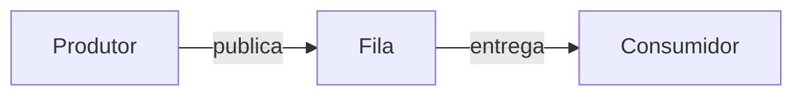
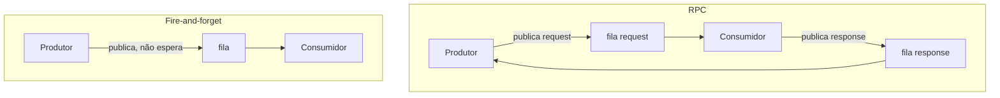

# Message broker

**TLDR**: um message broker é um intermediário de mensagens assíncronas entre serviços, o equivalente a uma caixa postal, o serviço que envia e o que recebe não precisam estar online ao mesmo tempo.

Um **message broker** desacopla quem produz uma mensagem de quem consome. O produtor deposita a mensagem numa fila, o consumidor retira quando estiver pronto para processá-la.

Dois padrões comuns de uso:

- **RPC** (request/response): o produtor publica uma mensagem de requisição numa fila e espera uma resposta numa fila separada, geralmente com timeout.
- **Fire-and-forget**: o produtor publica e segue em frente, sem esperar confirmação nem resposta.

O ganho principal de um message broker é **resiliência a indisponibilidade temporária**: se o consumidor está fora do ar, a mensagem espera na fila em vez de se perder, e é entregue quando o consumidor volta. O trade-off é consistência eventual em vez de imediata, e a necessidade de operar mais um componente de infraestrutura.

## Pra ir além

O [tutorial oficial do RabbitMQ](https://www.rabbitmq.com/tutorials) cobre os padrões de troca de mensagem (fila simples, publish/subscribe, roteamento, RPC) com exemplo executável em várias linguagens, sem depender de nenhum framework de aplicação específico.
