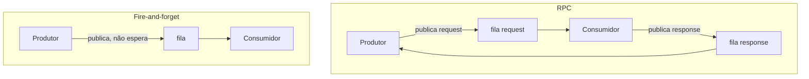

# Message broker

**TLDR**: o conceito geral de message broker, e a comparação entre RabbitMQ/Kafka/NATS, já está explicado em detalhe na documentação da [infrastructure](https://ladesa-ro.github.io/infrastructure/aprender/mensageria/). Esta página cobre só um ângulo que aquela não cobre: os dois padrões de uso, RPC e fire-and-forget.

## RPC vs. fire-and-forget

Dois padrões comuns de uso de um message broker, independente de qual ferramenta (RabbitMQ, Kafka, NATS):

- **RPC** (request/response): o produtor publica uma mensagem de requisição numa fila e espera uma resposta numa fila separada, geralmente com timeout.
- **Fire-and-forget**: o produtor publica e segue em frente, sem esperar confirmação nem resposta.

RPC serve quando quem publica precisa do resultado antes de continuar. Fire-and-forget serve quando o produtor só precisa garantir que a mensagem foi entregue, sem depender do resultado do processamento pra seguir em frente.

## Pra ir além

[Mensageria e streaming](https://ladesa-ro.github.io/infrastructure/aprender/mensageria/), na documentação da infrastructure, cobre o conceito geral de message broker e compara RabbitMQ, Kafka e NATS. O [tutorial oficial do RabbitMQ](https://www.rabbitmq.com/tutorials) cobre os padrões de troca de mensagem com exemplo executável em várias linguagens.
