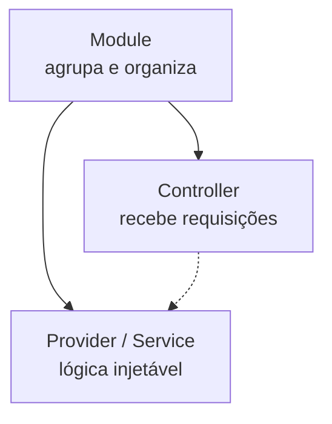
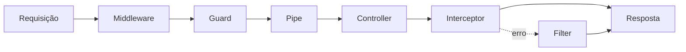

# NestJS

**TLDR**: NestJS é um framework Node.js/TypeScript que organiza a aplicação em módulos, controllers e providers, e processa toda requisição por uma esteira fixa de etapas (middleware, guard, pipe, controller, interceptor, filter).

| Termo | Vá pra |
|---|---|
| Module, Controller, Provider, Resolver | [Building blocks](#building-blocks) |
| A esteira que toda requisição atravessa | [Pipeline de uma requisição](#pipeline-de-uma-requisicao) |
| Como o framework resolve dependências | [Dependency injection](#dependency-injection) |

NestJS é um framework para construir aplicações server-side em TypeScript. Ele fornece uma estrutura opinada pra organizar código, gerenciar dependências e lidar com requisições HTTP e GraphQL, na mesma linha de frameworks como Spring (Java) ou Django (Python): convenção sobre configuração, decorators pra declarar intenção, um container de injeção de dependência central.

## Building blocks

| Conceito | O que é |
|---|---|
| **Module** | Unidade organizacional que agrupa controllers e providers. Toda aplicação NestJS tem um module raiz que importa os demais. |
| **Controller** | Classe que recebe requisições HTTP e delega pra providers, via decorators como `@Controller()`, `@Get()`, `@Post()`, `@Body()`, `@Param()`. |
| **Provider** | Qualquer classe injetável no container de DI: services, repositórios, handlers, configs. |
| **Resolver** | O equivalente do controller pra GraphQL, com `@Resolver()`, `@Query()`, `@Mutation()`. |

## Pipeline de uma requisição

Uma requisição não vai direto ao controller, ela passa por uma esteira de etapas, cada uma com um papel específico:

- **Middleware** executa antes de tudo, pode modificar requisição ou resposta.
- **Guard** decide se a requisição pode prosseguir, é onde autenticação e autorização de rota acontecem.
- **Pipe** transforma e valida os dados de entrada.
- **Interceptor** envolve a execução do handler, atua antes e depois da lógica principal.
- **Filter** captura erro lançado em qualquer etapa e formata uma resposta padronizada.

## Dependency injection

**Dependency injection** (DI, injeção de dependência) é um padrão onde uma classe não cria suas próprias dependências, ela declara "preciso de X" e o framework fornece X automaticamente, resolvido via constructor. Isso é o que torna a inversão de dependência da [arquitetura hexagonal](arquitetura-hexagonal.md) viável na prática: o código de alto nível declara o contrato que precisa, o container resolve qual implementação concreta entregar.

O NestJS usa **tokens de injeção** pra saber qual implementação entregar quando o contrato é uma interface TypeScript (que não existe mais em tempo de execução, já que TypeScript compila pra JavaScript puro). Um token pode ser uma classe, uma string, ou um `Symbol`, esse último é útil justamente porque garante um identificador único sem colisão de nome.

## Pra ir além

A [documentação oficial do NestJS](https://docs.nestjs.com) cobre os building blocks e o pipeline de requisição em detalhe, incluindo os pontos de extensão (custom decorators, exception filters, custom pipes) que um projeto real geralmente precisa além do básico.
