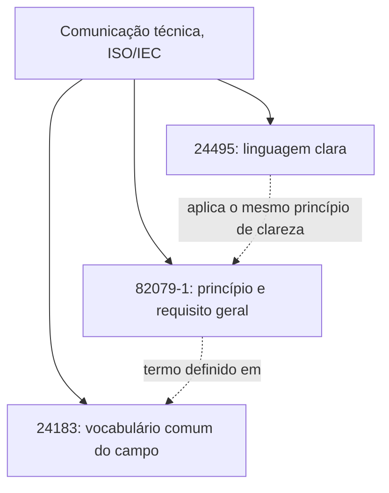
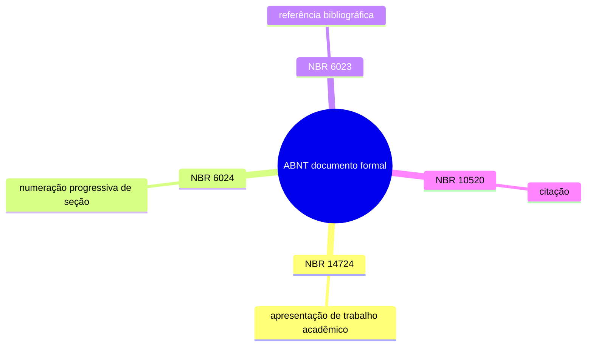

# Normas de redação técnica

**TLDR**: três camadas diferentes, três respostas diferentes. Comunicação técnica em geral (ISO/IEC 82079-1, 24183, 24495) é universal entre idioma, princípio a aproveitar, não conformidade a auditar. Documento acadêmico brasileiro (ABNT NBR 14724, 6024, 6023, 10520) tem escopo declarado que não é o de doc de software. Ortografia e gramática do português (Acordo Ortográfico) não é opcional, é a camada que qualquer texto em português já segue, adotada ou não.

| Termo | Vá pra |
|---|---|
| Princípio, vocabulário, linguagem clara | [A família ISO/IEC de comunicação técnica](#a-familia-isoiec-de-comunicacao-tecnica) |
| Formatação de trabalho acadêmico brasileiro | [ABNT: normas de documento formal](#abnt-normas-de-documento-formal) |
| A camada que não é opcional | [Norma linguística: o Acordo Ortográfico](#norma-linguistica-o-acordo-ortografico) |
| Por que as duas primeiras não viram norma literal de doc de software | [Princípio como inspiração, não como conformidade](#principio-como-inspiracao-nao-como-conformidade) |
| Uma ideia cogitada, sem aplicação hoje | [Matriz bilíngue, uma ideia pra quando houver doc em inglês](#matriz-bilingue-uma-ideia-pra-quando-houver-doc-em-ingles) |

## A família ISO/IEC de comunicação técnica

Três normas, cada uma resolvendo um problema diferente do mesmo domínio, publicadas em anos diferentes e com escopo que se completa:

**IEC/IEEE 82079-1** (edição 2 de 2019, "Preparation of information for use") é a norma mais antiga e mais abrangente das três: princípios e requisito geral pra preparar informação de uso de qualquer produto, de uma lata de tinta a uma planta industrial complexa, cobrindo conteúdo, estrutura, qualidade, processo, mídia e formato. Nasceu de instrução de produto físico (por isso o nome, "instructions for use"), mas os princípios de análise de audiência e estrutura por tarefa se aplicam igual a documentação de software.

**ISO 24183** (2024, "Technical communication: Vocabulary") resolve um problema diferente: define o vocabulário comum do campo de comunicação técnica, a base terminológica que as outras normas do campo assumem. Publicada depois da 82079-1, com uma diferença de escopo notável: a 24183 não amarra mais o termo "information for use" ao conceito de segurança do produto, limita esse termo ao processo de gestão de informação em si, uma definição mais estreita que a da 82079-1.

**ISO 24495-1** (2023, "Plain language, Part 1: Governing principles and guidelines") é a mais recente e a mais diretamente aplicável a prosa técnica comum: princípios pra escrever documento que qualquer leitor do público-alvo consegue achar, entender, usar e avaliar, resumidos em quatro pilares (relevância, encontrabilidade, compreensão, usabilidade). Desenvolvida com especialista de 25 países e 19 idiomas, deliberadamente agnóstica de idioma e domínio. A parte 2 (2025) estende o mesmo princípio pra comunicação jurídica especificamente.

## ABNT: normas de documento formal

Quatro normas brasileiras, todas reais, todas com escopo formal/acadêmico explícito no próprio texto da norma:

- **NBR 14724**: apresentação de trabalho acadêmico (monografia, dissertação, tese), incluindo elemento obrigatório como folha de rosto e margem específica.
- **NBR 6024**: numeração progressiva de seção de documento (o padrão `1`, `1.1`, `1.1.2`).
- **NBR 6023**: referência bibliográfica.
- **NBR 10520**: citação em documento.

## Norma linguística: o Acordo Ortográfico

As duas famílias acima resolvem organização e princípio de comunicação, nenhuma das duas dita como escrever português corretamente. Essa terceira camada, mais básica que as outras duas e não opcional do mesmo jeito, vem do **Acordo Ortográfico da Língua Portuguesa** (1990, em vigor no Brasil desde 2016): ortografia, acentuação, uso de hífen, unificados entre os países de língua portuguesa. Um texto técnico em português segue essa norma pelo simples fato de estar escrito em português correto, do mesmo jeito que um texto em inglês segue a ortografia de um dicionário de referência (americano ou britânico, a decisão que qualquer style guide em inglês precisa tomar e nenhum dos sete consolidados em [Linha editorial](../operacao/desenvolvimento.md#linha-editorial) escapa de declarar). A diferença pras duas famílias anteriores: não existe "adotar ou descartar" o Acordo Ortográfico, só existe "escrever certo ou errado" segundo ele.

## Princípio como inspiração, não como conformidade

Nenhuma norma acima costuma virar a regra literal de um repositório de documentação de software, por dois motivos diferentes, um pra cada família.

A família ISO/IEC de comunicação técnica é abrangente demais pra conformidade literal valer a pena fora de contexto regulado: 82079-1 pede estrutura obrigatória por tipo de conteúdo e declaração de risco pensada pra manual de produto físico, não pra README versionado em Git. O que se aproveita são os princípios (análise de audiência, estrutura por tarefa, as quatro pilastras de linguagem clara da 24495), não a auditoria de conformidade formal contra o texto da norma.

A família ABNT tem um motivo diferente pra não se aplicar direto: o escopo declarado da norma já é acadêmico (tese, monografia, trabalho científico), não documentação técnica de produto de software. Aplicar numeração progressiva estilo `1.1.2` a uma doc que já usa um sumário por âncora de heading (o que qualquer gerador de site de documentação moderno faz) não reforça organização nenhuma, duplica um trabalho que a ferramenta já faz de outro jeito.

## Matriz bilíngue, uma ideia pra quando houver doc em inglês

Uma ideia adjacente a essas normas, ainda sem repositório de destino: um guia de estilo interno organizado como matriz, uma coluna português e uma inglês, mostrando o que muda e o que não muda entre os dois quando a mesma organização mantém documentação nos dois idiomas. O que tende a não mudar: voz ativa, título no imperativo, sentence case em heading, estrutura por tarefa. O que tende a mudar: uso de contração (recurso do inglês sem equivalente direto em português, já discutido em [Linha editorial](../operacao/desenvolvimento.md#linha-editorial)), convenção de número e data, anglicismo aceito num idioma e estranho no outro, e a própria decisão de dicionário de referência (inglês americano vs. britânico) que esse Acordo Ortográfico já resolve pro lado português. Vale a pena registrar a ideia, não vale a pena construir a matriz agora: nenhum repositório deste ecossistema mantém documentação em inglês hoje.

## Pra ir além

- [IEEE SA, 82079-1](https://standards.ieee.org/ieee/82079-1/7219/): página oficial da edição 2019.
- [ISO, 24183:2024](https://www.iso.org/standard/78009.html): página oficial do catálogo.
- [ISO, 24495-1:2023](https://www.iso.org/standard/78907.html): página oficial do catálogo, com link pro texto completo via ISO OBP.
- [International Plain Language Federation](https://www.iplfederation.org/iso-standard/): contexto de como a 24495 foi negociada entre 25 países.
