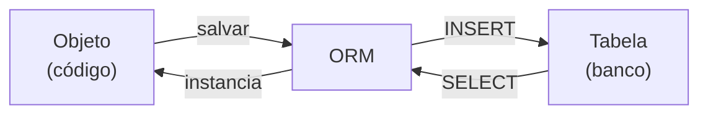
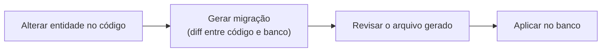
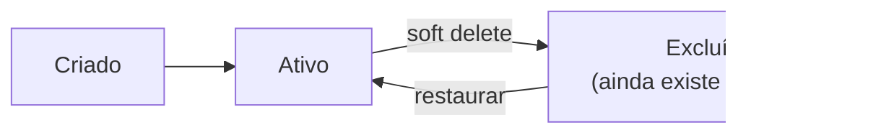
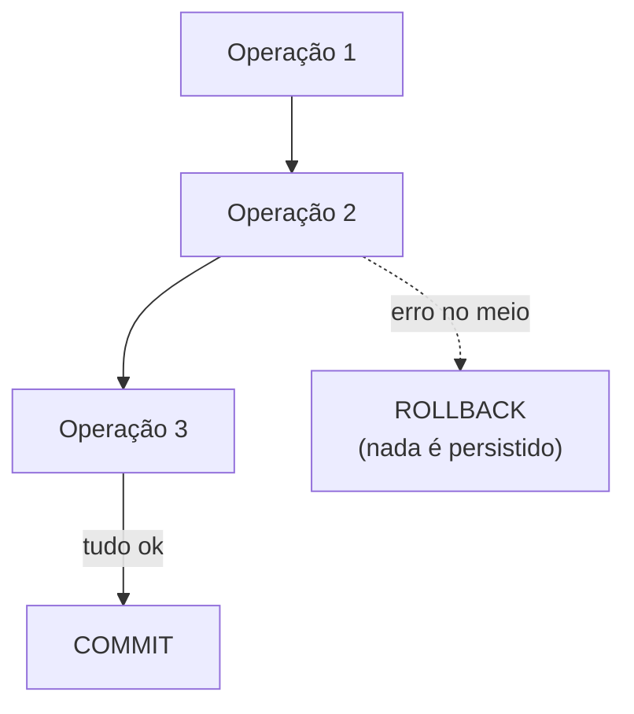

# ORM, migrações e transações

**TLDR**: um ORM traduz objetos de código para linhas de tabela. Migrações versionam a estrutura do banco como o Git versiona código. Soft delete marca um registro como excluído sem apagá-lo fisicamente. ACID são as quatro garantias de uma transação.

| Termo | Vá pra |
|---|---|
| Objeto vira linha de tabela | [ORM](#orm-object-relational-mapping) |
| Estrutura do banco versionada | [Migrações](#migracoes) |
| Excluir sem apagar | [Soft delete](#soft-delete) |
| As quatro garantias de uma transação | [ACID e transações](#acid-e-transacoes) |

## ORM (Object-Relational Mapping)

Um **ORM** é uma ferramenta que faz a ponte entre objetos de código e tabelas de um banco de dados relacional. Em vez de escrever SQL manualmente, o código manipula objetos e o ORM traduz para `INSERT`/`SELECT`/`UPDATE`.

Um ORM pode operar em dois modos de sincronização de schema: **automático**, onde ele altera a estrutura do banco pra bater com as entidades do código sempre que detecta diferença, e **manual**, onde toda alteração de schema passa por uma migração explícita, revisável antes de aplicar. O modo automático é conveniente em protótipo, mas arriscado em produção, uma sincronização automática pode apagar coluna ou alterar tipo de forma inesperada. O modo manual troca conveniência por previsibilidade.

## Migrações

**Migrações** são scripts que alteram a estrutura de um banco de dados de forma versionada e reproduzível, o equivalente de "Git para o schema do banco". Cada alteração fica registrada num arquivo com timestamp, pode ser aplicada (`up`) ou revertida (`down`), e o banco mantém registro de quais migrações já rodaram.

## Soft delete

**Soft delete** (exclusão lógica) significa que "excluir" um registro não o remove fisicamente, apenas marca uma data ou flag de exclusão. O registro fica invisível pra consultas normais, mas continua recuperável.

O trade-off do soft delete é espaço e complexidade de query (toda consulta de listagem precisa filtrar os excluídos) em troca de auditoria e reversibilidade. É a escolha padrão em sistemas onde perder um registro por engano tem custo alto.

## ACID e transações

Uma **transação** agrupa várias operações de banco numa unidade atômica, ou todas acontecem, ou nenhuma. **ACID** são as quatro garantias que uma transação bem implementada oferece:

- **Atomicidade**: tudo ou nada.
- **Consistência**: o banco nunca fica em estado inválido entre o início e o fim.
- **Isolamento**: transações concorrentes não interferem uma na outra.
- **Durabilidade**: depois do commit, o dado sobrevive a uma queda do sistema.

## Pra ir além

Cada um desses quatro conceitos tem literatura própria bem mais funda que o resumo acima: o paper original de Jim Gray sobre transações (1981) fundamenta ACID, e a documentação de qualquer ORM maduro (TypeORM, Prisma, Sequelize) detalha as opções reais de estratégia de migração e os trade-offs de cada uma.
