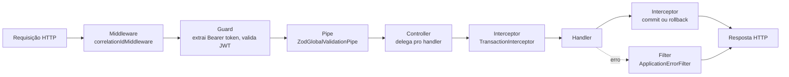
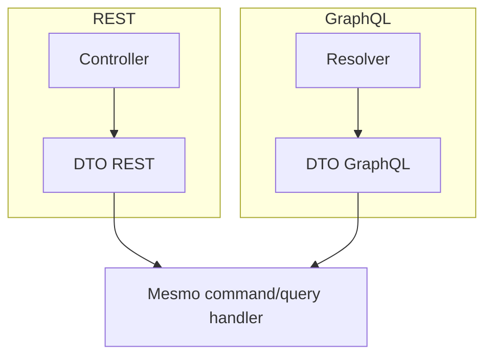

# APIs REST e GraphQL

**TLDR**: REST e GraphQL reutilizam os mesmos command/query handlers, só a camada de apresentação é duplicada. Pipeline HTTP real: middleware de correlation id, guard que extrai o ator autenticado, `ZodGlobalValidationPipe`, controller, `TransactionInterceptor`, `ApplicationErrorFilter`. GraphQL é Apollo Server v5, code-first. Os conceitos gerais (REST, GraphQL, DTO) estão em [REST, GraphQL e DTO](../aprender/graphql-e-rest.md).

| Termo | Vá pra |
|---|---|
| A esteira real de uma requisição HTTP | [Pipeline de uma requisição](#pipeline-de-uma-requisicao) |
| Validação automática de DTO | [ZodGlobalValidationPipe](#zodglobalvalidationpipe) |
| Erro de domínio para status HTTP | [ApplicationErrorFilter](#applicationerrorfilter) |
| Configuração do Apollo Server, code-first | [GraphQL](#graphql) |
| Quais módulos têm GraphQL | [Módulos com GraphQL vs. apenas REST](#modulos-com-graphql-vs-apenas-rest) |

## Pipeline de uma requisição



| Etapa | Implementação real |
|---|---|
| Middleware | `correlationIdMiddleware`, gera ID único por requisição pra rastreamento em log (`src/infrastructure.logging/`) |
| Guard | Valida Bearer token via JWKS (ou mock token em dev), popula `RequestActor` (`src/server/nest/auth/`), ver [Autenticação e autorização](autenticacao-e-autorizacao.md) |
| Pipe | `ZodGlobalValidationPipe`, valida body contra `static schema` do DTO |
| Controller | Extrai o ator (`@AccessContextHttp()`), delega pro handler |
| Interceptor | `TransactionInterceptor`, abre transação antes do handler, commit/rollback depois, ver [Banco de dados e transações](banco-de-dados-e-transacoes.md#transacao-automatica) |
| Filter | `ApplicationErrorFilter`, converte erro de domínio/aplicação em resposta HTTP |

## ZodGlobalValidationPipe

```typescript
export class ZodGlobalValidationPipe implements PipeTransform {
  transform(value: unknown, metadata: ArgumentMetadata) {
    const metatype = metadata.metatype;
    if (!hasSchema(metatype)) return value;
    const result = metatype.schema.safeParse(value);
    if (!result.success) {
      throw new BadRequestException(
        result.error.issues.map((issue) => ({ field: issue.path.join("."), message: issue.message })),
      );
    }
    return result.data;
  }
}
```

Se o DTO não declara `static schema`, o pipe deixa o valor passar sem validar.

## ApplicationErrorFilter

```typescript
@Catch(ApplicationError, DomainError)
export class ApplicationErrorFilter implements ExceptionFilter {
  catch(exception: ApplicationError | DomainError, host: ArgumentsHost) {
    const errorResponse = buildHttpErrorResponse(exception, request.url);
    response.status(errorResponse.statusCode).json(errorResponse);
  }
}
```

| Código do erro | HTTP status |
|---|---|
| `APP.RESOURCE_NOT_FOUND` | 404 |
| `APP.FORBIDDEN` | 403 |
| `APP.UNAUTHORIZED` | 401 |
| `APP.VALIDATION` | 422 |
| `APP.CONFLICT` | 409 |
| `APP.INTERNAL` | 500 |
| `APP.SERVICE_UNAVAILABLE` | 503 |
| `DOMAIN.ENTITY_VALIDATION` | 422 |
| `DOMAIN.BUSINESS_RULE_VIOLATION` | 422 |

## GraphQL

Apollo Server v5.4 com driver NestJS, endpoint `/api/graphql`, GraphiQL habilitado em desenvolvimento, cache LRU (100 MB, TTL de 5 minutos), schema **code-first** (`autoSchemaFile: true`, gerado a partir de classes `@ObjectType()`/`@Field()`, sem arquivo `.graphql` escrito à mão).



Resolvers (`presentation.graphql/`) reutilizam os mesmos command/query handlers da API REST, a lógica de negócio, validação e autorização são idênticas nos dois protocolos. O projeto **não** usa DataLoader pra resolver o problema N+1 do GraphQL, queries que buscam relação fazem `JOIN` no repositório TypeORM, relations declaradas no `paginateConfig` de cada repositório.

## Módulos com GraphQL vs. apenas REST

18 módulos têm REST e GraphQL: `campus`, `bloco`, `ambiente`, `usuario`, `perfil`, `curso`, `disciplina`, `turma`, `diario`, `modalidade`, `nivel-formacao`, `oferta-formacao`, `estado`, `cidade`, `endereco`, `calendario-letivo`, `empresa`, `imagem-arquivo`. Só REST: `autenticacao` (login, refresh), `arquivo` (upload), `estagiario`/`estagio`/`responsavel-empresa`, `gerar-horario`/`horario-edicao`/`horario-consulta`, `relatorio`/`notificacao`.

Importação em lote: o módulo de usuário expõe `POST /usuarios/importar/csv` (`multipart/form-data`), criando usuário com o campo `E-mail Pessoal`, sem exigir senha inicial.
