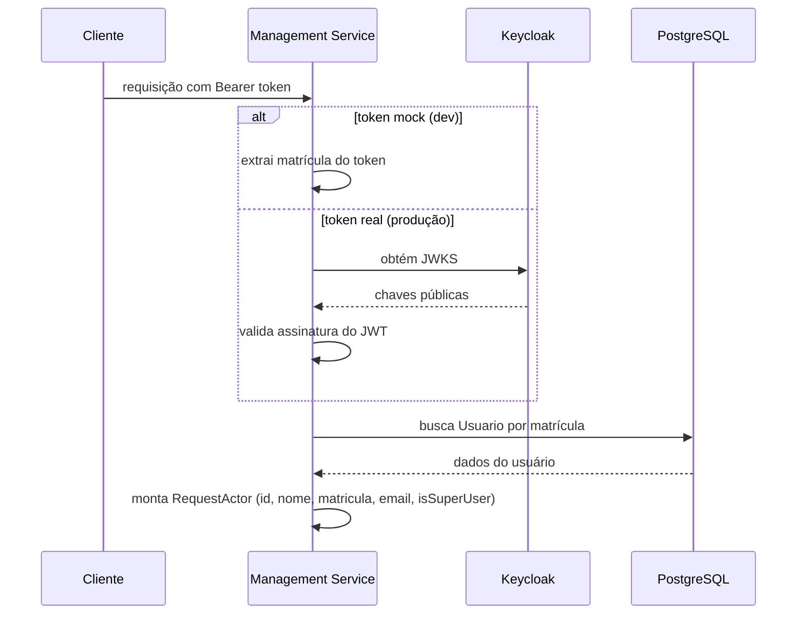
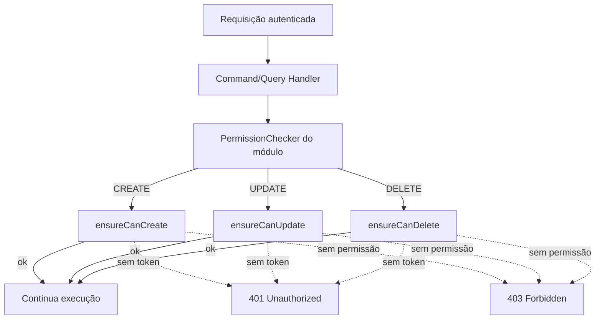

# Autenticação e autorização

**TLDR**: autenticação delegada a um servidor Keycloak via OAuth2/OIDC, validada por JWKS, com um mock de token pra desenvolvimento sem depender do Keycloak. Autorização segue "throw on deny" via `IPermissionChecker` por módulo, aplicando validações estritas de identidade (`accessContext.requestActor`), superusuário, mitigação de BOLA/IDOR e regras de isolamento por campus e hierarquia acadêmica. Os conceitos gerais (JWT, JWKS, OAuth2/OIDC) estão em [Autenticação](../aprender/autenticacao.md).

| Termo | Vá pra |
|---|---|
| O fluxo real de validação de token | [Autenticação](#autenticacao) |
| Como testar sem Keycloak | [Tokens mock em desenvolvimento](#tokens-mock-em-desenvolvimento) |
| Como a permissão é verificada | [Autorização](#autorizacao) |

## Autenticação



Fluxo real, implementado em `src/server/nest/auth/request-actor-resolver.adapter.ts`:

1. O cliente envia um Bearer token no header `Authorization`.
2. Se `ENABLE_MOCK_ACCESS_TOKEN=true` e o token segue o formato `mock.matricula.<número>`, a matrícula é extraída direto do token.
3. Caso contrário, o token é validado via JWKS obtido do Keycloak (`src/infrastructure.identity-provider/jwks/`, biblioteca `jwks-rsa` v4).
4. A API busca o `Usuario` no banco pela matrícula.
5. Se existe, um `RequestActor` com `id`, `nome`, `matricula`, `email` e `isSuperUser` é injetado nos controllers.
6. Se não existe, `ForbiddenException`.

O JWKS é buscado na URL `{OAUTH2_CLIENT_PROVIDER_OIDC_ISSUER}/.well-known/openid-configuration`. As credenciais de client (`KC_CLIENT_ID`, `KC_CLIENT_SECRET`) autenticam o admin client do Keycloak pra operação administrativa (como criar usuário), não o fluxo de validação de token em si.

## Tokens mock em desenvolvimento

```bash
curl -H "Authorization: Bearer mock.matricula.1234" http://localhost:3701/api/campi
```

Funciona com qualquer matrícula, desde que o `Usuario` correspondente exista no banco (o seed de migração cria um superuser, ver [Banco de dados e transações](banco-de-dados-e-transacoes.md#dados-iniciais-seed)). `ENABLE_MOCK_ACCESS_TOKEN` deve ser `false` em produção.

## Autorização



Cada módulo implementa `IPermissionChecker`, ver assinatura completa em [Padrões de código](padroes-de-codigo.md#permission-checker). O padrão é "throw on deny":
- Requisições sem ator autenticado (`accessContext.requestActor`) lançam `UnauthorizedError` (HTTP 401).
- Usuários com flag `isSuperUser` possuem autorização global para gerenciar recursos.
- Para usuários comuns, verificações granulares de permissão são executadas:
  - **Prevenção de escalonamento de privilégio**: usuários não-administradores não podem atribuir privilégios superiores (`isSuperUser`) ou criar vínculos administrativos indevidos.
  - **Anti-BOLA/IDOR e integridade cadastral**: edição e exclusão exigem validação da entidade ou escopo da permissão.
  - **Escopo contextual**: operações vinculadas a campus e departamentos validam a atuação e contexto do solicitante.
- Caso a validação falhe, `ForbiddenError` (HTTP 403) é lançado e a execução é abortada antes de persistir alterações.
