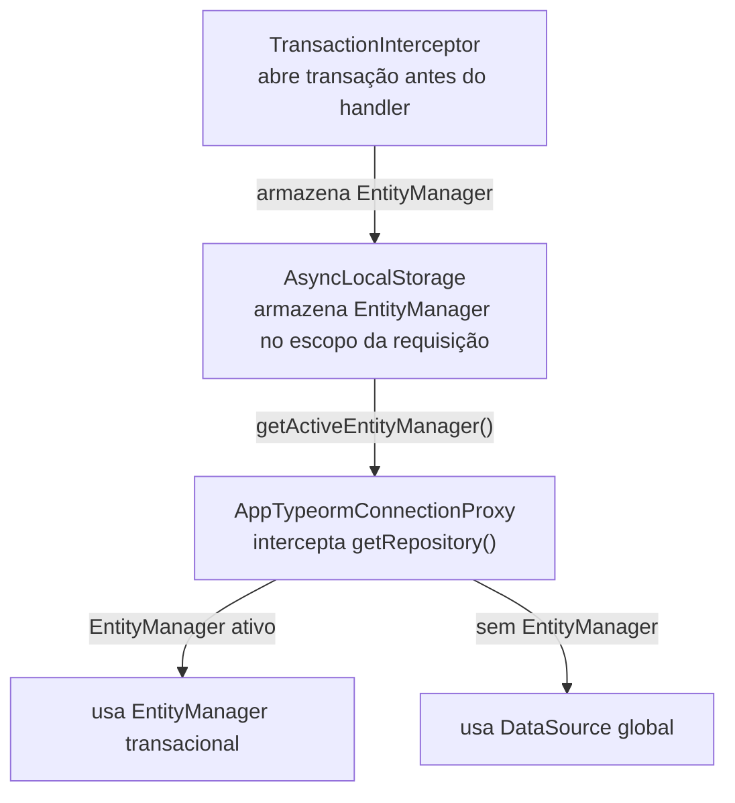

# Banco de dados e transações

**TLDR**: TypeORM 0.3 com `synchronize: false`, 58 migrações manuais, triggers automáticos de data no PostgreSQL, transação aberta automaticamente por requisição de escrita via `TransactionInterceptor`. Os conceitos gerais (o que é ORM, migração, soft delete, ACID) estão em [ORM, migrações e transações](../aprender/orm-e-banco-de-dados.md).

| Termo | Vá pra |
|---|---|
| TypeORM, `synchronize: false`, mapeamento de entidade | [ORM](#orm) |
| As 58 migrações, comandos, fluxo ao alterar entidade | [Migrações](#migracoes) |
| `dateDeleted`, triggers automáticos de data | [Soft delete e triggers](#soft-delete-e-triggers) |
| `TransactionInterceptor`, `AsyncLocalStorage`, `ConnectionProxy` | [Transação automática](#transacao-automatica) |
| Bootstrap tolerante, retry, health check | [Resiliência e tolerância a falhas](#resiliencia-e-tolerancia-a-falhas) |
| `nestjs-paginate`, spec de paginação por módulo | [Paginação](#paginacao) |

## ORM

O projeto usa [TypeORM](https://typeorm.io/) v0.3.28 com `synchronize: false`, o ORM nunca altera a estrutura do banco automaticamente. Cada entidade de domínio (`Campus`) tem uma entidade TypeORM correspondente (`CampusEntity`, em `infrastructure.database/typeorm/campus.typeorm.entity.ts`), e o mapeamento entre as duas fica só na infraestrutura, a entidade de domínio não sabe que o TypeORM existe.

```typescript
@Entity("campus")
export class CampusEntity {
  @PrimaryColumn("uuid") id!: string;
  @Column("text") nomeFantasia!: string;
  @ManyToOne(() => EnderecoEntity)
  @JoinColumn({ name: "id_endereco_fk" })
  endereco!: Relation<EnderecoEntity>;
}
```

## Migrações

As migrações ficam em `src/infrastructure.database/migrations/`, nomeadas por timestamp (58 arquivos, ex.: `1742515200000-create-function-change-date-updated.ts`).

```bash
bun run migration:run       # aplica migrações pendentes
bun run migration:revert    # reverte a última
bun run typeorm:generate    # gera migração a partir do diff entre entidade e banco
bun run db:reset            # apaga tudo e recria (perde todos os dados)
```

Fluxo ao alterar uma entidade: alterar a entidade TypeORM, gerar a migração (`typeorm:generate`), revisar o arquivo gerado, aplicar (`migration:run`), rodar `typecheck`.

### Dados iniciais (seed)

O seed roda como parte das migrações, na primeira execução de `migration:run`: todos os estados do Brasil com código IBGE, cidades de Rondônia, o campus do IFRO Ji-Paraná e um superuser.

## Soft delete e triggers

Toda entidade tem `dateDeleted` (`timestamptz`, nullable). `null` significa ativo, uma data preenchida significa excluído. Consulta de listagem filtra `dateDeleted IS NOT NULL` automaticamente.

O banco tem dois mecanismos automáticos de controle de data: a function `change_date_updated()` (criada na migração `1742515200000`), trigger `BEFORE UPDATE` que executa `new.date_updated := now()` em cada tabela, e a procedure `ensure_change_date_trigger(table_name)` (migração `1742515260000`), chamada no final de cada migração de criação de tabela pra anexar o trigger:

```sql
CALL ensure_change_date_trigger('campus');
```

Isso garante que `date_updated` é sempre preciso, independentemente de o código da aplicação lembrar de atualizá-lo.

## Transação automática

As transações são automáticas só para **operações de escrita** (POST/PUT/PATCH/DELETE em REST, mutation em GraphQL). Leitura executa sem transação, reduzindo overhead e contenção de recurso. Como desenvolvedor, nunca é preciso chamar `.transaction()` manualmente.

Três peças cooperam pra isso funcionar sem que o repositório saiba que está numa transação:



`TransactionInterceptor` (`src/server/nest/interceptors/transaction.interceptor.ts`) detecta se a operação é leitura ou escrita e abre transação via `appTypeormConnection.transaction()` só quando necessário. `transactionStorage` (`src/infrastructure.database/typeorm/connection/transaction-storage.ts`) é um `AsyncLocalStorage<EntityManager>` que propaga o `EntityManager` transacional por toda a call stack, sem passá-lo explicitamente entre camadas. `AppTypeormConnectionProxy` intercepta `getRepository()`, usando o `EntityManager` ativo se existir, ou o `DataSource` global caso contrário. O mecanismo é uma variação do **Unit of Work**: todo repositório dentro de uma requisição compartilha a mesma transação sem saber disso.

## Resiliência e tolerância a falhas

A aplicação sobe e opera mesmo com dependência externa (banco, fila BullMQ, Keycloak) indisponível ou não configurada:

- **Bootstrap tolerante**: dependência não configurada (variável de ambiente ausente) é marcada `unavailable` sem tentativa de conexão. Configurada mas indisponível, a aplicação tenta reconectar em background.
- **Reconexão automática**: conexão persistente usa retry com backoff exponencial e jitter (`src/shared/resilience/retry-with-backoff.ts`), indefinidamente até sucesso ou encerramento do processo.
- **Degradação controlada**: operação que precisa de dependência indisponível retorna `503 Service Unavailable` (`ServiceUnavailableError`). A API permanece operacional pros endpoints que não dependem do serviço afetado.
- **Health check enriquecido**: `GET /health` sempre retorna `200`, com status por dependência gerenciado por `ConnectionHealthRegistry` (`src/shared/resilience/connection-health-registry.ts`).

## Paginação

Via [`nestjs-paginate`](https://github.com/ppetzold/nestjs-paginate) v12, com adapter próprio (`src/infrastructure.database/pagination/`). Configuração separada em duas camadas: **spec no domínio** (`domain/{entidade}.pagination-spec.ts`), definindo campos ordenáveis, filtráveis e buscáveis via `PaginationFilter` (nunca importar `FilterOperator` de `nestjs-paginate` direto), e **config na infraestrutura** (`infrastructure.database/{entidade}.repository.ts`), que compõe o spec com as relations via `buildTypeOrmPaginateConfig`. Padrão de configuração: `maxLimit: 100`, `defaultLimit: 20`, `multiWordSearch: true`.

**Database command services**: operações programáticas (migration run/revert, schema drop) ficam em `src/infrastructure.database/services/`, implementando `IDatabaseCommand`, com um entrypoint executável via `bun run` por operação. Scripts de scaffolding (`typeorm:generate`, `typeorm:create`, `typeorm:entity`) continuam usando o CLI do TypeORM diretamente, não passam por esse padrão.
