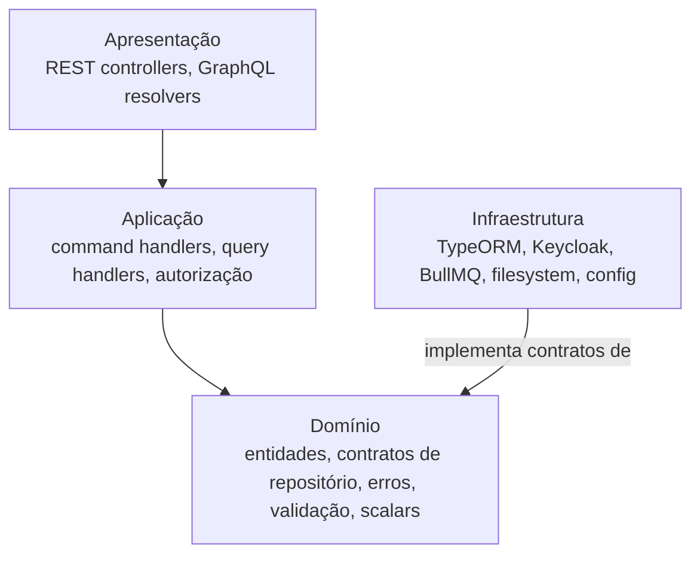

# Camadas e estrutura

**TLDR**: quatro camadas (domínio, aplicação, infraestrutura, apresentação), dependência sempre apontando pra dentro. Cada módulo de feature replica essa estrutura internamente, agrupado por área de negócio.

| Termo | Vá pra |
|---|---|
| O que cada camada contém | [As quatro camadas](#as-quatro-camadas) |
| A árvore de diretório completa | [Estrutura de diretórios](#estrutura-de-diretorios) |
| Como um módulo de feature é organizado | [Estrutura de um módulo](#estrutura-de-um-modulo) |
| Todos os grupos e módulos existentes | [Grupos de módulo](#grupos-de-modulo) |

## As quatro camadas



**Domínio** (`src/domain/`): a camada mais interna. Contém entidades com constructor privado e factory methods (`create`, `load`, `update`), schemas Zod (`EntitySchema`, `CreateSchema`, `UpdateSchema`), abstrações (`IRepositoryCreate<T>`, `IRepositoryFindAll<T>`, `IPermissionChecker`, `IAccessContext`), scalars semânticos (`IdUuid`, `ScalarDateTimeString`), erros de domínio (`EntityValidationError`, `BusinessRuleViolationError`) e os decorators de DI (`Dep`, `Impl`). Regra de ouro: o domínio nunca importa de `infrastructure.*`, `server/`, ou qualquer framework.

**Aplicação** (`src/application/`): orquestra o domínio. Contém command handlers (`Create`, `Update`, `Delete`), query handlers (`FindOne`, `List`), permission checkers, erros de aplicação (`ResourceNotFoundError`, `ForbiddenError`, `UnauthorizedError`, `ValidationError`, `ConflictError`, `InternalError`, `ServiceUnavailableError`) e helpers de paginação. Não contém regra de negócio (fica no domínio) nem detalhe de persistência (fica na infraestrutura).

**Infraestrutura** (`src/infrastructure.*/`): implementa os contratos do domínio com tecnologia concreta, um diretório por concern:

| Diretório | Tecnologia | O que implementa |
|---|---|---|
| `infrastructure.database` | TypeORM + PostgreSQL | Repositórios, migrações, paginação, connection proxy |
| `infrastructure.identity-provider` | Keycloak + JWKS | Validação de token, admin client |
| `infrastructure.message-broker` | BullMQ sobre PostgreSQL | Publicação e consumo de mensagens |
| `infrastructure.storage` | Filesystem + Sharp | Upload e redimensionamento de arquivos/imagens |
| `infrastructure.config` | NestJS ConfigModule | Leitura de variável de ambiente |
| `infrastructure.graphql` | Apollo Server | Configuração GraphQL, DTOs base, cache LRU |
| `infrastructure.logging` | Middleware próprio | Correlation ID |
| `infrastructure.authorization` | Implementações locais | Permission checkers concretos |
| `infrastructure.timetable-generator` | Contratos de mensagem | Tipos e commands de geração de horário |
| `infrastructure.dependency-injection` | NestJS DI | Configuração do container |

**Apresentação** (`src/modules/*/presentation.*/`): traduz protocolo externo (HTTP, GraphQL) em chamada pra aplicação. Regra: apresentação nunca acessa banco diretamente, sempre delega pra um handler.

## Estrutura de diretórios

```
management-service/
├── .devcontainer/          # Dev Container (VS Code / WebStorm)
├── .docker/                # Containerfile e compose.yml
├── .deploy/                # Helm/Kubernetes e VPS via Docker Compose
├── .github/workflows/      # Pipelines de CI/CD
├── src/
│   ├── domain/             # Camada de domínio
│   ├── application/        # Camada de aplicação
│   ├── infrastructure.*/   # Um diretório por concern de infraestrutura
│   ├── modules/            # Módulos de feature
│   ├── server/             # Bootstrap NestJS, filtros, interceptors, auth
│   ├── shared/             # Mappers, validação, decorators compartilhados
│   ├── utils/              # Utilitários puros
│   ├── commands/           # Scripts CLI
│   └── test/                # Helpers de teste
├── justfile
└── .env.example
```

## Estrutura de um módulo

Cada módulo em `src/modules/<grupo>/<nome>/` replica a mesma estrutura hexagonal internamente:

```
modules/<grupo>/<nome-do-modulo>/
├── domain/
│   ├── authorization/      # IPermissionChecker
│   ├── commands/           # Definições de command
│   ├── queries/            # Definições de query, schemas, result types
│   ├── repositories/       # Contrato do repositório (Symbol + type)
│   └── shared/             # QueryFields, input refs
├── application/
│   ├── authorization/      # Implementação do permission checker
│   ├── commands/           # Command handlers + testes
│   └── queries/            # Query handlers + testes
├── infrastructure.database/
│   └── typeorm/            # Entidade TypeORM + adapter + mapper
├── presentation.rest/      # Controllers, DTOs, mappers
└── presentation.graphql/   # Resolvers, DTOs, mappers (quando aplicável)
```

## Grupos de módulo

| Grupo | Módulos |
|---|---|
| `acesso/` | `autenticacao`, `usuario` (inclui `perfil`) |
| `ambientes/` | `ambiente`, `bloco`, `campus` |
| `armazenamento/` | `arquivo`, `imagem`, `imagem-arquivo` |
| `ensino/` | `curso`, `diario`, `disciplina`, `modalidade`, `nivel-formacao`, `oferta-formacao`, `turma`, entre outros |
| `estagio/` | `candidatura`, `empresa`, `empresa-avaliacao`, `estagiario`, `estagio`, `folha-ponto`, `relatorio`, `responsavel-empresa`, `solicitacao` |
| `calendario/` | `agendamento`, `colecao`, `consultas`, `gerar-horario`, `grade-horaria`, `horario-consulta`, `horario-edicao`, `indisponibilidade-ambiente`, `indisponibilidade-professor`, `letivo`, `solicitacao-mudanca`, `turmas` (disponibilidade) |
| `localidades/` | `cidade`, `endereco`, `estado` |
| `relatorios/` | `relatorio` |

`src/modules/@shared/` é legado em remoção, nunca importar dele, ver [Decisões arquiteturais](decisoes-arquiteturais.md).

## Diretórios compartilhados

| Diretório | Propósito |
|---|---|
| `src/domain/` | Entidades base, scalars, DI, metadata compartilhados |
| `src/application/` | Erros de aplicação, contratos de paginação |
| `src/shared/` | Validação Zod, mappers, decorators de apresentação |
| `src/server/` | Bootstrap NestJS, filtros, interceptors, auth, access context |
| `src/utils/` | Utilitários puros (datas, helpers) |
| `src/commands/` | Scripts CLI |
| `src/test/` | Helpers de teste (mocks, factories) |
