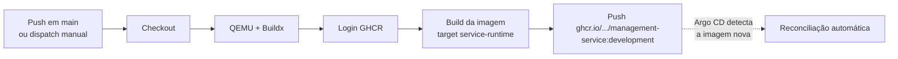
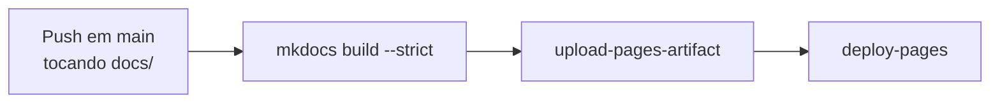

# CI/CD e deploy

**TLDR**: `build-push.dev.yml` builda e publica a imagem no GHCR a cada push em `main`, sem mais fazer o deploy. O deploy é declarativo, via GitOps: o Argo CD reconcilia o que está em `gitops/` automaticamente, sem step de pipeline nenhum aplicando no cluster. `gitops-lint.yml` valida o chart em todo PR que toque `gitops/`.

| Termo | Vá pra |
|---|---|
| O pipeline de build e push da imagem | [Pipeline de CI/CD](#pipeline-de-cicd) |
| Como o deploy é declarado e reconciliado pelo Argo CD | [Deploy via GitOps](#deploy-via-gitops) |
| O lint que roda em todo PR que toca gitops/ | [GitOps Lint](#gitops-lint) |
| Como o site de `docs/` é publicado | [Publicação de docs/ no GitHub Pages](#publicacao-de-docs-no-github-pages) |

## Pipeline de CI/CD

Definido em `.github/workflows/build-push.dev.yml` (renomeado de `build-deploy.dev.yml` quando o deploy virou GitOps, ver [Deploy via GitOps](#deploy-via-gitops) abaixo). Gatilhos: dispatch manual, ou push em `main` que toque `src/` ou `.docker/`. Concurrency `build-deploy-dev`, uma execução por vez.



Roda em `ubuntu-latest`: checkout, QEMU + Docker Buildx pra build multi-arquitetura, login no GHCR com `GITHUB_TOKEN`, build da imagem a partir de `.docker/Containerfile` (target `service-runtime`), push pra `ghcr.io/<owner>/management-service:development`. Build args `BUILD_TIME`/`GIT_COMMIT_HASH` pra rastreabilidade. Cache em duas camadas, GitHub Actions (`type=gha`) e registry (`mode=max`), pra build incremental rápido.

O workflow **não aplica nada no cluster**, diferente de antes. Nenhum step de lint (Biome), typecheck ou teste (Vitest) roda aqui tampouco, a validação de qualidade de código hoje é só local ou via `AGENTS.md`, ver [Qualidade de código](../operacao/desenvolvimento.md#qualidade-de-codigo).

## Deploy via GitOps

O deploy deixou de ser um script imperativo (`helm upgrade` rodado por um runner de CI) e virou declaração reconciliada pelo [Argo CD](https://github.com/ladesa-ro/infrastructure). A estrutura fica em `gitops/`:

```
gitops/
├── envs/development/applications/
│   ├── api.yaml     # Application do Argo CD pra API
│   └── waha.yaml    # Application do Argo CD pro WAHA
└── apps/
    ├── api/         # chart Helm local da API (Chart.yaml + values-development.yaml)
    └── waha/        # chart Helm local do WAHA
```

Duas `Application` (não uma) porque são dois releases Helm distintos, cada um com o seu nome. Cada `Chart.yaml` declara o chart genérico `stakater/application` (versão `6.0.2`) como dependência, o mesmo chart que o script antigo usava, só que agora renderizado pelo Argo CD em vez de por `helm upgrade` manual.

```yaml
# gitops/envs/development/applications/api.yaml (trecho)
spec:
  project: ladesa-satellites
  source:
    path: gitops/apps/api
    helm:
      releaseName: ladesa-ro-api
      valueFiles: [values-development.yaml]
  destination:
    namespace: ladesa-ro-development
  syncPolicy:
    automated: { prune: true, selfHeal: true }
```

`automated: { prune: true, selfHeal: true }` significa que o Argo CD aplica qualquer mudança em `gitops/apps/api/values-development.yaml` sozinho, assim que o PR é mergeado em `main`, sem step de CI/CD nenhum disparando o deploy. Trocar configuração é editar o `values-development.yaml` do componente e abrir um pull request, com revisão e histórico, ver [Deploy](../operacao/deploy.md).

Os dois `PersistentVolumeClaim` (upload da API, sessão do WAHA) não fazem parte de nenhum release Helm e continuam fora de `gitops/`, deliberadamente: spec de PVC é largamente imutável, declarar um que divirja do que já existe no cluster viraria erro de sincronização. Segredo nenhum vive em `gitops/`, os dois componentes consomem `Secret` do Kubernetes por referência, produzido a partir do [Infisical](https://infisical.ladesa.com.br).

HTTPS é obtido via `cert-manager` e `Ingress`, pré-configurado em `values-development.yaml` de cada componente:

```yaml
ingress:
  enabled: true
  annotations:
    cert-manager.io/cluster-issuer: ladesa-ro-issuer-production
  hosts:
    - host: dev.ladesa.com.br
      paths:
        - path: /api/v1
          pathType: ImplementationSpecific
```

## GitOps Lint

`.github/workflows/gitops-lint.yml` roda em todo PR que toque `gitops/`, e também no push em `main`. Pra cada chart em `gitops/apps/*`: `helm dependency build`, `helm lint` contra o `values-development.yaml`, e `helm template` renderizando o manifesto final. Um step adicional falha o build se algum manifesto renderizado tiver imagem sem tag nem digest (`image: repositorio` sem `:tag` no final), a mesma checagem de supply chain que a [infrastructure](https://github.com/ladesa-ro/infrastructure) já aplica em outro contexto.

## Publicação de docs/ no GitHub Pages

`.github/workflows/docs.yml`, mesmo padrão da [infrastructure](https://github.com/ladesa-ro/infrastructure/blob/main/.github/workflows/docs.yml): builda com `mkdocs build --strict --site-dir _site` e publica via `actions/upload-pages-artifact` + `actions/deploy-pages`. Gatilho: push em `main` tocando `docs/`, `mkdocs.yml` ou `requirements-docs.txt`, mais dispatch manual. `concurrency: pages` garante uma publicação por vez.



O workflow builda e falha se `mkdocs build --strict` encontrar link interno ou âncora quebrada, mas isso só acontece **depois** do merge em `main`, não é um check de PR, ver [Qualidade da documentação](../operacao/desenvolvimento.md#qualidade-da-documentacao). A publicação em si depende de uma configuração que não é feita por workflow nenhum: o Pages do repositório no GitHub precisa ter a fonte de build definida como "GitHub Actions" (Settings > Pages), sem isso o job `deploy` falha mesmo com o build passando, ver [Pendências](../operacao/pendencias.md).
