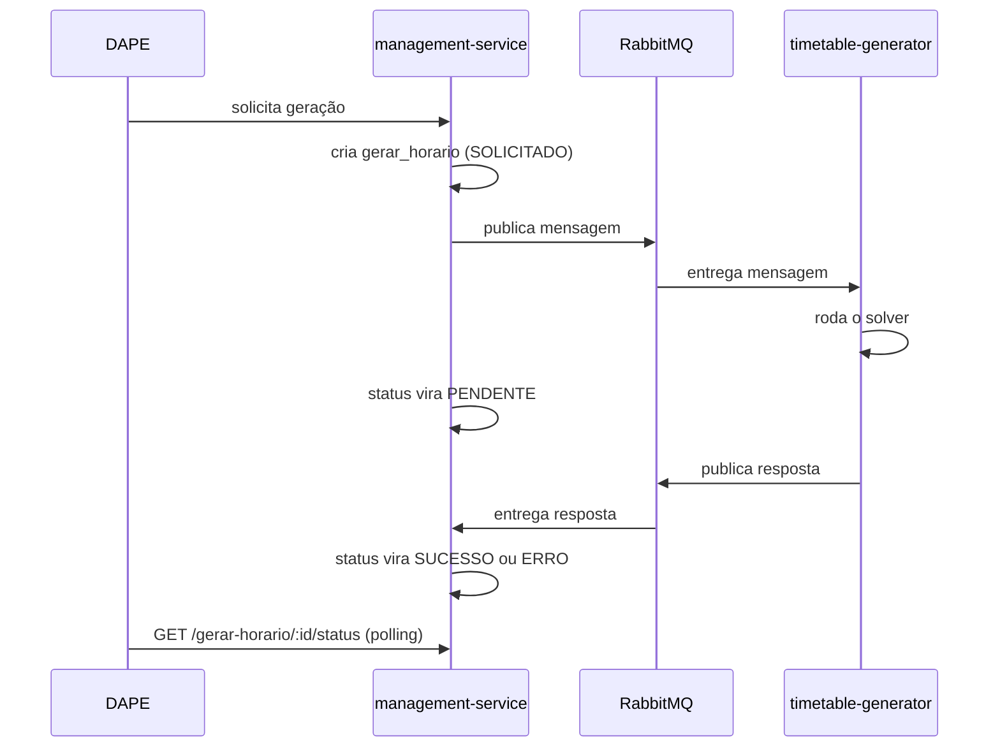

# Decisões de arquitetura da plataforma

**TLDR**: três ADRs (Architecture Decision Record) migrados do [ladesa-ro/docs](https://github.com/ladesa-ro/docs), por serem quase inteiramente sobre este serviço: por que NestJS e Bun, por que RabbitMQ pra falar com o timetable-generator, por que JSONB no contrato de geração de horário. Os outros ADRs da plataforma (frontend Nuxt unificado, solver OR-Tools, TypeSpec, Keycloak, Flutter) continuam no `ladesa-ro/docs`, por cobrirem decisão de mais de um serviço ao mesmo tempo, ver [Pendências](../operacao/pendencias.md).

| Termo | Vá pra |
|---|---|
| Por que NestJS sobre Bun, não Express/Fastify/Node puro | [ADR-002: NestJS + Bun](#adr-002-nestjs-e-bun) |
| Por que RabbitMQ entre este serviço e o timetable-generator (superado, ver [Message broker](message-broker.md)) | [ADR-006: RabbitMQ](#adr-006-rabbitmq) |
| Por que JSONB pra guardar requisição e resposta do solver | [ADR-007: JSONB no contrato do solver](#adr-007-jsonb-no-contrato-do-solver) |

## ADR-002: NestJS e Bun

**Status**: aceito.

**Contexto**: o backend precisa servir API REST e GraphQL, gerenciar entidade com ORM, e orquestrar a comunicação com o timetable-generator via mensageria. A equipe tem expertise em TypeScript.

**Decisão**: NestJS como framework do backend, executado sobre Bun como runtime, com TypeORM como ORM e PostgreSQL 15 como banco.

**Consequências**: NestJS oferece estrutura modular, injeção de dependência e suporte nativo a REST e GraphQL. Bun oferece performance superior ao Node.js pra I/O e startup. TypeORM permite modelagem por decorator com migração automática. O ecossistema TypeScript é compartilhado com o frontend Nuxt. Em contrapartida, Bun ainda é relativamente novo, com possível incompatibilidade com pacote npm, e TypeORM tem limitação conhecida com query complexa, mitigada com query builder.

**Alternativas consideradas**: Express + Prisma, descartado por falta de estrutura modular. Fastify, descartado por ecossistema menor de plugin pra GraphQL. Node.js puro, descartado, Bun oferece performance superior sem sacrifício de compatibilidade.

## ADR-006: RabbitMQ

**Status**: superado. O serviço migrou de RabbitMQ/Rascal para BullMQ sobre o backend PostgreSQL nativo dele, sem Redis — ver [Message broker](message-broker.md) para o desenho atual. Registro abaixo preservado como histórico da decisão original, não como estado do sistema.

**Contexto**: a geração de horário é uma operação computacionalmente intensiva, o solver pode levar de segundos a minutos conforme a complexidade. O usuário não deve ficar bloqueado esperando o resultado. O timetable-generator (C#) precisa ser desacoplado do management-service (TypeScript).

**Decisão**: RabbitMQ como broker de mensageria assíncrona entre os dois serviços.

**Consequências**: desacoplamento total, o timetable-generator escala independentemente. Retry nativo, mensagem que falha volta pra fila (dead letter queue). O usuário não fica bloqueado, pode navegar enquanto o solver trabalha. Tolerância a falha, se o solver cair a mensagem permanece na fila. Em contrapartida, mais um serviço pra monitorar, latência adicional na entrega, e debug mais difícil em fluxo assíncrono.

**Alternativas consideradas**: HTTP síncrono, descartado por bloquear o usuário durante a geração. Apache Kafka, descartado por ser oversized pro volume de mensagem do projeto. Redis Pub/Sub, descartado por não garantir entrega (at-most-once).

## ADR-007: JSONB no contrato do solver

**Status**: aceito, contrato especificado em TypeSpec.

**Contexto**: a tabela `gerar_horario` precisa guardar o payload enviado ao timetable-generator (input do solver) e a resposta recebida (grade gerada ou erro detalhado). O formato pode evoluir à medida que constraint nova é adicionada ao solver.

**Decisão**: campo JSONB no PostgreSQL pra `requisicao_gerador` e `resposta_gerador`, em vez de tabela relacional normalizada, ver [Banco de dados e transações](banco-de-dados-e-transacoes.md).

**Consequências**: flexibilidade, o schema do contrato evolui sem migração destrutiva. Indexação parcial, PostgreSQL permite índice GIN em caminho JSONB específico. Auditoria, cada geração preserva o snapshot exato do dado enviado e recebido. Performance de leitura, acesso direto ao JSON sem `JOIN` complexo. Em contrapartida, sem validação de schema no banco (erro de formato só detectado em runtime), e query analítica sobre JSONB é menos performática que tabela normalizada.

**Contrato**: especificado em TypeSpec, no repositório [ladesa-ro/messages](https://github.com/ladesa-ro/messages) (`apis/timetable-generator-v1/src/`). Detalhe completo do schema de request/response e das constraints do solver continua em [ladesa-ro/docs](https://github.com/ladesa-ro/docs/blob/main/docusaurus/docs/desenvolvimento/specs/contrato-solver.md), por ser especificação compartilhada com o solver, não fato isolado deste serviço.

## Pra ir além

Os demais ADRs da plataforma (frontend Nuxt unificado, solver OR-Tools CP-SAT, TypeSpec como formato de contrato entre serviço, Keycloak pra SSO, Flutter pro mobile) continuam em [ladesa-ro/docs, Visão geral de arquitetura](https://github.com/ladesa-ro/docs/blob/main/docusaurus/docs/desenvolvimento/arquitetura/visao-geral.md), por cobrirem decisão de mais de um serviço ao mesmo tempo.
