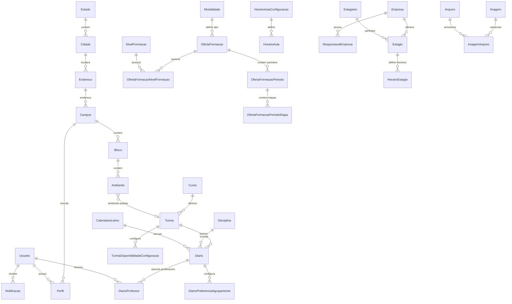

# Diagrama de entidades

**TLDR**: entidades principais e seus relacionamentos, baseado nas entidades TypeORM reais em `src/modules/*/infrastructure.database/typeorm/`.

Entidade de agendamento de calendário (`calendario-agendamento-*`) e de geração de horário (`gerar-horario-*`) têm tabela junction adicional não representada aqui, pra manter a legibilidade do diagrama.
