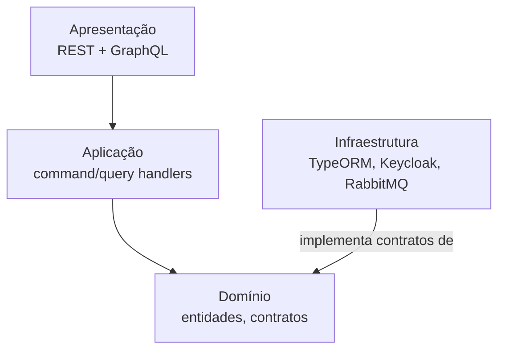

# Arquitetura

Esta seção é **referência**, no sentido de [Diátaxis](../aprender/diataxis.md): fato sobre este serviço específico, organizado pra consulta rápida, com o porquê de cada decisão registrado ao lado do fato. Os conceitos gerais por trás de cada peça (o que é arquitetura hexagonal, o que é CQRS, o que é um ORM) estão em [Aprender](../aprender/index.md), não repetidos aqui.

O **management-service** é a API REST/GraphQL de gerenciamento acadêmico do ecossistema Ladesa, construída com NestJS, TypeORM e PostgreSQL, seguindo arquitetura hexagonal.

| Se você precisa | Vá pra |
|---|---|
| As quatro camadas, a estrutura de diretório, os grupos de módulo | [Camadas e estrutura](camadas-e-estrutura.md) |
| Entidade, schema, repositório, handler, mapper, com exemplo real | [Padrões de código](padroes-de-codigo.md) |
| O padrão de mapeamento entre camadas em detalhe (`into`, `createMapper`) | [Mapeamento entre camadas](mapeamento-entre-camadas.md) |
| Decisões que já foram tomadas e não devem ser reabertas sem justificativa nova | [Decisões arquiteturais](decisoes-arquiteturais.md) |
| Por que NestJS+Bun, RabbitMQ, JSONB no contrato do solver (ADR migrado do ladesa-ro/docs) | [Decisões de arquitetura da plataforma](decisoes-de-plataforma.md) |
| Nomenclatura de arquivo, formatação, e os princípios de engenharia adotados | [Convenções e princípios](convencoes-e-principios.md) |
| Keycloak, JWT mock, fluxo de autorização | [Autenticação e autorização](autenticacao-e-autorizacao.md) |
| TypeORM, migrações, triggers, transação automática | [Banco de dados e transações](banco-de-dados-e-transacoes.md) |
| Pipeline HTTP real, GraphQL code-first, paginação, erro | [APIs REST e GraphQL](apis-rest-e-graphql.md) |
| RabbitMQ via Rascal, filas de geração de horário | [Message broker](message-broker.md) |
| Socket.IO, notificações de estágio em tempo real | [WebSockets e notificações](websockets-e-notificacoes.md) |
| Vitest, tipos de teste, helpers disponíveis | [Testes](testes.md) |
| Pipeline de CI/CD, deploy em Kubernetes via Helm | [CI/CD e deploy](ci-cd-e-deploy.md) |
| Cada tecnologia usada e sua versão | [Stack tecnológico](stack-tecnologico.md) |
| Entidades principais e como se relacionam | [Diagrama de entidades](diagrama-de-entidades.md) |

## Como esta seção foi montada

O conteúdo abaixo vem de duas fontes que existiam antes desta iniciativa: a seção de arquitetura do `README.md` (que misturava fato deste serviço com explicação de conceito geral, hoje separada em [Aprender](../aprender/index.md)) e os arquivos de `.claude/docs/` (`arquitetura.md`, `convencoes.md`, `decisoes-arquiteturais.md`, `mapeamento.md`, `padroes-codigo.md`, `principios.md`), que já estavam escritos em voz fatual, próxima do que esta trilha exige. Nenhum fato foi inventado nessa reorganização, só reagrupado por modo Diátaxis.
