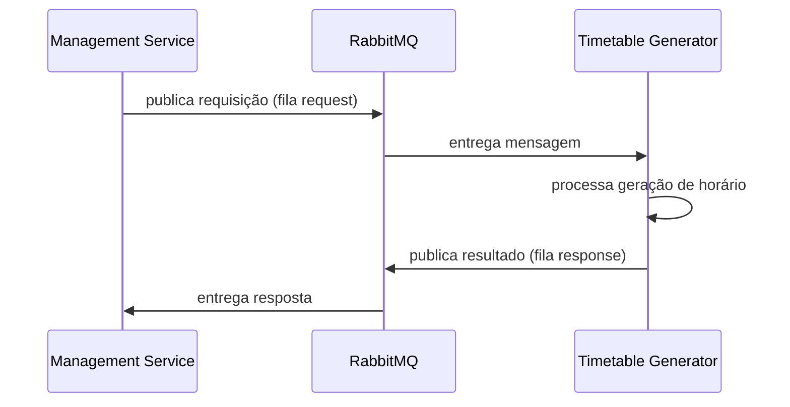

# Message broker

**TLDR**: RabbitMQ via biblioteca Rascal v21, usado hoje só pra geração assíncrona de horário (timetable), com dois padrões implementados, RPC e fire-and-forget. O conceito geral de message broker está em [Message broker](../aprender/message-broker.md).

A interface `IMessageBrokerService` (`src/domain/abstractions/message-broker/`) implementa dois padrões: **RPC** (`publishTimetableRequest`, publica e espera resposta com timeout de 60s) e **fire-and-forget** (`publishTimetableRequestFireAndForget`, publica sem esperar).

| Variável | Padrão | Propósito |
|---|---|---|
| `MESSAGE_BROKER_QUEUE_TIMETABLE_REQUEST` | `dev.timetable_generate.request` | Fila de requisição de geração de horário |
| `MESSAGE_BROKER_QUEUE_TIMETABLE_RESPONSE` | `dev.timetable_generate.response` | Fila de resposta |

A UI de gerenciamento do RabbitMQ fica em `http://localhost:15672` (usuário `admin`, senha `admin` em desenvolvimento). [Rascal](https://github.com/guidesmiths/rascal) é um wrapper sobre AMQP que adiciona gerenciamento de conexão, retry e configuração declarativa por cima do protocolo cru. Por que RabbitMQ e não HTTP síncrono, Kafka ou Redis Pub/Sub, ver [ADR-006](decisoes-de-plataforma.md#adr-006-rabbitmq).
