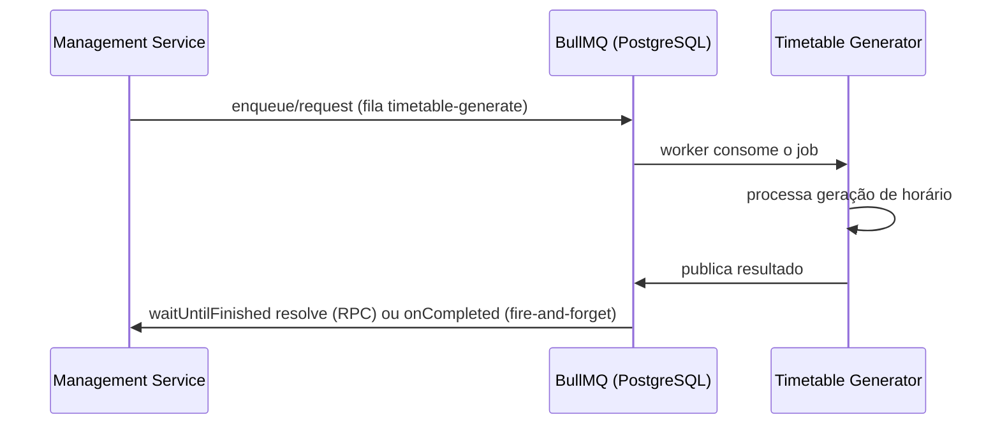

# Message broker

**TLDR**: [BullMQ](https://docs.bullmq.io/) sobre o backend PostgreSQL nativo dele (`createPostgresBackend`, sem Redis), usado pra geração assíncrona de horário (timetable) e pra notificação de folha de ponto via WhatsApp. Dois padrões implementados sobre a mesma fila, RPC e fire-and-forget. O conceito geral de message broker está em [Message broker](../aprender/message-broker.md). Isso substitui o RabbitMQ/Rascal descrito no [ADR-006](decisoes-de-plataforma.md#adr-006-rabbitmq), hoje superado.

Duas interfaces, em camadas diferentes:

- **`IQueueService`** (`src/domain/abstractions/message-broker/`), a porta genérica de fila: `enqueue`, `request` (enqueue + espera o resultado), `onCompleted`/`onFailed`, `process` (registra um worker) e `isAvailable()`. Implementada por `BullMqQueueService` (`src/infrastructure.message-broker/bullmq-queue.service.ts`), sobre `bullmq` com `createPostgresBackend` — mesma biblioteca de sempre, backend Postgres em vez de Redis, então não precisa de mais um serviço de infraestrutura só pra fila.
- **`IMessageBrokerService`**, a porta específica do domínio: `publishTimetableRequest` (**RPC**, espera resposta com timeout de 60s), `publishTimetableRequestFireAndForget` (**fire-and-forget**, não espera) e `publishFolhaPontoCreated` (fire-and-forget). Implementada por `MessageBrokerService`, que só traduz essas três chamadas de domínio em `IQueueService.request`/`.enqueue`.

| Variável | Padrão | Propósito |
|---|---|---|
| `QUEUE_DATABASE_URL` | — | Connection string do Postgres usado como backend da fila. Sem ela, `IQueueOptions` resolve `null` e todo publish lança `ServiceUnavailableError` — degradação explícita, não silenciosa |
| `QUEUE_SCHEMA` | `bullmq` | Schema Postgres onde o BullMQ cria suas tabelas |
| `QUEUE_TIMETABLE_GENERATE` | `timetable-generate` | Fila de geração de horário, usada nos dois padrões (RPC e fire-and-forget) |
| `QUEUE_FOLHA_PONTO_WHATSAPP` | `folha-ponto-notificacao-whatsapp` | Fila de notificação de folha de ponto |

Quem consome (`process`) roda em `src/modules/estagio/folha-ponto/application/consumers/` e no worker do timetable-generator — ver [infrastructure.timetable-generator](https://github.com/ladesa-ro/management-service/tree/main/src/infrastructure.timetable-generator) no próprio monorepo.
