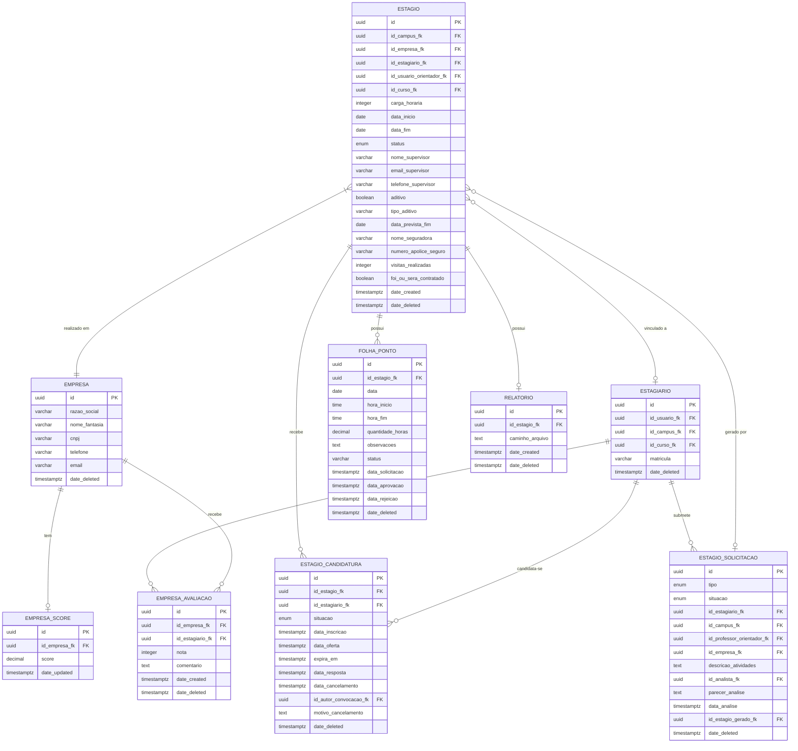

# Módulo de Estágios

Documentação técnica e arquitetural completa do módulo de Estágios do **management-service** da Ladesa.

---

## Índice

1. [Visão Geral](#1-visao-geral)
2. [Arquitetura do Módulo](#2-arquitetura-do-modulo)
3. [Entidades e Banco de Dados](#3-entidades-e-banco-de-dados)
4. [Status e Enums](#4-status-e-enums)
5. [Autenticação e Autorização](#5-autenticacao-e-autorizacao)
6. [Referência de Endpoints REST](#6-referencia-de-endpoints-rest)
   - [Estágios](#61-estagios)
   - [Estagiários](#62-estagiarios)
   - [Candidaturas / Fila de Espera](#63-candidaturas-fila-de-espera)
   - [Solicitações de Estágio](#64-solicitacoes-de-estagio)
   - [Minhas Solicitações (Aluno)](#65-minhas-solicitacoes-aluno)
   - [Folha de Ponto](#66-folha-de-ponto)
   - [Tokens de Folha de Ponto (Supervisor)](#67-tokens-de-folha-de-ponto-supervisor)
   - [Empresas](#68-empresas)
   - [Avaliações de Empresas](#69-avaliacoes-de-empresas)
   - [Relatórios de Estágio](#610-relatorios-de-estagio)
7. [Tabela Consolidada de Endpoints](#7-tabela-consolidada-de-endpoints)
8. [Regras de Negócio](#8-regras-de-negocio)
9. [Fluxos Principais](#9-fluxos-principais)
10. [Importação em Massa (CSV/XLSX)](#10-importacao-em-massa-csvxlsx)
11. [Diagrama ERD](#11-diagrama-erd)
12. [Integrações com Outros Módulos](#12-integracoes-com-outros-modulos)
13. [Notificações e WebSockets](#13-notificacoes-e-websockets)
14. [Possíveis Erros e Códigos HTTP](#14-possiveis-erros-e-codigos-http)
15. [Inconsistências e Observações Técnicas](#15-inconsistencias-e-observacoes-tecnicas)

---

## 1. Visão Geral

O módulo de Estágios é o núcleo da aplicação. Ele gerencia todo o ciclo de vida de um estágio supervisionado, desde a abertura de uma vaga ou solicitação de estágio até o encerramento e geração de relatórios.

### Sub-módulos

| Sub-módulo | Localização | Responsabilidade |
|---|---|---|
| `estagio` | `src/modules/estagio/estagio/` | Entidade principal do estágio; CRUD, filtros, carga horária, importação em massa |
| `estagiario` | `src/modules/estagio/estagiario/` | Perfil do aluno/estagiário vinculado a um usuário do sistema |
| `candidatura` | `src/modules/estagio/candidatura/` | Fila de espera: candidaturas, convocações, cancelamentos |
| `solicitacao` | `src/modules/estagio/solicitacao/` | Solicitações de estágio (interno/externo) submetidas pelo aluno à CIEC |
| `folha-ponto` | `src/modules/estagio/folha-ponto/` | Registro de frequência diária; aprovação pelo supervisor via link tokenizado |
| `empresa` | `src/modules/estagio/empresa/` | Empresas concedentes (CRUD + foto) |
| `empresa-avaliacao` | `src/modules/estagio/empresa-avaliacao/` | Avaliações e score das empresas pelos estagiários |
| `relatorio` | `src/modules/estagio/relatorio/` | Relatório de estágio (PDF upload/download por estágio) |
| `responsavel-empresa` | `src/modules/estagio/responsavel-empresa/` | Responsável legal da empresa concedente |

---

## 2. Arquitetura do Módulo

O projeto segue Arquitetura Hexagonal (Ports and Adapters) + DDD + Clean Architecture. As camadas por sub-módulo são:

```
domain/           → Entidades, value objects, interfaces de repositório, commands, queries
application/      → Command handlers, query handlers, services de domínio, helpers
infrastructure.database/ → Repositórios TypeORM, entities TypeORM, mappers TypeORM
presentation.rest/ → Controllers NestJS, DTOs REST, mappers REST
presentation.graphql/ → Resolvers GraphQL, DTOs GraphQL (onde aplicável)
```

### Convenções de Injeção de Dependência

O projeto **não** usa `@Injectable()` do NestJS diretamente para serviços de domínio. Em vez disso, usa decorators customizados:

- `@Dep(Symbol)` — injeta uma dependência pelo token Symbol
- `@Impl()` — marca uma classe como implementação de uma interface de domínio

### Prefixo Global da API

Configurado via variável de ambiente `API_PREFIX`. O valor padrão (`.env`) é:

```
API_PREFIX=/api/
```

Todos os endpoints descritos neste documento são relativos a esse prefixo. Exemplos: `GET /api/estagios`, `POST /api/folha-ponto`.

---

## 3. Entidades e Banco de Dados

### 3.1 Tabela `estagio`

Entidade TypeORM: `EstagioTypeormEntity` (`src/modules/estagio/estagio/infrastructure.database/typeorm/estagio.typeorm.entity.ts`)

| Coluna | Tipo PostgreSQL | Nullable | Descrição |
|---|---|---|---|
| `id` | `uuid` | NOT NULL | PK (UUIDv7) |
| `id_campus_fk` | `uuid` | NULL | FK → `campus` |
| `id_empresa_fk` | `uuid` | NOT NULL | FK → `empresa` |
| `id_estagiario_fk` | `uuid` | NULL | FK → `estagiario`; NULL = vaga sem aluno |
| `id_usuario_orientador_fk` | `uuid` | NULL | FK → `usuario` (professor orientador) |
| `id_curso_fk` | `uuid` | NULL | FK → `curso` (curso de referência da vaga) |
| `carga_horaria` | `integer` | NOT NULL | Carga horária total contratual (horas) |
| `data_inicio` | `date` | NULL | Data de início do estágio |
| `data_fim` | `date` | NULL | Data de encerramento real |
| `status` | `enum` | NOT NULL | Ver [seção 4.1](#41-status-do-estagio) |
| `nome_supervisor` | `varchar(255)` | NULL | Nome do supervisor na empresa |
| `email_supervisor` | `varchar(255)` | NULL | E-mail do supervisor |
| `telefone_supervisor` | `varchar(20)` | NULL | Telefone do supervisor |
| `aditivo` | `boolean` | NOT NULL | Indica se há aditivo ao contrato |
| `tipo_aditivo` | `varchar(255)` | NULL | Descrição do tipo de aditivo |
| `data_prevista_fim` | `date` | NULL | Data prevista de encerramento |
| `nome_seguradora` | `varchar(255)` | NULL | Seguradora do estágio |
| `numero_apolice_seguro` | `varchar(100)` | NULL | Número da apólice de seguro |
| `visitas_realizadas` | `integer` | NULL | Número de visitas realizadas pela CIEC |
| `visitas_justificadas` | `integer` | NULL | Número de visitas justificadas |
| `visitas_a_vencer` | `integer` | NULL | Número de visitas a vencer |
| `visitas_nao_realizadas` | `integer` | NULL | Número de visitas não realizadas |
| `resumo_pendencias` | `varchar(1000)` | NULL | Resumo das pendências do estágio |
| `encerramento_por` | `varchar(255)` | NULL | Responsável pelo encerramento |
| `motivacao_desligamento` | `varchar(1000)` | NULL | Motivo do desligamento |
| `motivo_rescisao` | `varchar(1000)` | NULL | Motivo da rescisão contratual |
| `media_notas_supervisor` | `decimal(5,2)` | NULL | Média das notas atribuídas pelo supervisor |
| `foi_ou_sera_contratado` | `boolean` | NULL | Indica contratação efetiva |
| `date_created` | `timestamptz` | NOT NULL | Data de criação |
| `date_updated` | `timestamptz` | NOT NULL | Data da última atualização |
| `date_deleted` | `timestamptz` | NULL | Data de soft delete |

### 3.2 Tabela `estagio_candidatura`

Entidade TypeORM: `EstagioCandidaturaTypeormEntity` (`src/modules/estagio/candidatura/infrastructure.database/typeorm/estagio-candidatura.typeorm.entity.ts`)

| Coluna | Tipo PostgreSQL | Nullable | Descrição |
|---|---|---|---|
| `id` | `uuid` | NOT NULL | PK (UUIDv7) |
| `id_estagio_fk` | `uuid` | NOT NULL | FK → `estagio` |
| `id_estagiario_fk` | `uuid` | NOT NULL | FK → `estagiario` |
| `situacao` | `enum` | NOT NULL | Ver [seção 4.2](#42-situacao-da-candidatura) |
| `data_inscricao` | `timestamptz` | NOT NULL | Momento da inscrição na fila |
| `data_oferta` | `timestamptz` | NULL | Quando a oferta foi feita ao candidato |
| `expira_em` | `timestamptz` | NULL | Prazo para aceite da oferta |
| `data_resposta` | `timestamptz` | NULL | Quando o aluno respondeu à oferta |
| `data_cancelamento` | `timestamptz` | NULL | Quando a candidatura foi cancelada |
| `id_autor_convocacao_fk` | `uuid` | NULL | FK → `usuario` (quem convocou) |
| `motivo_cancelamento` | `text` | NULL | Motivo do cancelamento |
| `date_created` | `timestamptz` | NOT NULL | Data de criação |
| `date_updated` | `timestamptz` | NOT NULL | Data da última atualização |
| `date_deleted` | `timestamptz` | NULL | Data de soft delete |

### 3.3 Tabela `estagio_solicitacao`

Entidade TypeORM: `EstagioSolicitacaoTypeormEntity` (`src/modules/estagio/solicitacao/infrastructure.database/typeorm/estagio-solicitacao.typeorm.entity.ts`)

| Coluna | Tipo PostgreSQL | Nullable | Descrição |
|---|---|---|---|
| `id` | `uuid` | NOT NULL | PK (UUIDv7) |
| `tipo` | `enum('INTERNO','EXTERNO')` | NOT NULL | Tipo de solicitação |
| `situacao` | `enum` | NOT NULL | Ver [seção 4.3](#43-situacao-da-solicitacao) |
| `id_estagiario_fk` | `uuid` | NOT NULL | FK → `estagiario` |
| `id_campus_fk` | `uuid` | NOT NULL | FK → `campus` |
| `id_professor_orientador_fk` | `uuid` | NULL | FK → `usuario` (professor orientador sugerido) |
| `local_interno` | `varchar(255)` | NULL | Local do estágio (para tipo INTERNO) |
| `descricao_atividades` | `text` | NULL | Descrição das atividades |
| `id_empresa_fk` | `uuid` | NULL | FK → `empresa` (se empresa já cadastrada) |
| `empresa_razao_social` | `varchar(255)` | NULL | Razão social da empresa (externo) |
| `empresa_nome_fantasia` | `varchar(255)` | NULL | Nome fantasia (externo) |
| `empresa_cnpj` | `varchar(20)` | NULL | CNPJ da empresa (externo) |
| `empresa_telefone` | `varchar(20)` | NULL | Telefone da empresa (externo) |
| `empresa_email` | `varchar(255)` | NULL | E-mail da empresa (externo) |
| `supervisor_nome` | `varchar(255)` | NULL | Nome do supervisor na empresa |
| `supervisor_email` | `varchar(255)` | NULL | E-mail do supervisor |
| `supervisor_telefone` | `varchar(20)` | NULL | Telefone do supervisor |
| `id_analista_fk` | `uuid` | NULL | FK → `usuario` (analista CIEC que avaliou) |
| `parecer_analise` | `text` | NULL | Parecer da análise pela CIEC |
| `data_analise` | `timestamptz` | NULL | Momento da análise |
| `id_estagio_gerado_fk` | `uuid` | NULL | FK → `estagio` (criado ao deferir) |
| `date_created` | `timestamptz` | NOT NULL | Data de criação |
| `date_updated` | `timestamptz` | NOT NULL | Data da última atualização |
| `date_deleted` | `timestamptz` | NULL | Data de soft delete |

### 3.4 Tabela `folha_ponto`

Entidade TypeORM: `FolhaPontoTypeormEntity` (`src/modules/estagio/folha-ponto/infrastructure.database/typeorm/folha-ponto.typeorm.entity.ts`)

| Coluna | Tipo PostgreSQL | Nullable | Descrição |
|---|---|---|---|
| `id` | `uuid` | NOT NULL | PK (UUIDv7) |
| `id_estagio_fk` | `uuid` | NOT NULL | FK → `estagio` |
| `data` | `date` | NOT NULL | Data do turno (YYYY-MM-DD) |
| `hora_inicio` | `time` | NOT NULL | Hora de início (HH:MM) |
| `hora_fim` | `time` | NOT NULL | Hora de término (HH:MM) |
| `quantidade_horas` | `decimal(5,2)` | NOT NULL | Total de horas calculado |
| `observacoes` | `text` | NULL | Observações do estagiário |
| `status` | `varchar(20)` | NOT NULL | Ver [seção 4.4](#44-status-da-folha-de-ponto) |
| `data_solicitacao` | `timestamptz` | NOT NULL | Quando o registro foi criado |
| `data_aprovacao` | `timestamptz` | NULL | Quando o supervisor aprovou |
| `data_rejeicao` | `timestamptz` | NULL | Quando o supervisor rejeitou |
| `date_created` | `timestamptz` | NOT NULL | Data de criação |
| `date_updated` | `timestamptz` | NOT NULL | Data da última atualização |
| `date_deleted` | `timestamptz` | NULL | Data de soft delete |

A tabela `folha_ponto` possui uma relação `@OneToMany` com a tabela de tokens (`folha_ponto_token`), usada no fluxo de aprovação por link.

---

## 4. Status e Enums

### 4.1 Status do Estágio

Enum: `EstagioStatus` (`src/modules/estagio/estagio/domain/estagio.ts`)

| Valor | Descrição |
|---|---|
| `DISPONIVEL` | Vaga aberta, sem estagiário vinculado. Aceita candidaturas. |
| `EM_FASE_INICIAL` | Solicitação deferida ou estágio criado, aguardando início formal. (Default ao criar.) |
| `EM_ANDAMENTO` | Estágio em execução. Estagiário registrando frequência. |
| `RESCINDIDO` | Contrato rescindido antes do prazo. |
| `COM_PENDENCIA` | Estágio com pendências a resolver (documentos, visitas etc.). |
| `ENCERRADO` | Estágio concluído. |
| `APTO_PARA_ENCERRAMENTO` | Critérios de encerramento atendidos, aguardando formalização. |

> **Nota:** O valor default do campo `status` na entity TypeORM é `EM_FASE_INICIAL` (não `DISPONIVEL`). Vagas criadas como disponíveis devem ter o campo `status` explicitamente definido como `DISPONIVEL` na criação.

### 4.2 Situação da Candidatura

Enum inline em: `EstagioCandidaturaTypeormEntity` (`src/modules/estagio/candidatura/infrastructure.database/typeorm/estagio-candidatura.typeorm.entity.ts`)

| Valor | Descrição |
|---|---|
| `PENDING` | Na fila de espera, aguardando convocação. |
| `OFFERED` | Convocado pela CIEC, aguardando aceite do aluno. |
| `ACCEPTED` | Oferta aceita pelo aluno. Candidaturas ativas concorrentes são canceladas automaticamente. |
| `REJECTED` | Candidatura rejeitada pelo aluno ou pela CIEC. |
| `CANCELLED` | Cancelada (pelo aluno ou pela CIEC). |
| `EXPIRED` | A oferta expirou sem resposta do aluno. |

### 4.3 Situação da Solicitação

Enum em: `EstagioSolicitacaoTypeormEntity` (`src/modules/estagio/solicitacao/infrastructure.database/typeorm/estagio-solicitacao.typeorm.entity.ts`)

| Valor | Descrição |
|---|---|
| `PENDENTE` | Recém-criada, aguardando análise da CIEC. (Default) |
| `EM_ANALISE` | Em avaliação pela equipe da CIEC. |
| `DEFERIDA` | Aprovada. O estágio é gerado automaticamente de forma transacional. |
| `INDEFERIDA` | Rejeitada com parecer obrigatório. |
| `CANCELADA` | Cancelada pelo aluno (somente `PENDENTE` ou `EM_ANALISE`). |

### 4.4 Status da Folha de Ponto

Enum: `FolhaPontoStatus`

| Valor | Descrição |
|---|---|
| `PENDING` | Aguardando validação do supervisor. |
| `APPROVED` | Aprovada pelo supervisor via link tokenizado ou pela CIEC. |
| `REJECTED` | Rejeitada pelo supervisor. |
| `EXPIRED` | Token expirou sem ação do supervisor. |
| `CANCELLED` | Cancelada pelo estagiário antes da aprovação. |

---

## 5. Autenticação e Autorização

### 5.1 Mecanismo

- **Autenticação**: JWT Bearer Token emitido pelo Keycloak (OIDC).
- **Header**: `Authorization: Bearer <token>`
- **Validação**: O guard verifica o token via `IIdentityProvider` → `IdentityProviderService` com cache LRU (TTL configurável).
- **Refresh Token**: Endpoint dedicado `POST /api/autenticacao/refresh` suporta renovação do token de acesso.

### 5.2 Perfis e Permissões

O sistema distingue dois grandes perfis de usuário:

| Perfil | Identificação | Capacidades principais |
|---|---|---|
| **Aluno / Estagiário** | Usuário com perfil de estagiário cadastrado | Candidatar-se, ver suas candidaturas e solicitações, registrar folha de ponto |
| **Staff CIEC / Coordenador** | Cargo diferente de "aluno" no perfil ativo | Gerenciar todos os estágios, deferir/indeferir solicitações, convocar candidatos, visualizar todas as folhas de ponto |

### 5.3 Regras de Autorização por Módulo

#### Estágio
- **Listar/Visualizar**: qualquer usuário autenticado.
- **Criar/Atualizar/Deletar**: `ensureCanManageEstagio` → apenas staff CIEC.
- **Importar CSV**: `ensureCanManageEstagio` → apenas staff CIEC.

#### Candidatura
- **Candidatar-se** (`POST /:estagioId/candidaturas`): usuário deve ter perfil de estagiário.
- **Visualizar fila** (`GET /:estagioId/candidaturas`): apenas staff CIEC / coordenadores.
- **Convocar** (`POST /candidaturas/:id/convocar`): apenas staff CIEC.
- **Cancelar** (`DELETE /candidaturas/:id`): aluno cancela a **própria** candidatura; staff CIEC cancela qualquer.

#### Solicitação
- **Criar interno/externo**: usuário com perfil de estagiário.
- **Listar todas**: apenas staff CIEC.
- **Deferir/Indeferir**: apenas staff CIEC.
- **Minhas solicitações / Cancelar**: aluno autenticado (cancela a própria solicitação).

#### Folha de Ponto
- **Criar**: estagiário vinculado ao estágio.
- **Listar/Visualizar todas**: staff CIEC, orientadores e o próprio estagiário.
- **Aprovar/Rejeitar via token**: supervisor da empresa (sem autenticação JWT, via link único tokenizado).

#### Empresa e Avaliações
- **CRUD de empresa**: staff CIEC.
- **Avaliar empresa**: estagiário que teve estágio na empresa (empresa "elegível").
- **Curtir/Descurtir avaliação**: qualquer estagiário.

---

## 6. Referência de Endpoints REST

> **Base URL**: `{APP_PUBLIC_BASE_URL}/api/`
>
> Todos os endpoints (exceto tokens de folha de ponto) exigem `Authorization: Bearer <token>`.

---

### 6.1 Estágios

**Controller**: `EstagioRestController` (`src/modules/estagio/estagio/presentation.rest/estagio.rest.controller.ts`)
**Tag OpenAPI**: `estagios`
**Prefixo**: `/api/estagios`

---

#### `GET /api/estagios`

Lista estágios com filtros e paginação.

**Autenticação**: Obrigatória  
**Permissão**: Qualquer usuário autenticado

**Query params**:

| Parâmetro | Tipo | Descrição |
|---|---|---|
| `limit` | `number` | Itens por página (padrão: 25) |
| `page` | `number` | Página (padrão: 1) |
| `search` | `string` | Busca textual geral |
| `sortBy` | `string[]` | Ordenação (ex: `dataInicio:DESC`) |
| `filter.campus.id` | `string[]` | Filtro por ID(s) do campus |
| `filter.empresa.id` | `string[]` | Filtro por ID(s) da empresa |
| `filter.empresa.cnpj` | `string[]` | Filtro por CNPJ(s) da empresa |
| `filter.empresa.razaoSocial` | `string[]` | Filtro por razão social |
| `filter.empresa.nomeFantasia` | `string[]` | Filtro por nome fantasia |
| `filter.estagiario.id` | `string[]` | Filtro por ID do estagiário |
| `filter.estagiario.matricula` | `string[]` | Filtro por matrícula do estagiário |
| `filter.estagiario.perfil.usuario.matricula` | `string[]` | Alias: filtro por matrícula |
| `filter.estagiario.nome` | `string[]` | Filtro por nome do estagiário |
| `filter.estagiario.perfil.usuario.nome` | `string[]` | Alias: filtro por nome |
| `filter.estagiario.curso.id` | `string[]` | Filtro por ID do curso do estagiário |
| `filter.status` | `string[]` | Filtro por status do estágio |
| `status` | `string[]` | Alias para `filter.status` |
| `filter.nomeSupervisor` | `string[]` | Filtro por nome do supervisor |
| `filter.emailSupervisor` | `string[]` | Filtro por e-mail do supervisor |
| `filter.CursoReferencia.id` | `string[]` | Filtro por ID do curso de referência |
| `filter.curso.id` | `string[]` | Alias para `filter.CursoReferencia.id` |
| `filter.usuarioOrientador.id` | `string[]` | Filtro por ID do orientador |
| `filter.usuarioOrientador.matricula` | `string[]` | Filtro por matrícula do orientador |
| `filter.usuarioOrientador.nome` | `string[]` | Filtro por nome do orientador |
| `filter.dataInicio` | `string[]` | Filtro por data de início (ISO 8601) |
| `filter.dataFim` | `string[]` | Filtro por data de término |
| `filter.aditivo` | `string[]` | Filtro por existência de aditivo |
| `disponivel` | `boolean` | Se `true`, retorna apenas vagas disponíveis |

**Resposta 200**:
```json
{
  "data": [ { ...EstagioFindOneOutputDto } ],
  "meta": {
    "totalItems": 150,
    "currentPage": 1,
    "totalPages": 6,
    "itemsPerPage": 25,
    "search": "",
    "sortBy": []
  }
}
```

---

#### `GET /api/estagios/disponiveis`

Lista vagas disponíveis para candidatura.

**Autenticação**: Obrigatória  
**Permissão**: Qualquer usuário autenticado

Equivale a `GET /api/estagios?disponivel=true`. Aceita os mesmos query params de listagem. Retorna apenas estágios com `status=DISPONIVEL` e `estagiario=null`.

**Resposta 200**: mesma estrutura paginada de `GET /api/estagios`.

---

#### `GET /api/estagios/orientador/:matricula`

Lista estágios de um orientador pela matrícula.

**Autenticação**: Obrigatória  
**Path params**:
- `matricula` — matrícula do orientador

**Query params**: mesmos de `GET /api/estagios`.

**Resposta 200**: estrutura paginada de estágios.

---

#### `GET /api/estagios/:id`

Detalha um estágio pelo UUID.

**Autenticação**: Obrigatória  
**Path params**:
- `id` — UUID do estágio

**Resposta 200**: objeto `EstagioFindOneOutputDto`  
**Resposta 401**: não autenticado  
**Resposta 403**: sem permissão  
**Resposta 404**: estágio não encontrado

---

#### `POST /api/estagios`

Cria um novo estágio.

**Autenticação**: Obrigatória  
**Permissão**: Staff CIEC (`ensureCanManageEstagio`)

**Body** (`application/json`):

```jsonc
{
  "campus": { "id": "uuid" },        // opcional
  "empresa": { "id": "uuid" },       // obrigatório
  "estagiario": { "id": "uuid" },    // opcional — null = vaga sem aluno
  "usuarioOrientador": { "id": "uuid" }, // opcional
  "cargaHoraria": 300,               // obrigatório (horas inteiras)
  "CursoReferencia": { "id": "uuid" }, // opcional
  "dataInicio": "2026-03-01",        // opcional (ISO 8601 date)
  "dataFim": "2026-08-31",           // opcional
  "status": "DISPONIVEL",            // opcional (ver enum EstagioStatus)
  "nomeSupervisor": "João Silva",    // opcional
  "emailSupervisor": "joao@empresa.com", // opcional
  "telefoneSupervisor": "+5511999999999", // opcional
  "aditivo": false,                  // opcional
  "tipoAditivo": null,               // opcional
  "horariosEstagio": []              // opcional — array de horários
}
```

**Resposta 201**: `EstagioFindOneOutputDto`  
**Resposta 400**: dados inválidos  
**Resposta 401**: não autenticado  
**Resposta 403**: sem permissão

---

#### `PATCH /api/estagios/:id`

Atualiza parcialmente um estágio (somente campos informados).

**Autenticação**: Obrigatória  
**Permissão**: Staff CIEC (`ensureCanManageEstagio`)

**Path params**: `id` — UUID  
**Body**: mesmos campos de `POST`, todos opcionais.

**Resposta 200**: `EstagioFindOneOutputDto`  
**Resposta 404**: não encontrado

---

#### `PUT /api/estagios/:id`

Substitui completamente um estágio (semântica idempotente). Campos não enviados são tratados como ausentes/nulos.

**Autenticação**: Obrigatória  
**Permissão**: Staff CIEC  
**Body**: mesmos campos de `POST`.

**Resposta 200**: `EstagioFindOneOutputDto`

---

#### `DELETE /api/estagios/:id`

Remove um estágio (soft delete).

**Autenticação**: Obrigatória  
**Permissão**: Staff CIEC

**Resposta 200**: `{ "message": "Estágio deletado com sucesso" }`  
**Resposta 404**: não encontrado

---

#### `GET /api/estagios/:id/carga-horaria`

Retorna o consolidado de carga horária do estágio.

**Autenticação**: Obrigatória  
**Permissão**: Qualquer usuário autenticado (estagiário vê o próprio; staff CIEC vê todos)

**Path params**: `id` — UUID do estágio

**Resposta 200**:
```jsonc
{
  "id": "uuid",
  "cargaHorariaPrevista": 300,      // horas contratadas
  "cargaHorariaRegistrada": 120.5,  // total submetido (não cancelado)
  "cargaHorariaComprovada": 100.5,  // total APPROVED
  "cargaHorariaPendente": 20.0,     // total PENDING
  "cargaHorariaRejeitada": 0.0,     // total REJECTED
  "cargaHorariaRestante": 199.5,    // prevista - comprovada
  "percentualConcluido": 33.5,      // (comprovada / prevista) * 100
  "situacao": "EM_ANDAMENTO",       // string descritiva
  "totalRegistros": 25,
  "totalAprovados": 20,
  "totalPendentes": 5,
  "totalRejeitados": 0
}
```

---

#### `POST /api/estagios/importar`

Importa estágios em massa via arquivo CSV ou XLSX.

**Autenticação**: Obrigatória  
**Permissão**: Staff CIEC (`ensureCanManageEstagio`)  
**Content-Type**: `multipart/form-data`

**Form fields**:
- `file` — arquivo CSV ou XLSX (obrigatório)
- `campusId` — UUID do campus (opcional)

**Comportamento**: O processamento ocorre em **background**. O endpoint retorna imediatamente com status 200 enquanto o job roda em segundo plano.

**Resposta 200**:
```json
{ "message": "A importação foi iniciada em background e pode levar alguns minutos." }
```

Ao concluir, o sistema:
1. Cria uma notificação para o usuário que disparou a importação (via `INotificacaoRepository`).
2. Emite um evento WebSocket via `EstagioNotificacaoPushService`.

Ver detalhes em [Importação em Massa](#10-importacao-em-massa-csvxlsx).

---

#### `POST /api/estagios/:id/solicitar`

Cria uma solicitação de estágio diretamente associada a um estágio existente (fluxo interno simplificado).

**Autenticação**: Obrigatória  
**Permissão**: Staff CIEC

**Path params**: `id` — UUID do estágio  
**Body**:
```json
{
  "razaoSocial": "string",
  "nomeFantasia": "string",
  "cnpj": "string",
  "telefone": "string",
  "email": "string",
  "endereco": { "id": "uuid" }
}
```

**Resposta 201**: `EstagioFindOneOutputDto`

---

### 6.2 Estagiários

**Controller**: `EstagiarioRestController` (`src/modules/estagio/estagiario/presentation.rest/estagiario.rest.controller.ts`)
**Tag OpenAPI**: `estagiarios`
**Prefixo**: `/api/estagiarios`

---

#### `GET /api/estagiarios`

Lista estagiários com paginação e filtros.

**Autenticação**: Obrigatória  
**Permissão**: Qualquer usuário autenticado

**Query params**: paginação padrão + filtros (ver DTO).

**Resposta 200**: lista paginada de `EstagiarioFindOneOutputDto`.

---

#### `GET /api/estagiarios/sem-estagio`

Lista alunos matriculados no período informado (padrão: 3º ano) que não possuem estágio ativo.

**Autenticação**: Obrigatória  
**Permissão**: Staff CIEC (implícito pela natureza da operação)

**Query params**:

| Parâmetro | Tipo | Padrão | Descrição |
|---|---|---|---|
| `cursoId` | `string` (UUID) | — | Filtra por curso |
| `periodo` | `string` | `"3"` | Período/ano letivo a filtrar |
| `page` | `number` | `1` | Página |
| `limit` | `number` | `20` | Itens por página |

**Resposta 200**:
```jsonc
{
  "data": [ { ...EstagiarioSemEstagioItem } ],
  "meta": {
    "totalItems": 42,
    "currentPage": 1,
    "totalPages": 3,
    "itemsPerPage": 20,
    "search": "",
    "sortBy": [["periodo", "DESC"], ["nome", "ASC"]]
  }
}
```

---

#### `GET /api/estagiarios/:id`

Detalha um estagiário pelo UUID.

**Resposta 200**: `EstagiarioFindOneOutputDto`  
**Resposta 404**: não encontrado

---

#### `POST /api/estagiarios`

Cria um novo perfil de estagiário.

**Autenticação**: Obrigatória  
**Permissão**: Staff CIEC

**Resposta 201**: `EstagiarioFindOneOutputDto`

---

#### `PATCH /api/estagiarios/:id`

Atualiza parcialmente um estagiário.

**Autenticação**: Obrigatória  
**Permissão**: Staff CIEC

**Resposta 200**: `EstagiarioFindOneOutputDto`

---

#### `DELETE /api/estagiarios/:id`

Remove um estagiário (soft delete).

**Resposta 200**: `true` (boolean)

---

### 6.3 Candidaturas / Fila de Espera

**Controller**: `EstagioCandidaturaRestController` (`src/modules/estagio/candidatura/presentation.rest/estagio-candidatura.rest.controller.ts`) + `MinhasCandidaturasRestController` (`src/modules/estagio/candidatura/presentation.rest/minhas-candidaturas.rest.controller.ts`)
**Tags OpenAPI**: `estagios-candidaturas`, `estagios-minhas-candidaturas`

---

#### `GET /api/estagios/:estagioId/candidaturas`

Lista a fila de espera de uma vaga de estágio.

**Autenticação**: Obrigatória  
**Permissão**: Apenas staff CIEC / coordenadores

**Path params**: `estagioId` — UUID da vaga

**Query params**:

| Parâmetro | Tipo | Descrição |
|---|---|---|
| `page` | `number` | Página (padrão: 1) |
| `limit` | `number` | Itens por página (padrão: 20) |
| `situacao` | `string` | Filtra por situação da candidatura |
| `filter.situacao` | `string` | Alias para `situacao` |

**Resposta 200**: `FilaEsperaListOutputDto`  
**Resposta 401**: token ausente/inválido  
**Resposta 403**: sem permissão  
**Resposta 404**: vaga não encontrada

---

#### `POST /api/estagios/:estagioId/candidaturas`

Candidata o aluno autenticado à vaga de estágio.

**Autenticação**: Obrigatória  
**Permissão**: Usuário com perfil de estagiário

**Path params**: `estagioId` — UUID da vaga  
**Body**: nenhum

**Regras de negócio**:
- O aluno não pode ter candidatura ativa (`PENDING` ou `OFFERED`) na mesma vaga.
- O aluno não pode ter estágio já em andamento.

**Resposta 201**: `EstagioCandidaturaOutputDto`  
**Resposta 401**: não autenticado  
**Resposta 403**: usuário sem perfil de estagiário  
**Resposta 404**: vaga não encontrada  
**Resposta 409**: já possui candidatura ativa ou estágio em andamento

---

#### `POST /api/estagios/candidaturas/:candidaturaId/convocar`

Convoca um candidato da fila de espera (altera situação para `OFFERED`).

**Autenticação**: Obrigatória  
**Permissão**: Staff CIEC

**Path params**: `candidaturaId` — UUID da candidatura

**Body**:
```json
{ "diasValidade": 5 }
```

**Regras de negócio**:
- Só pode haver uma oferta ativa (`OFFERED`) por vaga ao mesmo tempo.
- Um prazo de validade é definido (campo `expiraEm`).

**Resposta 200**: `EstagioCandidaturaOutputDto`  
**Resposta 409**: já existe oferta ativa para esta vaga

---

#### `DELETE /api/estagios/candidaturas/:candidaturaId`

Cancela ou remove da fila uma candidatura.

**Autenticação**: Obrigatória  
**Permissão**:
- Aluno: pode cancelar **apenas** a própria candidatura (`PENDING` ou `OFFERED`).
- Staff CIEC: pode cancelar qualquer candidatura.

**Path params**: `candidaturaId` — UUID

**Body** (opcional):
```json
{ "motivo": "Desistência voluntária" }
```

**Resposta 200**: `{ "message": "Candidatura cancelada com sucesso" }`  
**Resposta 403**: sem permissão para cancelar essa candidatura  
**Resposta 404**: candidatura não encontrada

---

#### `GET /api/estagios/minhas-candidaturas`

Lista as candidaturas do usuário autenticado.

**Controller**: `MinhasCandidaturasRestController`  
**Autenticação**: Obrigatória  
**Permissão**: Qualquer estagiário (retorna lista vazia se não tiver perfil de estagiário)

**Resposta 200**: lista de `EstagioCandidaturaOutputDto`

---

#### `POST /api/estagios/candidaturas/:candidaturaId/aceitar`

Aceita uma oferta de vaga (situação `OFFERED` → `ACCEPTED`).

**Autenticação**: Obrigatória  
**Permissão**: O próprio estagiário convocado

**Efeito colateral**: Ao aceitar, **todas as outras candidaturas ativas do estagiário em outras vagas são automaticamente canceladas**.

**Resposta 200**: `EstagioCandidaturaOutputDto`

---

### 6.4 Solicitações de Estágio

**Controller**: `EstagioSolicitacaoRestController` (`src/modules/estagio/solicitacao/presentation.rest/estagio-solicitacao.rest.controller.ts`)
**Tag OpenAPI**: `estagios-solicitacoes`
**Prefixo**: `/api/solicitacoes-estagio`

---

#### `POST /api/solicitacoes-estagio/interno`

Cria uma solicitação de estágio **interno** (dentro do IFRO/campus).

**Autenticação**: Obrigatória  
**Permissão**: Usuário com perfil de estagiário

**Body**: campos específicos de estágio interno (local, campus, orientador sugerido, descrição de atividades).

**Resposta 201**: `EstagioSolicitacaoOutputDto`  
**Resposta 403**: sem perfil de estagiário  
**Resposta 409**: limite de solicitações em análise atingido

---

#### `POST /api/solicitacoes-estagio/externo`

Cria uma solicitação de estágio **externo** (empresa parceira).

**Autenticação**: Obrigatória  
**Permissão**: Usuário com perfil de estagiário

**Body**: dados da empresa (razão social, CNPJ, telefone, e-mail), dados do supervisor, descrição das atividades.

**Resposta 201**: `EstagioSolicitacaoOutputDto`  
**Resposta 409**: limite de solicitações em análise atingido

---

#### `GET /api/solicitacoes-estagio`

Lista todas as solicitações de estágio (para a CIEC).

**Autenticação**: Obrigatória  
**Permissão**: Staff CIEC / administradores

**Query params**:

| Parâmetro | Tipo | Descrição |
|---|---|---|
| `filter.situacao` | `string` | Filtra por situação (`PENDENTE`, `EM_ANALISE`, etc.) |
| `filter.tipo` | `string` | Filtra por tipo (`INTERNO`, `EXTERNO`) |
| `filter.campusId` | `string` (UUID) | Filtra por campus |

**Resposta 200**: array de `EstagioSolicitacaoOutputDto`

---

#### `POST /api/solicitacoes-estagio/:id/deferir`

Defere uma solicitação de estágio.

**Autenticação**: Obrigatória  
**Permissão**: Staff CIEC

**Path params**: `id` — UUID da solicitação

**Body** (`EstagioSolicitacaoDeferirRestDto`): dados adicionais para geração do estágio.

**Comportamento transacional**:
1. Valida/cadastra a empresa concedente.
2. Cria o estágio vinculado.
3. Altera situação da solicitação para `DEFERIDA`.
4. **Cancela automaticamente todas as candidaturas ativas do estagiário em outras vagas**.

**Resposta 200**: `EstagioSolicitacaoOutputDto`  
**Resposta 404**: solicitação não encontrada  
**Resposta 409**: solicitação já está finalizada

---

#### `POST /api/solicitacoes-estagio/:id/indeferir`

Indefere uma solicitação de estágio.

**Autenticação**: Obrigatória  
**Permissão**: Staff CIEC

**Body** (`EstagioSolicitacaoIndeferirRestDto`):
```json
{ "parecer": "Documentação incompleta." }
```
O campo `parecer` é **obrigatório**.

**Resposta 200**: `EstagioSolicitacaoOutputDto`  
**Resposta 409**: solicitação já finalizada

---

### 6.5 Minhas Solicitações (Aluno)

**Controller**: `MinhasSolicitacoesRestController` (`src/modules/estagio/solicitacao/presentation.rest/minhas-solicitacoes.rest.controller.ts`)
**Tag OpenAPI**: `estagios-minhas-solicitacoes`
**Prefixo**: `/api/minhas-solicitacoes`

---

#### `GET /api/minhas-solicitacoes`

Lista as solicitações do aluno autenticado.

**Autenticação**: Obrigatória  
**Permissão**: Aluno com perfil de estagiário

**Resposta 200**: array de `EstagioSolicitacaoOutputDto`  
**Resposta 403**: sem perfil de estagiário

---

#### `DELETE /api/minhas-solicitacoes/:id`

Cancela uma solicitação do aluno autenticado.

**Autenticação**: Obrigatória  
**Permissão**: Aluno (cancela apenas a própria solicitação)

**Path params**: `id` — UUID da solicitação

**Regras**: Apenas solicitações com situação `PENDENTE` ou `EM_ANALISE` podem ser canceladas.

**Resposta 200**: `EstagioSolicitacaoOutputDto`  
**Resposta 403**: solicitação pertence a outro estudante  
**Resposta 404**: solicitação não encontrada  
**Resposta 409**: solicitação já analisada (DEFERIDA/INDEFERIDA)

---

### 6.6 Folha de Ponto

**Controller**: `FolhaPontoRestController` (`src/modules/estagio/folha-ponto/presentation.rest/folha-ponto.rest.controller.ts`)
**Tag OpenAPI**: `folha-ponto`
**Prefixo**: `/api/folha-ponto`

---

#### `GET /api/folha-ponto`

Lista folhas de ponto com filtros.

**Autenticação**: Obrigatória  
**Permissão**: Estagiário vê as próprias; staff CIEC e orientadores veem todas.

**Query params**:

| Parâmetro | Tipo | Descrição |
|---|---|---|
| `page` / `limit` | `number` | Paginação |
| `filter.status` | `string[]` | Filtro por status (`PENDING`, `APPROVED`, `REJECTED`, `EXPIRED`, `CANCELLED`) |
| `filter.data` | `string[]` | Filtro por data (`YYYY-MM-DD`) |
| `filter.estagio.id` | `string[]` | Filtro por ID do estágio |
| `filter.estagio.empresa.id` | `string[]` | Filtro por ID da empresa |
| `filter.empresa.id` | `string[]` | Alias para filtro por empresa |
| `filter.estagio.estagiario.id` | `string[]` | Filtro por ID do estagiário |
| `filter.estagiario.id` | `string[]` | Alias |
| `filter.estagio.estagiario.perfil.usuario.matricula` | `string[]` | Filtro por matrícula |
| `filter.matricula` | `string[]` | Alias |
| `filter.estagio.estagiario.perfil.usuario.nome` | `string[]` | Filtro por nome |
| `filter.nome` | `string[]` | Alias |

**Resposta 200**:
```json
{
  "data": [ { ...FolhaPontoFindOneOutputDto } ],
  "meta": { "totalItems": 10, "currentPage": 1, ... }
}
```

---

#### `GET /api/folha-ponto/:id`

Detalha uma folha de ponto pelo UUID.

**Resposta 200**: `FolhaPontoFindOneOutputDto`
```jsonc
{
  "id": "uuid",
  "estagio": { "id": "uuid" },
  "data": "2026-03-10",          // YYYY-MM-DD (sem deslocamento UTC)
  "horaInicio": "08:00",
  "horaFim": "12:00",
  "quantidadeHoras": 4.0,
  "observacoes": "...",
  "status": "PENDING",
  "dataSolicitacao": "2026-03-10T12:05:00.000Z",
  "dataAprovacao": null,
  "dataRejeicao": null
}
```

**Resposta 404**: não encontrada

---

#### `POST /api/folha-ponto`

Registra uma nova folha de ponto.

**Autenticação**: Obrigatória  
**Permissão**: Estagiário vinculado ao estágio

**Body**:
```json
{
  "estagio": { "id": "uuid" },
  "data": "2026-03-10",
  "horaInicio": "08:00",
  "horaFim": "12:00",
  "observacoes": "Desenvolvimento de módulo de relatórios."
}
```

> O campo `data` deve estar no formato `YYYY-MM-DD` para preservar a data sem deslocamento de fuso horário.

Após criação, o sistema gera automaticamente tokens de aprovação/rejeição e envia link ao supervisor por e-mail.

**Resposta 201**: `FolhaPontoFindOneOutputDto`

---

#### `DELETE /api/folha-ponto/:id`

Cancela uma folha de ponto (soft delete).

**Autenticação**: Obrigatória  
**Permissão**: Estagiário (cancela a própria) ou staff CIEC

**Resposta 200**: `true` (boolean)  
**Resposta 404**: não encontrada

---

### 6.7 Tokens de Folha de Ponto (Supervisor)

**Controller**: `FolhaPontoTokenRestController` (`src/modules/estagio/folha-ponto/presentation.rest/folha-ponto-token.rest.controller.ts`)
**Tag OpenAPI**: `folha-ponto-tokens`
**Prefixo**: `/api/folha-ponto/tokens`
**Autenticação**: **Não requerida** (rota pública `@Public()`)
**Rate limiting**: `ThrottlerGuard` ativo

---

#### `GET /api/folha-ponto/tokens/:tokenId/confirmar`

Exibe a página HTML de confirmação para o supervisor (tela de prévia).

**Path params**: `tokenId` — UUID do token

**Rate limit**: 10 req/minuto por IP

**Comportamento**: Operação segura e idempotente. Não consome o token nem altera o banco. Retorna HTML renderizado com detalhes da folha de ponto e botão para confirmar.

**Resposta 200**: `text/html` — página de confirmação  
**Content-Type**: `text/html; charset=utf-8`

---

#### `POST /api/folha-ponto/tokens/:tokenId/confirmar`

Confirma a ação do supervisor (aprovação/rejeição/cancelamento).

**Path params**: `tokenId` — UUID do token

**Rate limit**: 5 req/minuto por IP

**Headers de request**:
- Se `Accept: application/json` → resposta em JSON.
- Caso contrário → resposta em HTML (página de sucesso/erro).

**Comportamento**:
1. Valida o token (existência, expiração).
2. Executa a mutação correspondente ao tipo do token (`APROVACAO`, `REJEICAO`, `CANCELAMENTO`).
3. Invalida o token e todos os tokens irmãos da mesma folha.
4. Registra IP e user-agent para auditoria.

**Resposta 200 (JSON)**:
```json
{ "sucesso": true, "acao": "APROVACAO", "folhaPontoId": "uuid" }
```

**Resposta 200 (HTML)**: página de sucesso ou erro.

---

### 6.8 Empresas

**Controller**: `EmpresaRestController` (`src/modules/estagio/empresa/presentation.rest/empresa.rest.controller.ts`)
**Tag OpenAPI**: `empresas`
**Prefixo**: `/api/empresas`

---

| Método | Endpoint | Descrição |
|---|---|---|
| `GET` | `/api/empresas` | Lista empresas com paginação e filtros |
| `GET` | `/api/empresas/:id` | Detalha uma empresa |
| `POST` | `/api/empresas` | Cria uma empresa |
| `PATCH` | `/api/empresas/:id` | Atualiza parcialmente uma empresa |
| `DELETE` | `/api/empresas/:id` | Remove uma empresa (soft delete) |
| `GET` | `/api/empresas/:id/imagem/foto-empresa` | Retorna a imagem (binário) da empresa |
| `PUT` | `/api/empresas/:id/imagem/foto-empresa` | Faz upload/atualização da foto (multipart/form-data) |

---

### 6.9 Avaliações de Empresas

**Controller**: `EmpresaAvaliacaoRestController` (`src/modules/estagio/empresa-avaliacao/presentation.rest/empresa-avaliacao.rest.controller.ts`)
**Tag OpenAPI**: `empresas-avaliacoes`
**Prefixo**: `/api/empresas`

---

| Método | Endpoint | Descrição |
|---|---|---|
| `GET` | `/api/empresas/avaliacoes/minhas-elegiveis` | Lista empresas que o usuário pode avaliar |
| `GET` | `/api/empresas/:empresaId/avaliacoes` | Lista avaliações de uma empresa (paginado) |
| `GET` | `/api/empresas/:empresaId/avaliacoes/minha` | Retorna a avaliação do usuário para a empresa |
| `POST` | `/api/empresas/:empresaId/avaliacoes` | Cria uma avaliação para a empresa |
| `GET` | `/api/empresas/avaliacoes/:id` | Detalha uma avaliação |
| `PATCH` | `/api/empresas/avaliacoes/:id` | Atualiza uma avaliação |
| `DELETE` | `/api/empresas/avaliacoes/:id` | Remove uma avaliação |
| `POST` | `/api/empresas/avaliacoes/:id/curtidas` | Curte uma avaliação |
| `DELETE` | `/api/empresas/avaliacoes/:id/curtidas` | Remove curtida de uma avaliação |
| `GET` | `/api/empresas/avaliacoes/:id/historico` | Histórico de edições de uma avaliação |

**Regras de negócio**:
- Um estagiário só pode avaliar empresas onde trabalhou (`minhas-elegiveis`).
- Score é recalculado automaticamente a cada criação/atualização/exclusão de avaliação.

---

### 6.10 Relatórios de Estágio

Existem dois controllers para relatórios: um CRUD geral (`/relatorios-estagio`) e um nested por estágio (`/estagios/:id/relatorio`).

**Controllers**: `RelatorioRestController` (`src/modules/estagio/relatorio/presentation.rest/relatorio.rest.controller.ts`) + `EstagioRelatorioRestController` (`src/modules/estagio/relatorio/presentation.rest/estagio-relatorio.rest.controller.ts`)
**Tags OpenAPI**: `relatorios-estagio`, `estagios`

---

#### CRUD Geral

| Método | Endpoint | Descrição |
|---|---|---|
| `GET` | `/api/relatorios-estagio` | Lista relatórios com filtros |
| `GET` | `/api/relatorios-estagio/:id` | Detalha um relatório |
| `POST` | `/api/relatorios-estagio` | Cria um relatório |
| `PATCH` | `/api/relatorios-estagio/:id` | Atualiza um relatório |
| `PUT` | `/api/relatorios-estagio/:id` | Substitui completamente |
| `DELETE` | `/api/relatorios-estagio/:id` | Remove o relatório |

#### Nested por Estágio

| Método | Endpoint | Descrição |
|---|---|---|
| `GET` | `/api/estagios/:id/relatorio` | Busca o relatório do estágio |
| `POST` | `/api/estagios/:id/relatorio` | Upload do PDF do relatório |
| `POST` | `/api/estagios/:id/relatorio/upload` | Alias do endpoint de upload |
| `GET` | `/api/estagios/:id/relatorio/pdf` | Download do PDF |
| `GET` | `/api/estagios/:id/relatorio/download` | Alias do download |
| `DELETE` | `/api/estagios/:id/relatorio` | Remove o relatório do estágio |

**Upload de PDF**:
- `Content-Type`: `multipart/form-data`
- Campo: `file` (arquivo PDF)
- Retorna `RelatorioFindOneOutputDto`

**Download de PDF**:
- Resposta: stream binário com `Content-Type: application/pdf`

---

## 7. Tabela Consolidada de Endpoints

| Método | Endpoint | Permissão | Descrição |
|---|---|---|---|
| `GET` | `/api/estagios` | Autenticado | Lista estágios |
| `POST` | `/api/estagios` | Staff CIEC | Cria estágio |
| `GET` | `/api/estagios/disponiveis` | Autenticado | Vagas disponíveis |
| `GET` | `/api/estagios/orientador/:matricula` | Autenticado | Estágios por orientador |
| `GET` | `/api/estagios/:id` | Autenticado | Detalha estágio |
| `PATCH` | `/api/estagios/:id` | Staff CIEC | Atualiza parcial |
| `PUT` | `/api/estagios/:id` | Staff CIEC | Substitui completo |
| `DELETE` | `/api/estagios/:id` | Staff CIEC | Remove (soft delete) |
| `GET` | `/api/estagios/:id/carga-horaria` | Autenticado | Consolidado de horas |
| `POST` | `/api/estagios/importar` | Staff CIEC | Importação CSV/XLSX |
| `POST` | `/api/estagios/:id/solicitar` | Staff CIEC | Solicitar estágio |
| `GET` | `/api/estagios/:id/relatorio` | Autenticado | Relatório do estágio |
| `POST` | `/api/estagios/:id/relatorio` | Autenticado | Upload PDF do relatório |
| `POST` | `/api/estagios/:id/relatorio/upload` | Autenticado | Alias upload PDF |
| `GET` | `/api/estagios/:id/relatorio/pdf` | Autenticado | Download PDF |
| `GET` | `/api/estagios/:id/relatorio/download` | Autenticado | Alias download PDF |
| `DELETE` | `/api/estagios/:id/relatorio` | Autenticado | Remove relatório |
| `GET` | `/api/estagiarios` | Autenticado | Lista estagiários |
| `GET` | `/api/estagiarios/sem-estagio` | Autenticado | Alunos sem estágio |
| `GET` | `/api/estagiarios/:id` | Autenticado | Detalha estagiário |
| `POST` | `/api/estagiarios` | Staff CIEC | Cria estagiário |
| `PATCH` | `/api/estagiarios/:id` | Staff CIEC | Atualiza estagiário |
| `DELETE` | `/api/estagiarios/:id` | Staff CIEC | Remove estagiário |
| `GET` | `/api/estagios/:estagioId/candidaturas` | Staff CIEC | Fila de espera da vaga |
| `POST` | `/api/estagios/:estagioId/candidaturas` | Estagiário | Candidatar-se |
| `POST` | `/api/estagios/candidaturas/:id/convocar` | Staff CIEC | Convocar candidato |
| `POST` | `/api/estagios/candidaturas/:id/aceitar` | Estagiário | Aceitar oferta |
| `DELETE` | `/api/estagios/candidaturas/:id` | Próprio/CIEC | Cancelar candidatura |
| `GET` | `/api/estagios/minhas-candidaturas` | Estagiário | Minhas candidaturas |
| `POST` | `/api/solicitacoes-estagio/interno` | Estagiário | Solicitar estágio interno |
| `POST` | `/api/solicitacoes-estagio/externo` | Estagiário | Solicitar estágio externo |
| `GET` | `/api/solicitacoes-estagio` | Staff CIEC | Lista solicitações |
| `POST` | `/api/solicitacoes-estagio/:id/deferir` | Staff CIEC | Deferir solicitação |
| `POST` | `/api/solicitacoes-estagio/:id/indeferir` | Staff CIEC | Indeferir solicitação |
| `GET` | `/api/minhas-solicitacoes` | Estagiário | Minhas solicitações |
| `DELETE` | `/api/minhas-solicitacoes/:id` | Próprio aluno | Cancelar solicitação |
| `GET` | `/api/folha-ponto` | Autenticado | Lista folhas de ponto |
| `GET` | `/api/folha-ponto/:id` | Autenticado | Detalha folha de ponto |
| `POST` | `/api/folha-ponto` | Estagiário | Registrar frequência |
| `DELETE` | `/api/folha-ponto/:id` | Próprio/CIEC | Cancelar folha de ponto |
| `GET` | `/api/folha-ponto/tokens/:id/confirmar` | **Público** | Tela de confirmação |
| `POST` | `/api/folha-ponto/tokens/:id/confirmar` | **Público** | Confirmar ação do supervisor |
| `GET` | `/api/empresas` | Autenticado | Lista empresas |
| `GET` | `/api/empresas/:id` | Autenticado | Detalha empresa |
| `POST` | `/api/empresas` | Staff CIEC | Cria empresa |
| `PATCH` | `/api/empresas/:id` | Staff CIEC | Atualiza empresa |
| `DELETE` | `/api/empresas/:id` | Staff CIEC | Remove empresa |
| `GET` | `/api/empresas/:id/imagem/foto-empresa` | Autenticado | Foto da empresa |
| `PUT` | `/api/empresas/:id/imagem/foto-empresa` | Staff CIEC | Upload foto empresa |
| `GET` | `/api/empresas/avaliacoes/minhas-elegiveis` | Estagiário | Empresas avaliáveis |
| `GET` | `/api/empresas/:id/avaliacoes` | Autenticado | Avaliações da empresa |
| `GET` | `/api/empresas/:id/avaliacoes/minha` | Estagiário | Minha avaliação |
| `POST` | `/api/empresas/:id/avaliacoes` | Estagiário | Avaliar empresa |
| `GET` | `/api/empresas/avaliacoes/:id` | Autenticado | Detalha avaliação |
| `PATCH` | `/api/empresas/avaliacoes/:id` | Próprio avaliador | Editar avaliação |
| `DELETE` | `/api/empresas/avaliacoes/:id` | Próprio avaliador | Remover avaliação |
| `POST` | `/api/empresas/avaliacoes/:id/curtidas` | Estagiário | Curtir avaliação |
| `DELETE` | `/api/empresas/avaliacoes/:id/curtidas` | Estagiário | Descurtir avaliação |
| `GET` | `/api/empresas/avaliacoes/:id/historico` | Autenticado | Histórico da avaliação |
| `GET` | `/api/relatorios-estagio` | Autenticado | Lista relatórios |
| `GET` | `/api/relatorios-estagio/:id` | Autenticado | Detalha relatório |
| `POST` | `/api/relatorios-estagio` | Autenticado | Cria relatório |
| `PATCH` | `/api/relatorios-estagio/:id` | Autenticado | Atualiza relatório |
| `PUT` | `/api/relatorios-estagio/:id` | Autenticado | Substitui relatório |
| `DELETE` | `/api/relatorios-estagio/:id` | Autenticado | Remove relatório |

---

## 8. Regras de Negócio

### 8.1 Ciclo de Vida do Estágio

1. Um estágio pode ser **criado diretamente** pela CIEC (via `POST /api/estagios`) com ou sem estagiário.
2. Um estágio pode ser criado **indiretamente** pelo deferimento de uma solicitação (`POST /solicitacoes-estagio/:id/deferir`).
3. O status padrão na criação é `EM_FASE_INICIAL`. Para criar uma vaga aberta, enviar `status: "DISPONIVEL"` e `estagiario: null`.
4. Apenas estágios com `status=DISPONIVEL` e `estagiario=null` aparecem no endpoint `/disponiveis`.

### 8.2 Fila de Espera (Candidaturas)

1. Um aluno pode ter **apenas uma candidatura ativa** (`PENDING` ou `OFFERED`) por vaga.
2. A CIEC convoca candidatos em ordem de inscrição (`dataInscricao`).
3. Só pode haver **uma oferta ativa** (`OFFERED`) por vaga ao mesmo tempo.
4. Ao **aceitar** uma oferta, todas as outras candidaturas ativas do estagiário em outras vagas são canceladas automaticamente.
5. Ao **deferir** uma solicitação, o mesmo cancelamento automático ocorre.

### 8.3 Folha de Ponto

1. O estagiário registra um turno por dia (data + hora início + hora fim).
2. A quantidade de horas é calculada automaticamente.
3. O sistema gera tokens únicos (aprovação, rejeição, cancelamento) e envia link ao supervisor.
4. O supervisor clica no link (sem login) para aprovar ou rejeitar.
5. Staff CIEC e orientadores podem visualizar **todas** as folhas de ponto (não apenas as do próprio aluno).

### 8.4 Carga Horária

A carga horária é calculada dinamicamente:

- **Registrada**: soma de `quantidade_horas` de todas as folhas não canceladas.
- **Comprovada**: soma das folhas com `status=APPROVED`.
- **Pendente**: soma das folhas com `status=PENDING`.
- **Restante**: `cargaHorariaPrevista - cargaHorariaComprovada`.
- **Percentual**: `(comprovada / prevista) * 100`, arredondado a 2 casas.

### 8.5 Solicitações

1. O aluno pode ter um número limitado de solicitações `EM_ANALISE` simultaneamente.
2. Solicitações `DEFERIDAS` ou `INDEFERIDAS` não podem ser canceladas pelo aluno.
3. O deferimento cria o estágio de forma transacional: ou tudo é criado ou nada é salvo.

### 8.6 Score de Empresa

O score é recalculado automaticamente pelo `EmpresaScoreRecalculateCommandHandler` após cada criação, edição ou exclusão de avaliação. O serviço `company-score.service.ts` implementa a lógica de pontuação ponderada pela relevância das avaliações (`review-relevance.service.ts`).

---

## 9. Fluxos Principais

### 9.1 Fluxo: Candidatura à Vaga

```
Aluno vê /api/estagios/disponiveis
    → POST /api/estagios/:id/candidaturas         (situação: PENDING)
    → CIEC: POST /api/estagios/candidaturas/:id/convocar   (situação: OFFERED)
    → Aluno: POST /api/estagios/candidaturas/:id/aceitar   (situação: ACCEPTED)
    → [Automaticamente] Demais candidaturas ativas do aluno → CANCELLED
```

### 9.2 Fluxo: Solicitação de Estágio Externo

```
Aluno: POST /api/solicitacoes-estagio/externo     (situação: PENDENTE)
    → CIEC analisa: situação → EM_ANALISE
    → CIEC: POST /api/solicitacoes-estagio/:id/deferir
        → Empresa validada/cadastrada
        → Estágio criado automaticamente
        → [Automaticamente] Candidaturas ativas do aluno → CANCELLED
        → situação → DEFERIDA
    OU
    → CIEC: POST /api/solicitacoes-estagio/:id/indeferir   (com parecer obrigatório)
        → situação → INDEFERIDA
```

### 9.3 Fluxo: Registro de Frequência (Folha de Ponto)

```
Estagiário: POST /api/folha-ponto     (status: PENDING)
    → Sistema gera tokens e envia e-mail ao supervisor
    → Supervisor clica no link:
        GET /api/folha-ponto/tokens/:id/confirmar   (exibe prévia HTML)
        POST /api/folha-ponto/tokens/:id/confirmar  (executa ação)
            → status: APPROVED  (Aprovação)
            OR status: REJECTED (Rejeição)
    OU
    → Estagiário: DELETE /api/folha-ponto/:id       (status: CANCELLED)
```

---

## 10. Importação em Massa (CSV/XLSX)

O endpoint `POST /api/estagios/importar` aceita arquivos CSV e XLSX para cadastro em lote de estágios.

### 10.1 Detecção Automática de Delimitador

O helper `parseEstagioImportCsv` (`src/modules/estagio/estagio/application/helpers/estagio-import-csv.helper.ts`) detecta automaticamente o delimitador do CSV testando `,`, `;` e `\t` e escolhendo o que gera mais colunas.

### 10.2 Mapeamento de Colunas

O mapeamento de cabeçalhos é flexível (`findHeaderFlex`). O algoritmo:
1. Tenta correspondência exata (case-insensitive, normalizado).
2. Tenta correspondência por substring — exige comprimento mínimo de 4 caracteres para evitar falsos positivos.

### 10.3 Campos Suportados no CSV

| Campo CSV | Campo do Estágio |
|---|---|
| Matrícula / matrícula do aluno | `estagiario.matricula` |
| CNPJ / empresa | `empresa.cnpj` |
| Carga Horária | `cargaHoraria` |
| Data Início / data_inicio | `dataInicio` |
| Data Fim / data_fim | `dataFim` |
| Status | `status` |
| Supervisor / Nome Supervisor | `nomeSupervisor` |
| Email Supervisor | `emailSupervisor` |
| Telefone Supervisor | `telefoneSupervisor` |
| Tem Aditivo | `aditivo` |
| Tipo Aditivo | `tipoAditivo` |
| Data Prevista Fim | `dataPrevistaFim` |
| Nome Seguradora | `nomeSeguradora` |
| Número Apólice Seguro | `numeroApoliceSeguro` |
| Visitas Realizadas | `visitasRealizadas` |
| Visitas Justificadas | `visitasJustificadas` |
| Visitas a Vencer | `visitasAVencer` |
| Visitas Não Realizadas | `visitasNaoRealizadas` |
| Resumo Pendências | `resumoPendencias` |
| Encerramento Por | `encerramentoPor` |
| Motivação Desligamento | `motivacaoDesligamento` |
| Motivo Rescisão | `motivoRescisao` |
| Média Notas Supervisor | `mediaNotasSupervisor` |
| Foi ou Será Contratado | `foiOuSeraContratado` |

### 10.4 Resolução de Entidades

Durante a importação, o sistema resolve automaticamente:
- **Estagiário**: por matrícula → busca perfil no banco; cria usuário se não existir.
- **Empresa**: por CNPJ → busca no banco; cria se não existir.
- **Orientador**: por matrícula ou e-mail → busca no banco; cria se não existir.
- **Campus**: pelo `campusId` enviado no formulário (opcional).

### 10.5 Notificação de Conclusão

Ao final do job (com ou sem erros), o sistema:
1. Cria uma notificação persistente no banco para o usuário que disparou a importação.
2. Emite um evento WebSocket via `EstagioNotificacaoPushService.notificarImportacaoConcluida(created, failed, errorDetails)`.

---

## 11. Diagrama ERD



---

## 12. Integrações com Outros Módulos

| Módulo | Integração |
|---|---|
| `acesso/usuario` | Criação de usuário (estagiário/orientador) durante importação; lookup por matrícula/e-mail |
| `acesso/autenticacao` | Guard JWT; refresh token |
| `acesso/notificacao` | Notificações persistentes ao concluir importação em massa |
| `ambientes/campus` | FK em `estagio` e `estagio_solicitacao`; filtros de listagem |
| `ensino/curso` | FK `CursoReferencia` em `estagio`; filtro por curso do estagiário; criação de curso durante importação |
| `ensino/oferta-formacao` | Consulta durante importação para resolução de cursos |
| `localidades/cidade` | Resolução de cidade durante importação de empresa |
| `localidades/estado` | Resolução de estado durante importação |
| `localidades/endereco` | Criação/atualização de endereço durante importação de empresa |

---

## 13. Notificações e WebSockets

O sistema usa Redis como adapter para Socket.IO (configurado em `setup-server.ts`). O serviço `EstagioNotificacaoPushService` (`src/modules/acesso/notificacao/application/services/`) emite eventos para o cliente ao:

- Concluir uma importação em massa (`notificarImportacaoConcluida`)

O adapter Redis é configurado via `RedisIoAdapter` antes de qualquer outra configuração do servidor.

---

## 14. Possíveis Erros e Códigos HTTP

| Código | Situação |
|---|---|
| `200 OK` | Operação bem-sucedida |
| `201 Created` | Recurso criado |
| `400 Bad Request` | Dados inválidos (falha de validação de DTO, arquivo não enviado, etc.) |
| `401 Unauthorized` | Token JWT ausente, expirado ou inválido |
| `403 Forbidden` | Usuário autenticado não tem permissão para a operação |
| `404 Not Found` | Recurso não encontrado (estágio, candidatura, folha de ponto, empresa, etc.) |
| `409 Conflict` | Candidatura duplicada; oferta ativa existente; solicitação já finalizada; limite de solicitações atingido |

---

## 15. Inconsistências e Observações Técnicas

### 15.1 Convenção de Nomenclatura: `CursoReferencia`

O campo de referência ao curso no estágio é chamado `CursoReferencia` (PascalCase) em vez do esperado `cursoReferencia` (camelCase). Isso é herança de um campo criado sem aderir à convenção. O DTO e o banco usam o mesmo nome inconsistente. **Não alterar sem planejar migration e impacto no frontend.**

### 15.2 `PUT` vs `PATCH` em Estágio e Relatório

Os endpoints `PUT /:id` em estágios e relatórios usam o mesmo handler de `PATCH`. Semanticamente, ambos executam uma atualização parcial (não substituição completa), o que viola a semântica REST de PUT. Isso é um débito técnico existente.

### 15.3 Prefixo da API é Configurável

O prefixo `/api/` é definido pela variável de ambiente `API_PREFIX`. Em ambientes onde esse valor difere (ex: `/api/v2/`), todos os endpoints mudarão. A documentação assume `/api/` como padrão.

### 15.4 Token de Folha de Ponto: Rota Pública

Os endpoints `/api/folha-ponto/tokens/:id/confirmar` são decorados com `@Public()` e protegidos por rate limiting via `ThrottlerGuard`. O token em si é o mecanismo de segurança — é um UUID de uso único que expira e é invalidado após uso.

### 15.5 Campos de Data em Folha de Ponto

O campo `data` (coluna `date` no PostgreSQL) é serializado como string `YYYY-MM-DD` para evitar deslocamento de fuso horário que ocorria com `timestamptz`. O mapper usa `formatDateOnly` para garantir a preservação da data exata registrada.

### 15.6 Frontend

O frontend não reside neste repositório. Não há código de frontend em `ladesa/management-service`. O frontend é um projeto separado que consome esta API.

