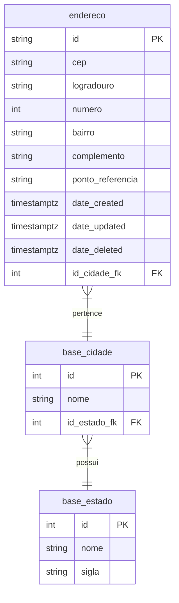

```mermaid
erDiagram
    base_estado {
        int id PK
        string nome
        string sigla
    }
    
    base_cidade {
        int id PK
        string nome
        
        int id_estado_fk FK
    }

    base_cidade }|--|| base_estado : possui
    
    endereco {
        string id PK

        string cep
        string logradouro
        int numero
        string bairro
        string complemento
        string ponto_referencia
        
        timestamptz date_created
        timestamptz date_updated
        timestamptz date_deleted
        
        int id_cidade_fk FK
    }
    
    endereco }|--|| base_cidade : pertence
```