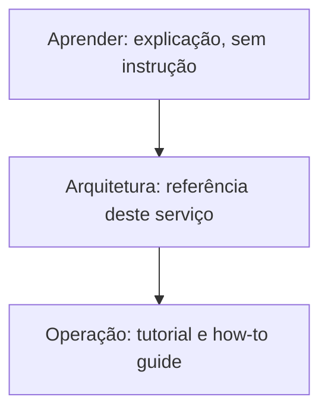

# management-service

API REST/GraphQL de gerenciamento acadêmico do Ladesa, construída com NestJS, TypeORM e PostgreSQL, seguindo arquitetura hexagonal com DDD e CQRS.

Esta documentação está organizada em três trilhas. A divisão segue [Diátaxis](aprender/diataxis.md): cada trilha responde a um tipo diferente de necessidade, não ao mesmo assunto visto de ângulos diferentes.

## [Aprender](aprender/index.md) (explicação)

Arquitetura hexagonal, DDD, CQRS, NestJS, ORM e transação, autenticação (JWT/JWKS/OAuth2), REST/GraphQL/DTO, message broker, containers: o que cada peça é e faz, de forma geral, sem depender de nenhuma decisão deste serviço.

## [Arquitetura](arquitetura/index.md) (referência)

Como este serviço usa cada peça: as quatro camadas e a estrutura de diretório, os padrões de código com exemplo real, autenticação e autorização, banco de dados e transação automática, REST e GraphQL, message broker, testes, CI/CD e deploy, stack tecnológico completo, diagrama de entidades.

## [Operação](operacao/index.md) (tutorial e how-to guide)

O roteiro executável: pré-requisito e primeiro setup, fluxo de contribuição (Git, commit, PR), lista de scripts, deploy manual, troubleshooting, e a linha editorial deste `docs/`.

## Ver também

Conceito de infraestrutura e cluster que este serviço usa mas não possui (Argo CD e o padrão app-of-apps, Infisical, TLS automático via cert-manager, Kubernetes) está documentado em [infrastructure](https://ladesa-ro.github.io/infrastructure/), linkado direto de cada página deste site onde o conceito é usado, não repetido aqui. Documentação de produto, requisito e apresentação da organização está em [docs.ladesa.com.br](https://docs.ladesa.com.br).
