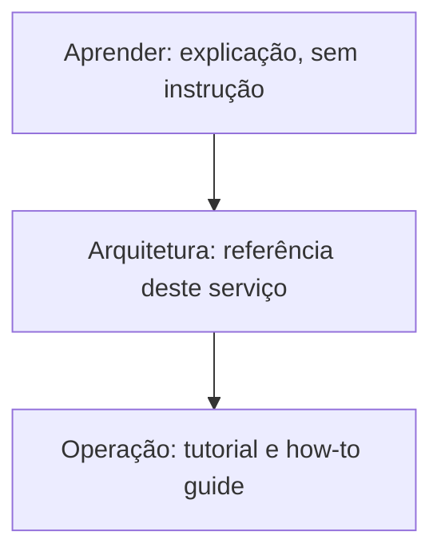

# management-service

API REST/GraphQL de gerenciamento acadêmico do Ladesa, construída com NestJS, TypeORM e PostgreSQL, seguindo arquitetura hexagonal com DDD e CQRS.

Esta documentação está organizada em três trilhas, mesma estrutura já validada em [infrastructure](https://github.com/ladesa-ro/infrastructure). A divisão segue [Diátaxis](aprender/diataxis.md): cada trilha responde a um tipo diferente de necessidade, não ao mesmo assunto visto de ângulos diferentes.

## [Aprender](aprender/index.md) (explicação)

Arquitetura hexagonal, DDD, CQRS, NestJS, ORM e transação, autenticação (JWT/JWKS/OAuth2), REST/GraphQL/DTO, message broker, containers: o que cada peça é e faz, de forma geral, sem depender de nenhuma decisão deste serviço.

## [Arquitetura](arquitetura/index.md) (referência)

Como este serviço usa cada peça: as quatro camadas e a estrutura de diretório, os padrões de código com exemplo real, autenticação e autorização, banco de dados e transação automática, REST e GraphQL, message broker, testes, CI/CD e deploy, stack tecnológico completo, diagrama de entidades.

## [Operação](operacao/index.md) (tutorial e how-to guide)

O roteiro executável: pré-requisito e primeiro setup, fluxo de contribuição (Git, commit, PR), lista de scripts, deploy manual, troubleshooting, e a linha editorial deste `docs/`.

## Como esta documentação foi montada

Esta documentação nasceu em duas levas. A primeira importou a linha editorial e a estrutura de três trilhas já validadas em [infrastructure](https://github.com/ladesa-ro/infrastructure). A segunda migrou o conteúdo que antes vivia espalhado em `README.md` (4298 linhas, misturando explicação de conceito, fato deste serviço e passo a passo na mesma página) e em `.claude/docs/`, reorganizando cada trecho no modo Diátaxis certo. O `README.md` na raiz do repositório agora é um resumo curto que aponta pra cá, ver [Pendências](operacao/pendencias.md) pro que ainda falta (gate de CI de documentação, testes automatizados em CI, entre outros).
