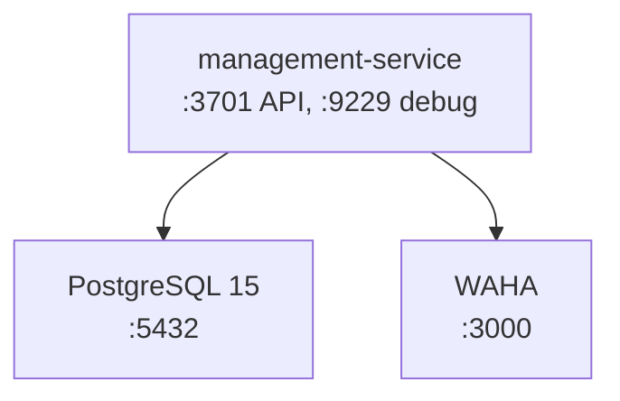

# Comece por aqui

**TLDR**: `git clone`, depois `just up` (sobe os containers e abre um shell dentro do container), depois `bun run dev`. Primeiro acesso depois disso: aplique as migrações e acesse a documentação da API.

| Termo | Vá pra |
|---|---|
| O que instalar antes de começar | [Pré-requisitos](#pre-requisitos) |
| Como subir o ambiente | [Rodando o projeto](#rodando-o-projeto) |
| O que fazer logo depois de subir | [Primeiros passos](#primeiros-passos) |
| Onde cada URL leva | [Acessando a aplicação](#acessando-a-aplicacao) |
| O que cada container faz | [Serviços do ambiente](#servicos-do-ambiente) |
| Toda variável de ambiente disponível | [Variáveis de ambiente](#variaveis-de-ambiente) |

## Pré-requisitos

Todo o ambiente de desenvolvimento é containerizado, não instale Bun, Node.js ou PostgreSQL diretamente na máquina.

| Ferramenta | Necessidade |
|---|---|
| Docker + Docker Compose v2+ | Recomendado, ver [docs.docker.com](https://docs.docker.com/get-docker/). Podman é suportado por conta e risco do usuário (`OCI_RUNTIME=podman`) |
| [just](https://github.com/casey/just) | Recomendado pro caminho A abaixo |
| Git | Pra clonar e versionar |
| VS Code ou WebStorm | Qualquer um com suporte a Dev Container, se for usar o caminho B |

## Clonando o repositório

```bash
git clone https://github.com/ladesa-ro/management-service.git
cd management-service
```

`just setup` copia os arquivos `.example` automaticamente, nenhuma configuração manual é necessária pra começar.

## Rodando o projeto

Dois caminhos, escolha o que preferir.

### Caminho A: justfile (recomendado)

```bash
just up
```

Esse único comando copia os `.env` a partir dos exemplos, builda a imagem se necessário, sobe os containers (aplicação, PostgreSQL, WAHA), instala dependências (`bun install`) e abre um shell `zsh` dentro do container. Uma vez dentro:

```bash
bun run dev
```

Receitas do `justfile` mais usadas:

| Comando | O que faz |
|---|---|
| `just up` | Sobe tudo e abre shell |
| `just start` | Sobe em background, sem abrir shell |
| `just stop` / `just down` | Para (ou para e remove) os containers |
| `just cleanup` | Para, remove containers **e volumes** (pede confirmação) |
| `just logs` | Logs em tempo real |
| `just shell-1000` / `just shell-root` | Shell como usuário `happy` ou como `root` |
| `just exec <args>` | Executa um comando dentro do container |

### Caminho B: Dev Container

1. Instale a extensão Dev Containers (VS Code) ou use Remote Development (WebStorm).
2. Abra a pasta do projeto, aceite "Reopen in Container" (VS Code) ou selecione o `devcontainer.json` em **File > Remote Development > Dev Containers** (WebStorm).
3. Aguarde o build e a instalação de dependência (`bun install` roda automaticamente no `postCreateCommand`).
4. No terminal integrado, rode `bun run dev`.

O Dev Container já configura Biome como formatador padrão com auto-format ao salvar, terminal `zsh`, e portas `3701`/`9229`/`5432` encaminhadas.

## Primeiros passos

1. Aplique as migrações, cria as 58 tabelas e o dado inicial (estados, cidades de Rondônia, campus IFRO Ji-Paraná, superuser):
   ```bash
   bun run migration:run
   ```
2. Acesse a documentação da API em <http://localhost:3701/api/docs>.
3. Acesse o GraphQL Playground em <http://localhost:3701/api/graphql>.
4. Faça uma requisição autenticada com token mock (`ENABLE_MOCK_ACCESS_TOKEN=true` é o padrão):
   ```bash
   curl -H "Authorization: Bearer mock.matricula.1234" http://localhost:3701/api/campi
   ```
5. Rode os testes pra confirmar que está tudo certo:
   ```bash
   bun run test
   ```

## Acessando a aplicação

| Recurso | URL | Descrição |
|---|---|---|
| Health check | `http://localhost:3701/health` | Status por dependência, sempre `200` |
| Documentação Scalar | `http://localhost:3701/api/docs` | Documentação interativa REST |
| OpenAPI JSON | `http://localhost:3701/api/docs/openapi.v3.json` | Schema OpenAPI pra Postman/Insomnia |
| Swagger UI | `http://localhost:3701/api/docs/swagger` | Interface Swagger clássica |
| GraphQL Playground | `http://localhost:3701/api/graphql` | GraphiQL |

As URLs usam o prefixo padrão `/api/`. Se `API_PREFIX` mudar no `.env`, as URLs mudam junto, exceto o health check, que fica fora do prefixo.

## Serviços do ambiente



| Serviço | Container | Porta | Credenciais |
|---|---|---|---|
| management-service | `ladesa-management-service` | `3701` (API), `9229` (debug) | sem credencial |
| PostgreSQL 15 | `ladesa-management-service-db` | `5432` | database `main` |
| WAHA | `ladesa-waha-service` | `3000` | API key em `.env.example` |

A fila (BullMQ, ver [Message broker](../arquitetura/message-broker.md)) roda sobre o mesmo PostgreSQL acima, schema `bullmq` — não é um container à parte.

Rede `ladesa-net` (bridge), todos os serviços se comunicam por nome de container. Volumes persistentes: dado do PostgreSQL, arquivo enviado, histórico do shell, sessão do WhatsApp.

## Variáveis de ambiente

Definidas em `.env`, criado automaticamente a partir de `.env.example`.

| Grupo | Variáveis principais |
|---|---|
| Servidor | `PORT` (3701), `NODE_ENV`, `API_PREFIX` (`/api/`), `APP_PUBLIC_BASE_URL` |
| Banco de dados | `DB_CONNECTION`, `DATABASE_URL`, `DATABASE_USE_SSL`, `TYPEORM_LOGGING` |
| Autenticação OAuth2/OIDC | `OAUTH2_CLIENT_PROVIDER_OIDC_ISSUER`, `OAUTH2_CLIENT_REGISTRATION_LOGIN_CLIENT_ID`/`_SECRET`/`_SCOPE` |
| Keycloak (admin client) | `KC_BASE_URL`, `KC_REALM`, `KC_CLIENT_ID`, `KC_CLIENT_SECRET`, `KC_PASSWORD_RESET_REDIRECT_URI` |
| Mock de autenticação | `ENABLE_MOCK_ACCESS_TOKEN` (`true` em dev, **deve ser `false` em produção**) |
| Message broker | `MESSAGE_BROKER_URL`, `MESSAGE_BROKER_QUEUE_TIMETABLE_REQUEST`/`_RESPONSE` |
| Armazenamento | `STORAGE_PATH` |
| WAHA | `WAHA_BASE_URL`, `WAHA_API_KEY`, `WAHA_TIMEOUT`, `WAHA_SESSION`, `WAHA_WEBHOOK_URL` |

`API_PREFIX` (`/api/` por padrão) prefixa toda rota, REST, documentação e GraphQL, exceto o health check. Ambiente de produção pode usar um prefixo diferente (ex.: `/api/v1/`), configurado no deploy.

`APP_PUBLIC_BASE_URL` (sem barra no final) é obrigatória em produção (`NODE_ENV=production`), a aplicação lança erro na inicialização se estiver ausente. Usada pra gerar link de confirmação em e-mail e notificação de WhatsApp, exemplo local `http://localhost:3701`, exemplo produção `https://dev.ladesa.com.br`.
