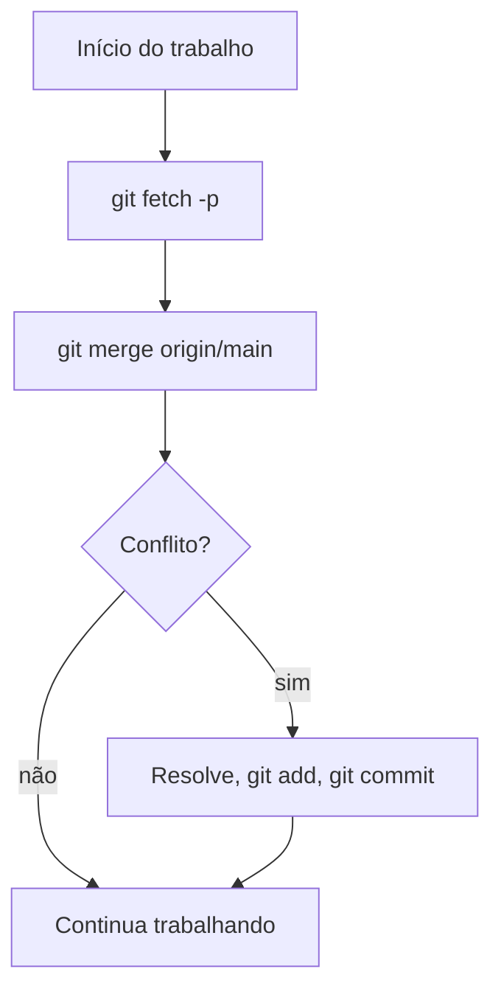
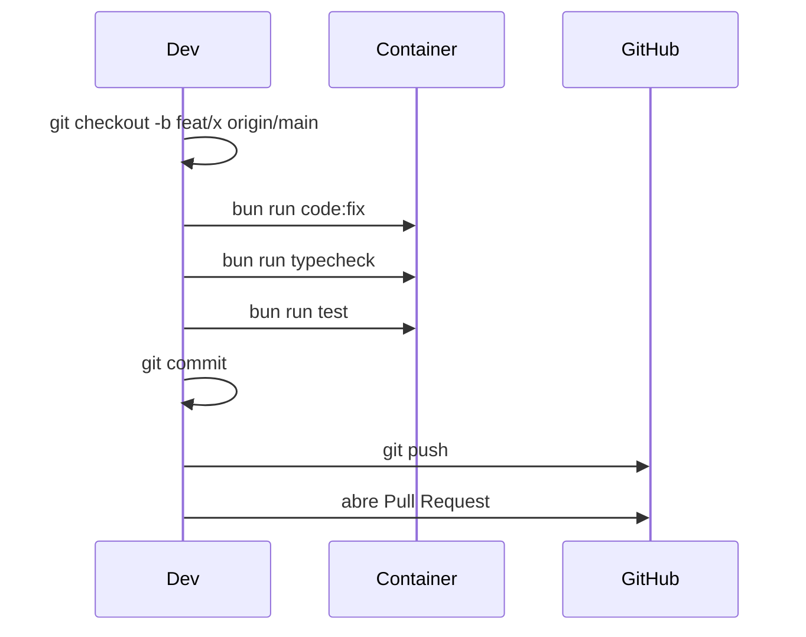

# Contribuindo

**TLDR**: crie uma feature branch a partir de `origin/main`, nunca de `git pull`, rode `code:fix` e `typecheck` antes de todo commit, siga Conventional Commits, abra PR pequeno e focado.

| Termo | Vá pra |
|---|---|
| Nome de branch, tipo de commit | [Convenções de nomenclatura](#convencoes-de-nomenclatura) |
| Por que `fetch` + `merge`, não `pull` | [Trabalhando com Git localmente](#trabalhando-com-git-localmente) |
| O passo a passo do início ao PR | [Passo a passo completo](#passo-a-passo-completo) |
| O que fazer e o que não fazer | [O que fazer vs. o que não fazer](#o-que-fazer-vs-o-que-nao-fazer) |
| Antes de commitar, antes de abrir PR | [Checklists](#checklists) |
| Como escrever issue e PR | [Issue e Pull Request](#issue-e-pull-request) |

## Convenções de nomenclatura

**Branch**, prefixo indica o tipo:

| Prefixo | Quando usar | Exemplo |
|---|---|---|
| `feat/` | Nova funcionalidade | `feat/cadastro-estagio` |
| `fix/` | Correção de bug | `fix/paginacao-campus` |
| `refactor/` | Refatoração sem mudar comportamento | `refactor/extrair-handler-turma` |
| `docs/` | Só documentação | `docs/atualizar-readme` |
| `test/` | Adicionar ou corrigir teste | `test/handler-diario` |
| `chore/` | Manutenção (dependência, CI, config) | `chore/atualizar-nestjs` |

**Commit**, [Conventional Commits](https://www.conventionalcommits.org/): `tipo(escopo): descrição no imperativo`. Tipos: `feat`, `fix`, `refactor`, `docs`, `test`, `chore`, `style`, `perf`, `ci`.

```bash
git commit -m "feat(campus): adicionar validação de CNPJ duplicado"

git commit -m "fix(turma): corrigir erro 500 ao listar turmas sem diario

O findAll retornava erro quando a turma não tinha diários associados
porque o LEFT JOIN não tratava o caso de relação vazia."
```

| Ruim | Por quê | Bom |
|---|---|---|
| `fix` | Não diz o que foi corrigido | `fix(campus): corrigir paginação na listagem` |
| `update` | Genérico demais | `feat(turma): adicionar campo observacao` |
| `wip` | Não deve chegar a ser commitado | Finalize antes de commitar, use stash |

## Trabalhando com Git localmente

O fluxo recomendado usa `git fetch -p` + `git merge origin/main`, não `git pull`. `git pull` é um atalho de `fetch` + `merge` (ou `rebase`, conforme config global), automático demais: se a config global tiver `pull.rebase = true` e alguém rodar `git pull origin main` numa feature branch já publicada, os commits locais são rebaseados e o histórico diverge do remoto.



Regra deste projeto: **nunca faça checkout na `main` local pra atualizar**, use sempre `origin/main` como referência. A `main` local pode ficar desatualizada, isso é esperado, ela não é usada pra nada. Se ficou divergente: `git checkout main && git reset --hard origin/main` (depois de um fetch).

```bash
# início do trabalho, na feature branch
git fetch -p
git merge origin/main

# fim do trabalho
bun run code:fix
bun run typecheck
git add .
git commit -m "feat(modulo): descricao"
git push origin feat/minha-feature

# nova branch, a partir do remoto atualizado
git fetch -p
git checkout -b feat/nova-feature origin/main
```

## Passo a passo completo



1. `git fetch -p && git checkout -b feat/minha-feature origin/main`.
2. Faça as alterações, seguindo [Camadas e estrutura](../arquitetura/camadas-e-estrutura.md) e [Convenções e princípios](../arquitetura/convencoes-e-principios.md).
3. `bun run code:fix && bun run typecheck`, os dois obrigatórios antes de commitar.
4. `bun run test`, corrija antes de commitar se algo falhar.
5. `git add . && git commit -m "feat(campus): descrição"`.
6. `git push origin feat/minha-feature`.
7. Abra o Pull Request no GitHub, título seguindo Conventional Commits, adicione revisor.

Ciclo de vida do PR: `Draft` (se ainda estiver trabalhando) ou `Ready for review` direto, depois `In review`, `Changes requested` (volta pra `In review` após correção) ou `Approved`, depois `Merged`. CI verde é esperado antes do merge, quando o pipeline existir pra isso, ver [Pendências](pendencias.md).

## O que fazer vs. o que não fazer

| Fazer | Não fazer |
|---|---|
| Uma branch por feature/fix | Commitar direto na `main` |
| Commit pequeno e frequente | Um commit gigante com "várias coisas" |
| `code:fix` + `typecheck` antes de todo commit | Commitar com erro de tipo ou formatação |
| `bun run test` antes de abrir PR | Abrir PR com teste falhando |
| Manter branch atualizada (`fetch -p` + `merge origin/main`) | Trabalhar semanas sem sincronizar |
| Título de PR descritivo | Título genérico como "Update" |
| PR pequeno e focado | PR com 50 arquivos e 3 features misturadas |
| Resolver conflito com cuidado | Force push sem entender o efeito |
| Deletar a branch após merge | Acumular branch antiga |

## Checklists

**Antes de cada commit**: `code:fix` executado sem erro, `typecheck` passando, mensagem no padrão `tipo(escopo): descrição`, nenhum `console.log` de debug, nenhum arquivo sensível (`.env`, credencial) incluído.

**Antes de abrir PR**: `code:fix`, `typecheck` e `test` passando, branch atualizada com a main, endpoint novo documentado no Swagger, migração criada se houve alteração de entidade, PR com título descritivo e descrição explicando o quê e o porquê.

## Issue e Pull Request

**Issue de bug**:

```markdown
## Descrição do bug
## Comportamento esperado
## Como reproduzir
## Contexto adicional
```

**Issue de feature**:

```markdown
## Descrição
## Critérios de aceite
## Contexto técnico (se aplicável)
```

**Pull Request**:

```markdown
## O que foi feito
## Por que
## Como testar
## Checklist
```

PR pequeno (até ~400 linhas alteradas, considere dividir se passar disso), uma responsabilidade por PR, descrição completa o bastante pra quem revisa não precisar ler o diff inteiro pra entender o contexto.
