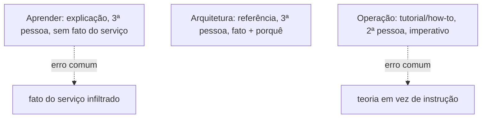
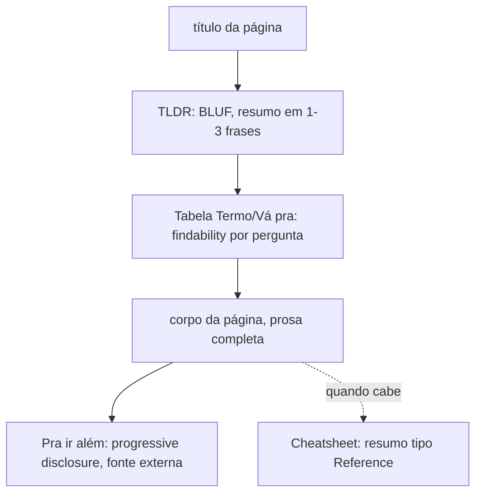
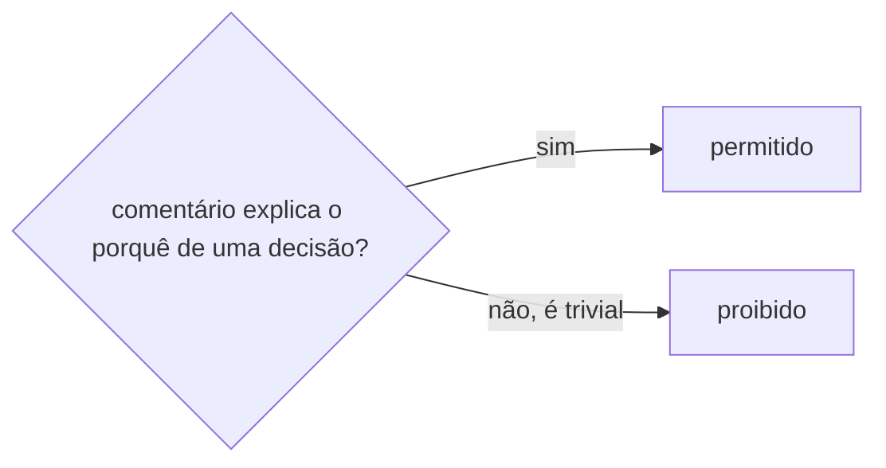

# Desenvolvimento

**TLDR**: três modos, três vozes (Aprender impessoal, Arquitetura fatual, Operação imperativa), a mesma linha editorial já validada em [infrastructure](https://github.com/ladesa-ro/infrastructure), importada aqui com uma única mudança deliberada: a regra de comentário em código segue o `AGENTS.md` deste repositório (comentário de "por quê" é permitido, trivial não), não a proibição total da infrastructure. Padrão estrutural repetido (TLDR, tabela de navegação, "Pra ir além", cheatsheet, diagrama mermaid do tipo certo pro conteúdo certo), qualidade de código via Biome e Nx, testes via Vitest, Conventional Commits só no título. Os gates de CI que a infrastructure já tem pra `docs/` (link quebrado, caractere fora do teclado, `mkdocs build --strict`) ainda não estão configurados aqui, ver [Pendências](pendencias.md).

| Termo | Vá pra |
|---|---|
| Modo e voz por seção | [Estrutura de conteúdo](#estrutura-de-conteudo-modo-e-voz-por-secao) |
| Regras de redação adotadas | [Linha editorial](#linha-editorial) |
| TLDR, tabela de navegação, "Pra ir além", cheatsheet, admonition | [Seções especiais](#secoes-especiais-padrao-estrutural-repetido-de-proposito) |
| Qual diagrama mermaid pra qual conteúdo | [Diagramas](#diagramas-qual-tipo-mermaid-pra-qual-proposito) |
| Por que a regra de comentário diverge da infrastructure, de propósito | [Comentários em código](#comentarios-em-codigo) |
| Biome, typecheck via Nx, o que falta virar gate de CI | [Qualidade de código](#qualidade-de-codigo) |
| Vitest, cobertura, e2e, o que falta virar gate de CI | [Testes](#testes) |
| Gates de qualidade de documentação que a infrastructure tem e este repositório ainda não | [Qualidade da documentação](#qualidade-da-documentacao) |
| CODEOWNERS e cooldown do Dependabot | [Donos de código e atualização de dependências](#donos-de-codigo-e-atualizacao-de-dependencias) |
| Convenção de commit | [Commits](#commits) |

## Estrutura de conteúdo: modo e voz por seção

As três trilhas ([Aprender](../aprender/index.md), [Arquitetura](../arquitetura/index.md), [Operação](index.md)) seguem [Diátaxis](../aprender/diataxis.md), não são só uma divisão temática. Cada seção corresponde a um modo diferente, e o modo determina tanto o que entra em cada página quanto a voz usada pra escrever ela:

**Aprender é explicação**: terceira pessoa, impessoal ("um agregado é", não "você vai usar um agregado"), sem instrução nenhuma ("faça X"), sem fato específico deste serviço real. O teste rápido: se a frase começa a soar como comando ou como "isto aqui, especificamente, faz assim", ela não pertence ao Aprender.

**Arquitetura é referência**: fato sobre este serviço específico, organizado pra consulta rápida, com o porquê de cada decisão registrado ao lado do fato, não uma explicação de conceito geral (isso já está no Aprender), só o raciocínio da escolha feita aqui. Terceira pessoa também, mas fatual, não instrucional.

**Operação é tutorial e how-to guide**: segunda pessoa, voz ativa, modo imperativo ("rode o comando", "suba o container"), assumindo que quem lê já sabe o básico (isso está no Aprender) e só precisa do passo concreto.

Misturar um modo com outro é o erro mais comum que Diátaxis nomeia, e é exatamente o estado atual do `README.md` deste repositório: uma página só, com setup, decisão arquitetural e conceito geral misturados na mesma prosa. Corrigir isso é o objetivo da próxima leva de migração, ver [Arquitetura](../arquitetura/index.md).



## Linha editorial

As regras abaixo são as mesmas já consolidadas em [infrastructure, Linha editorial](https://github.com/ladesa-ro/infrastructure/blob/main/docs/operacao/desenvolvimento.md#linha-editorial), importadas aqui sem alteração: leitura de sete style guides de documentação técnica mais a norma internacional de linguagem clara **ISO 24495-1** (ver [Normas de redação técnica](../aprender/normas-de-redacao-tecnica.md)). O detalhe completo de cada guia (Google, Microsoft, GitHub, GitLab, Red Hat, MDN, Docker) e o porquê de cada adoção ou rejeição vive naquele repositório, não duplicado aqui linha por linha: reproduzir a tabela inteira de novo criaria duas fontes da mesma decisão editorial, divergentes assim que uma mudar sem a outra. O que fica registrado aqui é o resumo operacional, suficiente pra escrever uma página nova sem abrir outro repositório:

**Adotado, resumo:**

- Título e cabeçalho em sentence case, nunca Title Case.
- Sem travessão, sem meia-risca (en dash, U+2013), sem seta Unicode (U+2192/U+2190/U+2194/U+21D2/U+21D0) em texto corrido: nenhum desses caracteres existe num teclado padrão, então aparecem só por cópia ou atalho de composição, nunca de propósito. Fluxo de UI vira `>` (`Settings > Deploy keys`), direção em prosa vira "de X pra Y" ou, em contexto técnico curto (mermaid, shell), a seta ASCII `->`.
- Sem ponto e vírgula: duas frases separadas em vez de uma frase composta.
- Sem abuso de crase marcando termo como código: nome de arquivo, comando ou identificador continua entre crases, mas prosa que vira uma sequência de termos crasados precisa ser reescrita.
- Texto de link sempre descritivo (`ver [Arquitetura](../arquitetura/index.md)`), nunca genérico (`clique aqui`).
- Sem linguagem de marketing nem superlativo não verificável.
- Sem autorreferência de preenchimento ("esta página explica"). A frase de modo Diátaxis que abre cada seção é a exceção deliberada, sinalização estrutural, não preenchimento.
- Título de procedimento no imperativo, não no gerúndio.
- Um comando por bloco de código quando o passo precisa ser copiado isoladamente.
- Valor que quem lê precisa substituir sempre em `<algo>`.

Ver o histórico completo de "considerado e descartado" (contração, vírgula de Oxford, numeração progressiva de seção, heading limitado a N palavras) na fonte original, ele não muda entre repositórios do Ladesa, é a mesma decisão editorial em ambos.

## Seções especiais: padrão estrutural repetido de propósito

**TLDR**: TLDR, tabela "Termo \| Vá pra", "Pra ir além" e "Cheatsheet" não são um capricho de formatação, cada um implementa um princípio de escrita técnica com nome e referência própria, e aparecem nesta ordem, sempre que cabem, em praticamente toda página deste site. Mesma prática de [infrastructure](https://github.com/ladesa-ro/infrastructure), importada sem alteração.

- **TLDR** (1-3 frases, logo abaixo do título): aplica **BLUF** (*Bottom Line Up Front*), a informação mais importante primeiro, detalhe depois.
- **Tabela "Termo \| Vá pra"** (logo após o TLDR): *findability* de segundo nível, organizada pelo que quem lê já tem na cabeça antes de saber qual seção responde, não pela ordem em que o conteúdo foi escrito.
- **"Pra ir além"** (perto do fim): *progressive disclosure*, essencial primeiro, aprofundamento opcional visível mas separado.
- **Cheatsheet** (tabela final, quando o conteúdo cabe): resumo tipo **Reference** dentro de uma página de **Explanation**, sem duplicar a página inteira numa trilha separada.



### Admonition: reservado pra passo de alto risco

O tema Material do mkdocs habilita a extensão `admonition` (ver `mkdocs.yml`, `markdown_extensions`), que renderiza blocos `!!! nota`/`!!! aviso`/`!!! perigo` com destaque visual. Mesma decisão da infrastructure: reservado pra sinalizar especificamente um passo de alto risco (`git reset --hard`, remoção de dado real, migração de banco irreversível), não pra nota genérica, que continua em texto corrido normal, pra não diluir o sinal com uso demais. Nenhuma página deste `docs/` usa a sintaxe ainda, porque nenhuma página de Operação com passo de alto risco foi migrada ainda, ver [Pendências](pendencias.md).

```
!!! warning "Título curto"
    Corpo do aviso, mesma prosa normal, markdown funciona dentro do bloco.
```

## Diagramas: qual tipo mermaid pra qual propósito

**TLDR**: [mermaid](https://mermaid.js.org) é a única ferramenta de diagrama adotada neste site, mesma decisão e mesmo motivo da infrastructure: texto puro versionável no mesmo PR do conteúdo que descreve (**Diagrams as Code**, ver [Documentação como código](../aprender/documentacao-como-codigo.md)). Nenhum PNG ou export binário de ferramenta gráfica entra em `docs/`.

| Tipo mermaid | Quando usar |
|---|---|
| `flowchart` | Processo, decisão, hierarquia, dependência entre partes |
| `sequenceDiagram` | Interação entre partes ao longo do tempo, quem chama quem, em que ordem |
| `mindmap` | Taxonomia sem ordem temporal nem hierarquia de decisão, só "isto se divide nisto" |
| `stateDiagram-v2` | Máquina de estado de verdade, onde o objeto muda de fase e a transição importa mais que o fluxo de dados |
| `timeline` | Sequência cronológica sem decisão nem ramificação |
| `quadrantChart` | Dois eixos independentes e contínuos decidindo posição, não um fluxo |

Critério prático, quando não é óbvio: perguntar se o diagrama mostra **ordem no tempo** (sequenceDiagram/timeline), **decisão/ramificação** (flowchart), **classificação sem hierarquia** (mindmap), **mudança de fase de um mesmo objeto** (stateDiagram) ou **posição em dois eixos contínuos** (quadrantChart). Este `docs/` ainda é pequeno demais pra um levantamento real de qual tipo domina, diferente da infrastructure, que já tem 64 páginas pra medir.

## Comentários em código

**TLDR**: comentário de "por quê" é permitido, comentário trivial não. Regra já em vigor no [AGENTS.md](https://github.com/ladesa-ro/management-service/blob/main/AGENTS.md) deste repositório, mantida aqui de propósito em vez de importar a proibição total de comentário da infrastructure.

A infrastructure adota zero comentário em qualquer arquivo de código, sem exceção narrativa (ver [infrastructure, Comentários em código](https://github.com/ladesa-ro/infrastructure/blob/main/docs/operacao/desenvolvimento.md#comentarios-em-codigo)). Esse repositório já tinha, antes deste `docs/` existir, uma regra diferente e explícita no próprio `AGENTS.md`: "Comentários devem explicar: por que a decisão foi tomada, qual problema está sendo resolvido" e "não comentar código trivial". Importar a regra da infrastructure sem checar isso teria criado uma contradição direta dentro do mesmo repositório, um `docs/` dizendo uma coisa e um `AGENTS.md` já em vigor dizendo outra. A decisão, confirmada explicitamente, foi manter a regra que já está em vigor:



Cada repositório do Ladesa pode ter sua própria regra de comentário em código, desde que declarada no próprio `AGENTS.md`/`CLAUDE.md` do repositório. Não é uma inconsistência a resolver, é a autoridade de cada `AGENTS.md` sobre o código do seu próprio repositório.

## Qualidade de código

**TLDR**: [Biome](https://biomejs.dev) cobre formatação e lint (`code:check`/`code:fix`), typecheck roda via Nx (`bun run check`). Nenhum dos dois roda como gate de CI hoje, só localmente ou dentro do pipeline obrigatório do `AGENTS.md`.

Os scripts já existem em `src/package.json` e são invocados via `just exec`, conforme o `AGENTS.md` exige (nenhum comando roda direto no host):

```bash
just exec bun run code:check
just exec bun run code:fix
just exec bun run check
```

`code:check`/`code:fix` cobrem formatação e lint via Biome (`src/biome.json`), configurado com `lineWidth: 100`, indentação de 2 espaços, `useEditorconfig: true`. `check` roda o typecheck completo do projeto via Nx (`nx.json`). Nenhum dos três está hoje verificado pelos workflows de `.github/workflows/` (`build-push.dev.yml` só builda e publica a imagem, `readme-sync-ai.yml` só sincroniza o `README.md`), ver [Pendências](pendencias.md) pra esse gap.

## Testes

**TLDR**: [Vitest](https://vitest.dev) roda via Nx (`bun run test`), com variantes de cobertura, e2e e watch. Igual à qualidade de código, nenhuma variante roda como gate de CI hoje.

```bash
just exec bun run test
just exec bun run test:cov
just exec bun run test:e2e
just exec bun run test:watch
```

## Qualidade da documentação

**TLDR**: a infrastructure já tem três gates bloqueantes pra `docs/`, [lychee](https://lychee.cli.rs) (link quebrado), grep de caractere fora do teclado (travessão, meia-risca, seta), e `mkdocs build --strict` (nav/âncora quebrado), os três rodando em todo PR. Aqui, `mkdocs build --strict` já roda via `.github/workflows/docs.yml`, mas só no push em `main` (parte do deploy pro GitHub Pages), não como check de PR. `lychee` e o grep de caractere continuam sem gate nenhum, ver [Pendências](pendencias.md). A checagem local funciona do mesmo jeito, pode rodar antes de propor mudança grande em `docs/`:

```bash
docker run --rm -v "$PWD":/docs -w /docs lycheeverse/lychee 'docs/**/*.md' 'README.md'
docker run --rm -it -p 8000:8000 -v "$PWD":/docs squidfunk/mkdocs-material:9.7.7 build --strict
```

## Bypass e afrouxamento de CI

**TLDR**: mesma regra da infrastructure, todo `continue-on-error` ou qualquer outra forma de afrouxar um gate de CI entra em [Pendências](pendencias.md) junto com a justificativa, no mesmo commit que introduz o afrouxamento, não depois.

Regra ainda mais simples de seguir aqui do que na infrastructure hoje: nenhum gate de qualidade de código ou de documentação está sequer ligado em CI neste repositório (ver [Qualidade de código](#qualidade-de-codigo) e [Qualidade da documentação](#qualidade-da-documentacao) acima), então não existe hoje nenhum afrouxamento a registrar, só a ausência do gate em si, já registrada em [Pendências](pendencias.md).

## Donos de código e atualização de dependências

**TLDR**: `CODEOWNERS` marca `.github/**/*` e `gitops/**/*` com `@ladesa-ro/devops` e `@ladesa-ro/security` juntos, `dependabot.yml` cobre as três dependências reais deste repositório (`docker`, `github-actions`, `bun`), com 14 dias de espera antes de propor versão nova, o dobro da janela de 7 dias usada na infrastructure.

`CODEOWNERS`, na raiz, marca `.github/**/*` e `gitops/**/*` com `@ladesa-ro/devops @ladesa-ro/security` juntos, e o próprio `CODEOWNERS` com `@ladesa-ro/security` sozinho. Bem mais enxuto do que quando o deploy ainda era `.deploy/development/deploy.sh`: os caminhos de arquivo de pacote (`**/package.json`, `**/bun.lock`), Docker (`.docker/**/*`) e script solto (`**/*.sh`) que existiam antes saíram do arquivo quando o deploy virou GitOps.

`.github/dependabot.yml` cobre `docker` (`/.docker`), `github-actions` (`/.github/workflows`) e `bun` (`/src`, com grupos separados de dependência de desenvolvimento e atualização menor de produção), todos com `cooldown: default-days: 14`. A infrastructure usa 7 dias pro mesmo tipo de janela, ver [infrastructure, Qualidade de código e infraestrutura](https://github.com/ladesa-ro/infrastructure/blob/main/docs/operacao/desenvolvimento.md#qualidade-de-codigo-e-infraestrutura): a diferença de janela entre os dois repositórios não foi revisada ainda, fica como item aberto em [Pendências](pendencias.md), não uma divergência deliberada como a de [Comentários em código](#comentarios-em-codigo).

## Commits

**TLDR**: [Conventional Commits](https://www.conventionalcommits.org) só no título, sem corpo, sem `Co-Authored-By`, mesma convenção da infrastructure. Nenhum workflow de `commit-lint` verifica isso automaticamente neste repositório hoje.

Título no formato `tipo(escopo): assunto`, tipos permitidos `feat`, `fix`, `docs`, `style`, `refactor`, `perf`, `test`, `build`, `ci`, `chore`, sem linha de corpo, sem `Co-Authored-By` em nenhum lugar da mensagem. A infrastructure enforça isso via `commit-lint.yml` (`scripts/lint-commit-messages.sh`, não bloqueante ainda). Este repositório não tem workflow equivalente, a convenção é seguida por prática direta, não por gate automático, ver [Pendências](pendencias.md).
